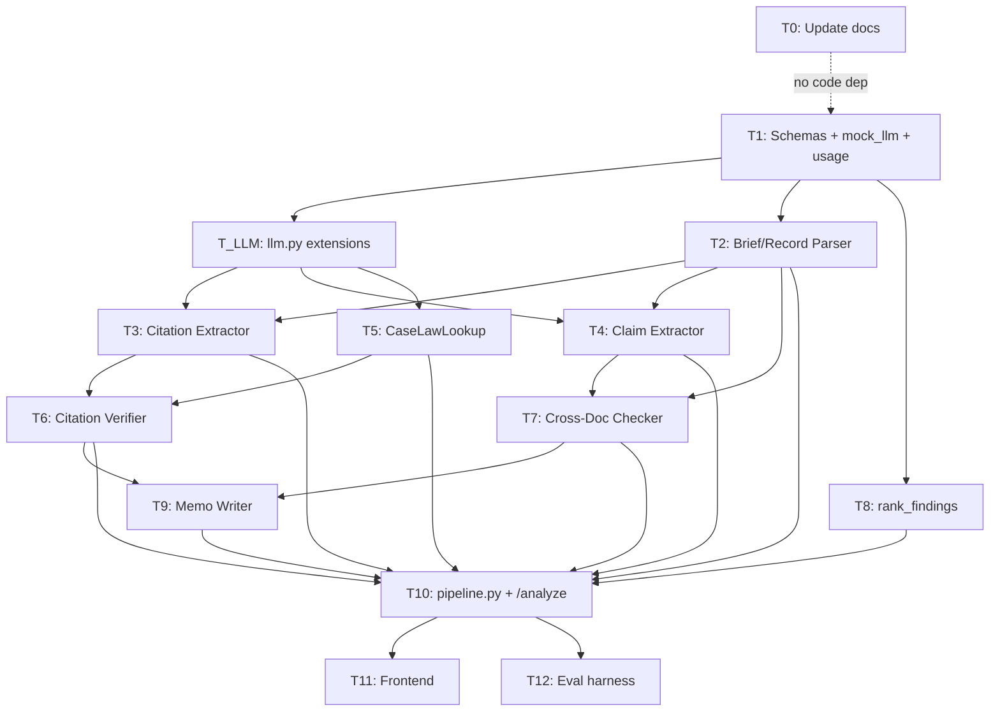

# Plan: Core Verification Pipeline

**Status:** In Progress
**Owner:** Stefano
**Created:** 2026-05-02

## 1. Specification

### Goal
End-to-end multi-agent pipeline that ingests a brief + supporting record (today: the Rivera v. Harmon MSJ + 3 supporting docs loaded server-side), produces a structured `Report` with verifiable findings, and renders it in a judge-readable UI. Plus an eval harness that measures precision, recall, hallucination rate, cost, and latency on one hand-labeled case. The pipeline is **agnostic to which files are passed** - it cares that *some* files are passed with one marked as the brief and the rest as records.

### In scope
- 6 agents wired by a linear async orchestrator (`pipeline.py`)
- `CaseLawLookup` interface with `ParametricLLMLookup` impl (door open for real lookups later)
- Deterministic `rank_findings` for memo top-N selection
- Per-agent failure isolation: agent errors -> `could_not_verify` findings + `meta.partial_failures` entries; memo surfaces partial failures explicitly
- `llm.py` extended with 3-step token-escalating retry on JSON parse failures
- Concurrency cap: `asyncio.Semaphore(5)` for in-flight LLM calls
- `meta.token_usage` and `meta.elapsed_ms` per request
- Frontend: memo + grouped findings + verdict pills + confidence badges + click-through (inline expand ±200 chars + "view full doc" escape) + spinner with elapsed-time counter
- Eval harness: single labeled case (Rivera), measures precision/recall/hallucination rate/cost/latency, appends to `evals/history.jsonl`
- **Document-set generalization (internal only):** `DocumentSet` envelope flows through the pipeline; agents and schemas don't hardcode `motion_for_summary_judgment` or any specific document_id. Swapping cases is a `case_loader.py` edit, not a schema/agent edit.
- ARCHITECTURE.md updates: fold `quote_checker` into Citation Verifier, lock 4-value verdict vocab, document the orchestrator + `rank_findings` choice, document the `DocumentSet` abstraction
- AGENTS.md note: token-escalating retry is a deliberate extension to the "one retry on parse" rule

### Out of scope
- Real case-law lookups (CourtListener, Westlaw, Lexis, web search) - interface is built, only `ParametricLLMLookup` ships
- Symmetry test / paired plaintiff brief
- UI: filters, side-by-side source viewer, partial-failure banners (beyond what the memo says)
- Reflection document
- Streaming `/analyze` results, polling status endpoint
- Mixed-model cost optimization (gpt-4o everywhere this round)
- Authentication, persistence, history UI
- **Optional request body for `POST /analyze`.** The endpoint takes no body; the backend decides the document set via `case_loader.load_default_case()`. The pipeline is internally agnostic, so adding a request-body code path later is a small, additive change - but it's not in this plan. Don't build an upload UI or wire request validation for caller-supplied document sets.
- **Multi-brief support.** `DocumentSet` enforces exactly one brief per run.

### Acceptance criteria for the whole plan
- [ ] `docker compose up --build` starts both services; `POST /analyze` (no body) returns a valid `Report` against the default Rivera case  *(BLOCKED: backend container crashes - `entrypoint.sh` runs `uvicorn main:app` from `/app` but `main.py` imports `from backend.X` which doesn't resolve in that layout. Either fix the imports in main.py/pipeline.py/case_loader.py to drop the `backend.` prefix, or change the entrypoint + docker-compose volume mount. In-process TestClient verified the endpoints work; only the container layout is broken.)*
- [ ] Frontend renders memo on top, grouped findings (consistency first, then citations), verdict pills, confidence badges, click-through to ±200 char source excerpt  *(Code present and `npm run build` clean. Browser smoke test couldn't run because the backend container is broken. Frontend file structure matches the plan.)*
- [x] All 6 agents have unit tests using `mock_llm`; tests pass via `pytest backend/tests/`  *(151 tests pass; mock_llm fixture used by every LLM-bound agent test)*
- [ ] `cd backend && python -m evals.run` runs against the live MSJ with real LLM calls, prints per-case + aggregate precision/recall/hallucination/cost/latency, appends to `evals/history.jsonl`  *(Runner is built and unit-tested but NOT executed - costs real money, user's call to run. Command updated post-R1 - was `python -m backend.evals.run` before the import-prefix fix.)*
- [ ] Eval reports recall ≥ 0.6 and hallucination rate ≤ 0.1 on the Rivera case (honest floor, not aspirational ceiling)  *(Pending the eval run above)*
- [x] Memo writer never emits a verdict word stronger than the source finding's verdict (asserted by unit test)  *(test_memo_writer.py covers all 6 forbidden verdict words plus 4 outcome-recommendation phrases)*
- [x] When an agent fails, the report still renders and the memo notes the failure  *(test_pipeline.py::test_run_pipeline_single_agent_failure + test_run_pipeline_all_agents_fail)*
- [x] **No agent or schema mentions a specific document_id by literal value.**  *(grep confirms zero matches outside case_loader.py + test_case_loader.py + evals/cases/*.json + documents/)*
- [x] ARCHITECTURE.md and AGENTS.md updated to reflect the locked decisions  *(T0 complete; mermaid, schemas, §3.10, §3.11, §4 all updated; quote_checker references gone)*

### Data contracts

```python
# backend/schemas.py - Pydantic v2, model_config = ConfigDict(extra="forbid") on every model

Verdict = Literal["supported", "contradicted", "unsupported", "could_not_verify"]
DocumentId = str  # type alias for clarity at call sites; no value constraint - the active DocumentSet is the source of truth

class DocumentRole(str, Enum):
    BRIEF = "brief"            # the document being audited
    RECORD = "record"          # supporting documents the brief is checked against

class DocumentInput(BaseModel):
    model_config = ConfigDict(extra="forbid")
    document_id: DocumentId    # caller-chosen, must be unique within the set
    display_name: str          # what the UI shows ("Police Report")
    role: DocumentRole
    text: str

class DocumentSet(BaseModel):
    """The pipeline's input envelope. Exactly one BRIEF, N RECORDs, unique ids."""
    model_config = ConfigDict(extra="forbid")
    documents: list[DocumentInput]

    @model_validator(mode="after")
    def _validate(self) -> "DocumentSet":
        briefs = [d for d in self.documents if d.role == DocumentRole.BRIEF]
        if len(briefs) != 1:
            raise ValueError(f"DocumentSet must contain exactly one BRIEF; found {len(briefs)}")
        ids = [d.document_id for d in self.documents]
        if len(set(ids)) != len(ids):
            raise ValueError(f"document_ids must be unique; got {ids}")
        return self

    def brief(self) -> DocumentInput: ...
    def records(self) -> list[DocumentInput]: ...
    def by_id(self, document_id: DocumentId) -> DocumentInput: ...
    def has_id(self, document_id: DocumentId) -> bool: ...

class TextSpan(BaseModel):
    document_id: DocumentId    # must reference a document in the active DocumentSet
    start: int  # char offset, inclusive
    end: int    # char offset, exclusive
    excerpt: str  # the text at [start:end], stored for UI rendering

class ParagraphSpan(BaseModel):
    document_id: DocumentId
    paragraph_index: int  # 0-based
    span: TextSpan

class ParsedBrief(BaseModel):
    document_id: DocumentId
    raw_text: str
    paragraphs: list[ParagraphSpan]

class ParsedRecord(BaseModel):
    document_id: DocumentId
    display_name: str          # carried forward so cross-doc + UI don't re-derive it
    raw_text: str
    paragraphs: list[ParagraphSpan]

class ExtractedCitation(BaseModel):
    cite: str                          # "Privette v. Superior Court, 5 Cal.4th 689 (1993)"
    proposition: str                   # what the brief claims this authority supports
    quoted_language: str | None        # verbatim quote attributed to the case, if any
    claim_span: TextSpan               # where in the brief this citation appears

class ExtractedClaim(BaseModel):
    claim_text: str                    # "the incident occurred on March 14, 2021"
    claim_span: TextSpan               # where in the brief this claim appears

class CaseLookupResult(BaseModel):
    found: bool
    canonical_cite: str | None
    holding_text: str | None
    quoted_text_match: bool | None     # null = no quote to check; bool = match result
    source_url: str | None
    lookup_status: Literal["found", "not_found", "ambiguous", "lookup_failed"]
    notes: str | None

class CitationFinding(BaseModel):
    citation: ExtractedCitation
    verdict: Verdict
    confidence: float                  # [0.0, 1.0]
    reasoning: str
    evidence_quote: str | None
    evidence_span: TextSpan | None     # null when verdict is could_not_verify
    lookup: CaseLookupResult           # provenance: where the verifier looked

class ConsistencyFinding(BaseModel):
    claim: ExtractedClaim
    verdict: Verdict
    confidence: float
    reasoning: str
    evidence_quote: str | None
    evidence_span: TextSpan | None     # null when verdict is could_not_verify
    checked_documents: list[DocumentId]

class FindingRef(BaseModel):
    finding_type: Literal["citation", "consistency"]
    finding_index: int                 # index into report.citations or report.consistency

class JudicialMemo(BaseModel):
    text: str                          # one paragraph, clerk voice
    top_findings: list[FindingRef]     # references only; never restates verdicts
    partial_failure_note: str | None   # "Citation verification failed for 2 of 10 cites." etc.

class PartialFailure(BaseModel):
    agent: str
    error: str

class TokenUsage(BaseModel):
    prompt: int
    completion: int

class ReportMeta(BaseModel):
    model: str
    elapsed_ms: int
    token_usage: TokenUsage
    partial_failures: list[PartialFailure]

class Report(BaseModel):
    consistency: list[ConsistencyFinding]
    citations: list[CitationFinding]
    memo: JudicialMemo
    meta: ReportMeta
```

### Open questions / accepted assumptions
- **Token-escalating retry** is a deliberate extension to AGENTS.md §3's "one retry on parse" rule. The original rule guards against re-running expensive prompts; token escalation guards against output truncation, which is a different failure class. The retry only re-runs the *same* prompt with a larger `max_tokens` budget, not a corrected-JSON prompt. Logged as an explicit AGENTS.md amendment in T0.
- **Verdict can be a list** in eval cases (e.g., a fabricated cite counts as match if the pipeline returns either `unsupported` or `could_not_verify`). Stefano will fine-tune later.
- **`evidence_span` excerpt is stored on the span itself** (not re-derived at render time) so the frontend doesn't need the full doc to show context. Costs ~100 bytes per finding, buys statelessness on the client.
- **Brief Parser is non-LLM** (deterministic paragraph segmentation), so it has no `mock_llm` dependency in tests.
- **`DocumentId = str`, not a `Literal`.** The schema is agnostic to which documents exist. Validation is runtime: every `TextSpan.document_id` produced by an agent must be present in the active `DocumentSet` (validated in the orchestrator's `_safe_call`). A span with an unknown `document_id` becomes a `could_not_verify` finding rather than a Pydantic validation error - the agent hallucinated a doc, that's a finding, not a crash.
- **`POST /analyze` takes no request body in this plan.** The backend always loads the document set via `case_loader.load_default_case()`. The pipeline is internally agnostic (it takes a `DocumentSet`), so adding a request-body code path later is an additive change touching only `main.py`.
- **`case_loader.load_default_case()` is the only place that knows about specific filenames.** Lives in `backend/case_loader.py`, ~30 lines, reads `backend/documents/*.txt`, returns a `DocumentSet` with hardcoded role + display_name assignment for the four Rivera files. Swap files = edit this function.
- **Memo is one LLM call** over pre-ranked top-N findings (default N=5). N is a constant in `pipeline.py`, not a config.

## 2. Architecture

```mermaid
flowchart LR
    api[POST /analyze<br/>no body] --> loader[case_loader<br/>load_default_case]
    loader -->|DocumentSet| pipe[run_pipeline]
    pipe --> bp[T2: Brief Parser<br/>deterministic]
    pipe --> rp[T2: Record Parser<br/>deterministic, per record]
    bp -->|ParsedBrief| ce[T3: Citation Extractor]
    bp -->|ParsedBrief| cle[T4: Claim Extractor]
    ce -->|ExtractedCitation per cite| cv[T6: Citation Verifier<br/>uses CaseLawLookup]
    cle -->|ExtractedClaim per claim| cdc[T7: Cross-Doc Checker]
    rp -->|ParsedRecord per doc| cdc
    cl[T5: CaseLawLookup<br/>+ ParametricLLMLookup] -.->|injected| cv
    cv -->|CitationFinding[]| rank[T8: rank_findings<br/>deterministic]
    cdc -->|ConsistencyFinding[]| rank
    rank -->|top-N FindingRef[]| memo[T9: Judicial Memo]
    rank --> assemble
    memo --> assemble[T10: Report assembly<br/>in pipeline.py]
    assemble -->|Report| api
    api --> ui[T11: Frontend ReportView]
    api --> eval[T12: Eval harness<br/>builds DocumentSet from case JSON]
```

**Data flow:** `POST /analyze` (no body) calls `case_loader.load_default_case()` which returns a `DocumentSet` (one BRIEF + N RECORDs, all from `backend/documents/`). The orchestrator `run_pipeline(doc_set)` parses the brief and each record (deterministic, parallel) - no agent or schema knows the specific document_ids. It then runs Citation Extractor and Claim Extractor in parallel on the parsed brief. Each extractor's output fans out: citations -> Citation Verifier (one call per cite, gathered under `Semaphore(5)`); claims -> Cross-Doc Checker (one call per claim, same semaphore, with all parsed records as context). All findings funnel into `rank_findings` (pure Python sort by `verdict_weight × confidence`), which selects top-N for the memo. Memo agent writes the prose. `pipeline.py` assembles the final `Report` with `meta` populated from a `usage_collector` passed through every `llm.py` call.

**Per-agent failure isolation:** every agent invocation goes through `_safe_call` in `pipeline.py`. On exception, `lookup_failed`, or **a span pointing at a document_id not in the active `DocumentSet`** (the agent invented a doc), the per-input result becomes a `could_not_verify` finding with `reasoning: "agent error: <msg>"`, and a `PartialFailure` entry is appended to `meta.partial_failures`. The memo agent receives `partial_failures` as context and writes a one-sentence note when any are present.

**Eval entrypoint:** the eval harness (T12) builds a `DocumentSet` from a case-file JSON (`evals/cases/<id>.json` references text files by path + assigns role + display_name) and calls `run_pipeline` directly, bypassing `case_loader`. This proves the pipeline is genuinely document-set-agnostic - the same code path serves Rivera-from-disk and any future eval case.

## 3. Tasks

13 tasks (T0 + T1-T12) across 7 waves. Each task ≤500 LOC.

---

### T0 - Update AGENTS.md and ARCHITECTURE.md to reflect locked decisions
- **Description:** Documentation prerequisite. Lock the four decisions made in `/plan` so subagents reading these docs (per AGENTS.md §6) get the right rules.
- **Files to create/modify:**
  - `AGENTS.md` (extend §3.OpenAI/LLM with the token-escalating retry rule)
  - `ARCHITECTURE.md` (update §3.1 pipeline diagram, §3.5 schemas, drop `quote_checker` references, lock 4-value verdict vocab, document `rank_findings`)
- **How:**
  - In ARCHITECTURE.md §3.1, replace the mermaid with the one from §2 of this plan.
  - In ARCHITECTURE.md §3.5, replace the schema sketches with the ones from §1 of this plan (Verdict, `DocumentSet`, `DocumentInput`, `DocumentRole`, etc.). Keep field-order-as-judge-reading-order rule.
  - Drop `quote_checker.py` from the §2 layout. Note that quote-accuracy lives inside Citation Verifier.
  - In ARCHITECTURE.md, add a new §3.10 documenting `rank_findings` as a deterministic helper (not an agent).
  - In ARCHITECTURE.md, add a new §3.11 documenting the `DocumentSet` abstraction: pipeline takes a `DocumentSet` (one BRIEF + N RECORDs); `case_loader.load_default_case()` is the only place specific filenames live; `POST /analyze` takes no body in this plan; eval harness builds its own `DocumentSet` from case JSON; `DocumentId = str` (not Literal) and span validation is runtime in `_safe_call`. Note the door left open for a future request-body code path.
  - Update ARCHITECTURE.md §4 ("The shape of `POST /analyze`") to clarify: request takes no body in v1; backend chooses the document set via `case_loader`.
  - In AGENTS.md §3 OpenAI/LLM, add: "Retries: token-escalating retry is allowed when the failure mode is output truncation (re-run same prompt with 2x then 4x `max_tokens`). For all other JSON parse failures, one retry on the parse step."
- **Acceptance criteria:**
  - [ ] ARCHITECTURE.md mermaid in §3.1 matches §2 of this plan
  - [ ] ARCHITECTURE.md no longer mentions `quote_checker.py` or a separate `quotes` list in the report
  - [ ] ARCHITECTURE.md verdict vocab is `supported | contradicted | unsupported | could_not_verify`
  - [ ] ARCHITECTURE.md §3.5 schemas show `DocumentSet`, `DocumentInput`, `DocumentRole`; `DocumentId` is `str` not `Literal`
  - [ ] ARCHITECTURE.md §3.11 explains the `DocumentSet` abstraction and why `POST /analyze` takes no body in this plan
  - [ ] ARCHITECTURE.md §4 reflects no-body `POST /analyze`
  - [ ] AGENTS.md §3 includes the token-escalating retry exception with its rationale
  - [ ] No code changes outside these two files
  - [ ] No test command (docs-only task)
- **Depends on:** none
- **Estimated LOC:** ~80 (mostly diff in existing files)
- **Subagent prompt:**
  > You are implementing T0 (update AGENTS.md and ARCHITECTURE.md) in the BS Detector repo.
  > Read the current AGENTS.md and ARCHITECTURE.md first. You're updating them to reflect locked architectural decisions from `.claude/plans/core-verification-pipeline.md`.
  >
  > **Decisions to encode (verbatim from the plan):**
  > 1. Drop the separate `quote_checker` agent. Quote-accuracy checks fold into the Citation Verifier.
  > 2. Verdict vocab is exactly `Literal["supported", "contradicted", "unsupported", "could_not_verify"]`. The old `unverified` value is gone. `unsupported` = source exists but doesn't say what the brief claims; `could_not_verify` = couldn't reach the source / lookup failed / ambiguous.
  > 3. Add `rank_findings` as a deterministic helper in `pipeline.py` (not an agent). It sorts findings by `verdict_weight × confidence` and selects top-N for the memo. Add a new §3.10 in ARCHITECTURE.md describing it.
  > 4. AGENTS.md §3 OpenAI/LLM: amend the retry rule. Token-escalating retry (3 tries, 2x then 4x `max_tokens`) is allowed when the failure mode is output truncation. For all other JSON parse failures the existing one-retry-on-parse rule stands. Explain the rationale: original rule guards against re-running expensive prompts; truncation is a different failure class.
  > 5. Document the `DocumentSet` abstraction in a new ARCHITECTURE.md §3.11. Key points: pipeline takes a `DocumentSet` (one BRIEF + N RECORDs, validated); `DocumentId = str` (not Literal) so the schema is agnostic to which docs exist; `case_loader.load_default_case()` is the single place specific filenames live; `POST /analyze` takes no body in this plan but the pipeline is internally agnostic so a body code path is an additive change later; eval harness builds its own `DocumentSet` from case JSON; agents never reference document_ids by literal value (no `if doc_id == "police_report"`).
  > 6. Update ARCHITECTURE.md §4 to clarify `POST /analyze` takes no body in v1.
  >
  > Replace ARCHITECTURE.md §3.1's mermaid with the one in `.claude/plans/core-verification-pipeline.md` §2. Replace §3.5's schema sketches with the locked schemas from §1 of the plan (which now include `DocumentSet`, `DocumentInput`, `DocumentRole`).
  >
  > **Files you may touch:** `AGENTS.md`, `ARCHITECTURE.md`. Don't modify anything else.
  >
  > **Style rules (from AGENTS.md):** dashes never emdashes, talk like a person, no business-speak. Apply to your edits.
  >
  > Report back: which sections changed, a 5-line diff summary per file, and confirmations that (a) no `quote_checker` references remain in either doc, (b) ARCHITECTURE.md §3.5 shows `DocumentId = str` not `Literal[...]`, (c) ARCHITECTURE.md §3.11 exists and explains the DocumentSet abstraction, (d) §4 reflects no-body `POST /analyze`.

---

### T1 - Schemas + `mock_llm` fixture + `usage_collector`
- **Description:** Land every Pydantic schema for the pipeline, the `mock_llm` test fixture (which doesn't exist yet), and a token-usage collector helper. Foundation for every other task.
- **Files to create/modify:**
  - `backend/schemas.py` (new)
  - `backend/tests/conftest.py` (new)
  - `backend/tests/test_schemas.py` (new)
  - `backend/usage.py` (new) - tiny `UsageCollector` class
- **How:**
  - In `schemas.py`, declare every model from §1 of this plan. `model_config = ConfigDict(extra="forbid")` on each.
  - `Verdict` and `DocumentId` are module-level `Literal` aliases.
  - `mock_llm` fixture in `conftest.py`: takes a `dict[str, Any] | Callable[[str], Any]`, monkeypatches `backend.llm.call_llm` (sync) and `backend.llm.call_llm_async` (async, will be added in T_LLM). Returns the recorded calls list. Asserts called ≥ once at teardown.
  - `usage.py`: `UsageCollector` with `prompt: int`, `completion: int`, `add(prompt, completion)`. Used by `pipeline.py` to populate `meta.token_usage`.
  - `test_schemas.py`: round-trip every schema, assert `extra="forbid"` rejects unknown keys, assert `evidence_span` is `None`-able when verdict is `could_not_verify`. Plus `DocumentSet`-specific tests: validator rejects zero-brief, two-brief, and duplicate-id sets; helpers (`brief()`, `records()`, `by_id()`, `has_id()`) work on a happy-path set.
- **Acceptance criteria:**
  - [ ] Every schema from §1 declared, no extras
  - [ ] `DocumentSet` validator rejects: zero briefs, two+ briefs, duplicate document_ids
  - [ ] `DocumentSet` helpers (`brief`, `records`, `by_id`, `has_id`) tested
  - [ ] `DocumentId = str` (a type alias), NOT a `Literal` - asserted by test that constructs a `TextSpan` with an arbitrary string id
  - [ ] `pytest backend/tests/test_schemas.py` passes
  - [ ] `mock_llm` fixture documented in a docstring with the exact dict-or-callable contract
  - [ ] No imports of `openai` outside `llm.py`
- **Depends on:** none (parallel with T0)
- **Estimated LOC:** ~340
- **Subagent prompt:**
  > You are implementing T1 (schemas, mock_llm fixture, usage collector) in the BS Detector repo.
  > Read AGENTS.md and ARCHITECTURE.md first. Follow them strictly, including the writing style (no emdashes, talk like a person, no comments unless the why is non-obvious).
  >
  > **TDD is mandatory:**
  > 1. Write failing tests in `backend/tests/test_schemas.py` for every schema in `.claude/plans/core-verification-pipeline.md` §1. Tests must round-trip JSON, assert `extra="forbid"` rejects unknown keys, and assert `evidence_span` can be `None` when verdict is `could_not_verify`.
  >    Plus DocumentSet-specific tests:
  >    - Constructing a `DocumentSet` with zero BRIEF documents raises ValueError
  >    - Constructing with two BRIEF documents raises ValueError
  >    - Constructing with duplicate `document_id`s raises ValueError
  >    - `brief()` returns the single BRIEF document
  >    - `records()` returns only RECORD documents
  >    - `by_id("foo")` returns the matching DocumentInput; missing id raises KeyError
  >    - `has_id("foo")` returns True/False appropriately
  >    - `TextSpan(document_id="anything-goes", start=0, end=5, excerpt="hello")` constructs cleanly - DocumentId is `str`, not constrained at the schema level
  >    Run, confirm red.
  > 2. Implement `backend/schemas.py` with every model from the plan. Pydantic v2, `model_config = ConfigDict(extra="forbid")` on every model. `DocumentRole` is a `str, Enum`. `DocumentId = str` (module-level alias, no Annotated/Literal). `DocumentSet` uses `@model_validator(mode="after")` for the brief-count + uniqueness checks.
  > 3. Implement `backend/usage.py` - a tiny `UsageCollector` dataclass with `prompt: int = 0`, `completion: int = 0`, and an `add(prompt: int, completion: int)` method.
  > 4. Implement `backend/tests/conftest.py` with the `mock_llm` fixture. The fixture takes a `dict[str, Any] | Callable[[str], Any]` mapping prompt-substring to response payload, monkeypatches `backend.llm.call_llm` AND `backend.llm.call_llm_async` (these will exist after T_LLM but the fixture is the contract - it's fine if it patches functions that don't exist yet, since the patch only resolves at test time). Returns the recorded list of call records `[{"prompt": str, "response": Any}, ...]`. Asserts called ≥ once at teardown.
  >
  > **Files you may touch:** `backend/schemas.py`, `backend/usage.py`, `backend/tests/conftest.py`, `backend/tests/test_schemas.py`. Don't modify anything else.
  > **You must not:** import `openai` anywhere, create unused stub files, add Pydantic v1 syntax, or constrain `DocumentId` to a `Literal` (it must stay `str`).
  >
  > **Acceptance criteria (verbatim):**
  > - Every schema in `.claude/plans/core-verification-pipeline.md` §1 declared with `extra="forbid"`
  > - `DocumentSet` validator rejects zero-brief, two-brief, duplicate-id sets
  > - `DocumentId = str` (no Literal value constraint)
  > - `DocumentSet` helpers tested
  > - `pytest backend/tests/test_schemas.py` passes
  > - `mock_llm` fixture has a docstring documenting the dict-or-callable contract
  >
  > Report back: list of files created, `pytest backend/tests/test_schemas.py -v` output (last 20 lines), the line in `schemas.py` where `DocumentId` is defined (so I can spot-check it's a `str` alias), and any open issues.

---

### T_LLM - Extend `llm.py` with async + structured output + 3 retry classes (truncation / parse / 429-backoff) + usage tracking
- **Description:** Single LLM seam. Adds async client, `response_format` structured output via Pydantic, three independent retry classes (truncation, malformed JSON, rate-limit with exponential backoff), and per-call usage reporting.
- **Files to create/modify:**
  - `backend/llm.py` (extend - the file exists as a stub today)
  - `backend/tests/test_llm.py` (new)
- **How:**
  - `DEFAULT_MODEL: str = "gpt-4o"` module-level constant.
  - `DEFAULT_TIMEOUT_S: float = 60.0`.
  - Rate-limit retry constants: `MAX_RATE_LIMIT_RETRIES: int = 4`, `INITIAL_BACKOFF_S: float = 1.0`, `BACKOFF_MULTIPLIER: float = 2.0`, `JITTER_RATIO: float = 0.25` (±25% random jitter to avoid thundering herd).
  - Add `call_llm_async(prompt: str, response_model: type[BaseModel] | None, *, max_tokens: int = 2048, temperature: float = 0.0, usage: UsageCollector | None = None) -> Any`. When `response_model` is given, uses OpenAI's `response_format={"type": "json_schema", "json_schema": {...}}` and returns a parsed instance. Otherwise returns string.
  - **Three independent retry classes**, each handles a different failure mode:
    1. **Rate-limit retry (HTTP 429 / `RateLimitError`):** outermost layer. On 429, sleep `INITIAL_BACKOFF_S * BACKOFF_MULTIPLIER^attempt` with ±25% jitter, retry up to `MAX_RATE_LIMIT_RETRIES` times (so ~1s, 2s, 4s, 8s with jitter). If the OpenAI SDK exposes a `Retry-After` header on the error, honor it instead of computing the next backoff. Exhausted -> raise `LlmError`. This handles the most common cause of agent errors when the pipeline fans out.
    2. **Token-escalating retry (truncation):** inside the rate-limit retry. On `finish_reason == "length"` OR empty response, re-run with 2x then 4x `max_tokens` (3 attempts total). Each token-escalation attempt internally goes through the rate-limit retry layer.
    3. **One-retry-on-parse (malformed JSON, not truncation):** innermost. After a successful API response that fails JSON parse, re-prompt "fix this malformed JSON: <body>" exactly once. The fix-up call also goes through both outer retry layers.
  - All three retries can stack (e.g., a request can hit 429 twice, then succeed but truncate, then succeed but malformed-JSON, then succeed on fix-up). The combined max-attempts ceiling is bounded but generous.
  - `usage.add(prompt_tokens, completion_tokens)` after every successful call.
  - Sync `call_llm` is a thin `asyncio.run` wrapper around the async version (kept because it's part of the existing seam contract, even if pipeline only uses async).
  - Tests use `respx` or monkeypatch `AsyncOpenAI.chat.completions.create` directly. **Constraint: do not introduce new dependencies.** Monkeypatch with a fake async function that records calls. Patch `asyncio.sleep` to a no-op (or pass an injected fast-clock) so backoff tests don't actually sleep up to 8 seconds.
- **Acceptance criteria:**
  - [ ] `call_llm_async` exists, async, accepts `response_model`, returns parsed instance
  - [ ] Truncated response triggers 2x then 4x retry (assert by patching the OpenAI call to return a truncation on first attempt)
  - [ ] Malformed JSON (not truncation) triggers exactly one fix-up retry
  - [ ] HTTP 429 / `RateLimitError` triggers exponential backoff retry with jitter (assert via patched `asyncio.sleep` that the sleep durations are within ±25% of 1s, 2s, 4s, 8s)
  - [ ] `Retry-After` header (if present in the rate-limit error) is honored over the computed backoff
  - [ ] Exhausted rate-limit retries (>4) -> raises `LlmError`
  - [ ] Rate-limit retry stacks with token-escalation (one logical call can hit 429, then truncate, then succeed)
  - [ ] All retries exhausted -> raises `LlmError`, caller's responsibility to convert to `could_not_verify`
  - [ ] Every successful call increments `usage` if provided
  - [ ] `pytest backend/tests/test_llm.py` passes
  - [ ] `openai` is still imported nowhere else
- **Depends on:** T1 (uses `UsageCollector`)
- **Estimated LOC:** ~330
- **Subagent prompt:**
  > You are implementing T_LLM (extend llm.py) in the BS Detector repo.
  > Read AGENTS.md and ARCHITECTURE.md first. Follow them strictly. Read `backend/llm.py` to see the current stub.
  >
  > **TDD is mandatory:**
  > 1. Write failing tests in `backend/tests/test_llm.py`:
  >    - Successful call returns parsed Pydantic instance when `response_model` is given
  >    - Truncated response (finish_reason="length") triggers 2x then 4x token retry
  >    - After 3 truncation attempts, raises `LlmError`
  >    - Malformed-JSON-but-not-truncated triggers exactly one fix-up retry
  >    - Successful call increments `UsageCollector.prompt` and `.completion`
  >    Use monkeypatching of `AsyncOpenAI.chat.completions.create`, no new deps.
  > 2. Implement `call_llm_async` in `backend/llm.py` per `.claude/plans/core-verification-pipeline.md` T_LLM "How" section. Module constants: `DEFAULT_MODEL = "gpt-4o"`, `DEFAULT_TIMEOUT_S = 60.0`. Define `LlmError(Exception)`.
  > 3. Sync `call_llm` is a thin `asyncio.run` wrapper around the async version.
  > 4. Run tests, confirm green.
  >
  > **Files you may touch:** `backend/llm.py`, `backend/tests/test_llm.py`. Don't touch anything else.
  > **You must not:** import `openai` outside `llm.py`, add new pip dependencies, or skip the truncation-detection logic.
  >
  > **Acceptance criteria (verbatim):**
  > - `call_llm_async` is async, accepts `response_model: type[BaseModel] | None`
  > - Truncation triggers 2x then 4x token retry (3 attempts total)
  > - Non-truncation JSON failures trigger exactly one fix-up retry
  > - Exhausted retries raise `LlmError`
  > - Successful calls update `UsageCollector` if provided
  > - `pytest backend/tests/test_llm.py` passes
  >
  > Report back: files changed, pytest output (last 20 lines), and confirmation that `openai` imports remain only in `llm.py`.

---

### T2 - Brief Parser + Record Parser (deterministic)
- **Description:** Two non-LLM agents. Read a `.txt` document, segment into paragraphs, return `ParsedBrief` / `ParsedRecord` with `TextSpan` offsets.
- **Files to create/modify:**
  - `backend/agents/__init__.py` (new, empty)
  - `backend/agents/brief_parser.py` (new)
  - `backend/agents/record_parser.py` (new)
  - `backend/tests/test_agents/__init__.py` (new, empty)
  - `backend/tests/test_agents/test_brief_parser.py` (new)
  - `backend/tests/test_agents/test_record_parser.py` (new)
- **How:**
  - Paragraph segmentation: split on `\n\n+`, strip leading/trailing whitespace, drop empty.
  - Each paragraph gets a `TextSpan` whose `start`/`end` are offsets into the *raw* text (before stripping). Excerpt is the trimmed paragraph text.
  - `parse_brief(doc: DocumentInput) -> ParsedBrief` - takes the BRIEF DocumentInput, asserts `doc.role == DocumentRole.BRIEF` (cheap defensive check), returns `ParsedBrief(document_id=doc.document_id, raw_text=doc.text, paragraphs=...)`.
  - `parse_record(doc: DocumentInput) -> ParsedRecord` - takes a RECORD DocumentInput, asserts `doc.role == DocumentRole.RECORD`, returns `ParsedRecord(document_id=doc.document_id, display_name=doc.display_name, raw_text=doc.text, paragraphs=...)`. The `display_name` is carried forward so cross-doc + UI don't re-derive it.
  - Tests: feed canned `DocumentInput`s, assert paragraph count and offsets round-trip (i.e., `raw_text[span.start:span.end].strip() == paragraph.span.excerpt`). Assert role-mismatch raises (parser called with wrong role).
- **Acceptance criteria:**
  - [ ] `parse_brief` and `parse_record` take `DocumentInput`, return correctly-typed Pydantic models
  - [ ] Paragraph offsets satisfy `raw_text[span.start:span.end].strip() == excerpt`
  - [ ] Empty paragraphs and trailing whitespace are dropped
  - [ ] `parse_brief` raises if given a RECORD; `parse_record` raises if given a BRIEF
  - [ ] `ParsedRecord.display_name` is populated from the input
  - [ ] No literal document_id strings appear in either parser source file
  - [ ] `pytest backend/tests/test_agents/test_brief_parser.py backend/tests/test_agents/test_record_parser.py` passes
- **Depends on:** T1
- **Estimated LOC:** ~170
- **Subagent prompt:**
  > You are implementing T2 (Brief Parser + Record Parser) in the BS Detector repo.
  > Read AGENTS.md and ARCHITECTURE.md first. These are deterministic agents - no LLM call.
  >
  > **TDD is mandatory:**
  > 1. Write failing tests in `backend/tests/test_agents/test_brief_parser.py` and `test_record_parser.py`. Tests should:
  >    - Feed a canned `DocumentInput` with multi-paragraph text, assert the right number of `ParagraphSpan`s
  >    - Assert `raw_text[span.start:span.end].strip() == paragraph.span.excerpt` for every paragraph
  >    - Empty/whitespace-only paragraphs are dropped
  >    - Returns the right Pydantic type
  >    - `parse_brief` raises ValueError when given a `DocumentInput` with `role=DocumentRole.RECORD`
  >    - `parse_record` raises ValueError when given a `DocumentInput` with `role=DocumentRole.BRIEF`
  >    - `parse_record` returns a `ParsedRecord` whose `display_name` matches the input's `display_name`
  >    - Use arbitrary string `document_id`s in tests (e.g., "test-brief-123") to prove the parsers don't depend on specific filenames
  >    Run, confirm red.
  > 2. Implement `backend/agents/brief_parser.py` and `backend/agents/record_parser.py`. Each takes `DocumentInput`, asserts the role, returns the parsed model. Split on `\n\n+`. Track offsets into raw text.
  > 3. Run tests, confirm green.
  >
  > **Files you may touch:** `backend/agents/__init__.py`, `backend/agents/brief_parser.py`, `backend/agents/record_parser.py`, `backend/tests/test_agents/__init__.py`, `backend/tests/test_agents/test_brief_parser.py`, `backend/tests/test_agents/test_record_parser.py`. Nothing else.
  > **You must not:** call the LLM, use regex beyond paragraph splitting, hardcode any document_id strings (e.g., "motion_for_summary_judgment"), or merge brief_parser and record_parser into one (they're separate agents per ARCHITECTURE.md - they happen to share segmentation logic but are separate concerns).
  >
  > **Acceptance criteria (verbatim):**
  > - `parse_brief(doc: DocumentInput) -> ParsedBrief`
  > - `parse_record(doc: DocumentInput) -> ParsedRecord` with `display_name` carried through
  > - Paragraph offsets round-trip: `raw_text[start:end].strip() == excerpt`
  > - Empty paragraphs dropped
  > - Role mismatch raises ValueError
  > - No literal document_id strings in either source file
  > - `pytest backend/tests/test_agents/test_brief_parser.py backend/tests/test_agents/test_record_parser.py` passes
  >
  > Report back: files created, pytest output (last 20 lines), and confirm via grep that neither parser file contains the strings "motion_for_summary_judgment", "police_report", "medical_records_excerpt", or "witness_statement".

---

### T3 - Citation Extractor agent
- **Description:** LLM agent. Reads `ParsedBrief`, returns `list[ExtractedCitation]` with `claim_span` for each.
- **Files to create/modify:**
  - `backend/agents/citation_extractor.py` (new)
  - `backend/agents/prompts/citation_extractor.py` (new) - prompt as a constant + builder function
  - `backend/agents/prompts/__init__.py` (new, empty)
  - `backend/tests/test_agents/test_citation_extractor.py` (new)
- **How:**
  - Async function `extract_citations(brief: ParsedBrief, *, usage: UsageCollector | None = None) -> list[ExtractedCitation]`.
  - Uses `call_llm_async` with `response_model=CitationExtractionResponse` (a pipeline-internal wrapper holding `citations: list[ExtractedCitationDraft]`).
  - The model returns each citation with the verbatim text span (start/end offsets the model inferred); we validate by checking `brief.raw_text[start:end]` actually contains the cite. If not, we re-derive the span by string-find (deterministic fallback) and only flag `could_not_verify` if even that fails.
  - Prompt uses clerk voice. Outputs cite, proposition, optional verbatim quote, and the literal text it found in the brief (so we can re-derive the span).
  - Test: `mock_llm` returns a fixture payload with 3 citations; assert 3 `ExtractedCitation` returned with correct spans (use a canned `ParsedBrief`).
- **Acceptance criteria:**
  - [ ] `extract_citations` is async and returns `list[ExtractedCitation]`
  - [ ] Every citation has a `claim_span` whose excerpt appears in the brief's raw text
  - [ ] Spans the model returns are validated; mismatches trigger string-find fallback
  - [ ] Prompt is in `backend/agents/prompts/citation_extractor.py`, declares role/inputs/output schema, no "be helpful" filler, no advocacy verbs
  - [ ] `pytest backend/tests/test_agents/test_citation_extractor.py` passes (mocked LLM)
- **Depends on:** T1, T_LLM, T2
- **Estimated LOC:** ~280
- **Subagent prompt:**
  > You are implementing T3 (Citation Extractor agent) in the BS Detector repo.
  > Read AGENTS.md and ARCHITECTURE.md first. Pay close attention to AGENTS.md §3 prompt hygiene rules - clerk voice, role/inputs/output declared, no "be helpful" filler, no advocacy verbs.
  >
  > **TDD is mandatory:**
  > 1. Write failing tests in `backend/tests/test_agents/test_citation_extractor.py`:
  >    - Feed a canned `ParsedBrief` with 3 known citations
  >    - Use `mock_llm` to return a fixture payload with those 3 citations
  >    - Assert `extract_citations` returns 3 `ExtractedCitation`
  >    - Assert each `claim_span.excerpt` appears verbatim in the brief raw_text
  >    - Add a test where the model returns a span that doesn't match the brief - assert string-find fallback succeeds
  >    - Add a test where neither model span nor fallback finds the text - assert that citation is dropped (with a warning log; we don't ship malformed findings)
  >    Run, confirm red.
  > 2. Implement `backend/agents/prompts/citation_extractor.py` with the prompt as a constant or builder function. Clerk voice. Declares role, inputs, output JSON schema, what counts as "not a citation."
  > 3. Implement `backend/agents/citation_extractor.py`:
  >    - `async def extract_citations(brief: ParsedBrief, *, usage: UsageCollector | None = None) -> list[ExtractedCitation]`
  >    - Uses `call_llm_async` with a `response_model` that wraps a list of citation drafts (cite, proposition, quoted_language, span_start, span_end)
  >    - Validates each draft's span; falls back to `brief.raw_text.find(cite)` if mismatch; drops if not found
  > 4. Run tests, confirm green.
  >
  > **Files you may touch:** `backend/agents/citation_extractor.py`, `backend/agents/prompts/citation_extractor.py`, `backend/agents/prompts/__init__.py`, `backend/tests/test_agents/test_citation_extractor.py`. Nothing else.
  > **You must not:** import `openai`, mock anything beyond the `mock_llm` fixture, add new dependencies.
  >
  > **Acceptance criteria (verbatim):**
  > - `extract_citations` is async, returns `list[ExtractedCitation]`
  > - Every returned citation's `claim_span.excerpt` appears in `brief.raw_text`
  > - Span mismatch triggers string-find fallback
  > - Prompt is clerk voice, declares role/inputs/output, no advocacy verbs, no "be helpful"
  > - `pytest backend/tests/test_agents/test_citation_extractor.py` passes
  >
  > Report back: files created, pytest output (last 20 lines), the prompt text (so I can review tone).

---

### T4 - Factual Claim Extractor agent
- **Description:** LLM agent. Reads `ParsedBrief`, returns `list[ExtractedClaim]` - atomic factual assertions in the brief that can be checked against the supporting record (dates, who-did-what, physical facts, document contents). Excludes legal arguments and characterizations.
- **Files to create/modify:**
  - `backend/agents/claim_extractor.py` (new)
  - `backend/agents/prompts/claim_extractor.py` (new)
  - `backend/tests/test_agents/test_claim_extractor.py` (new)
- **How:**
  - Async function `extract_claims(brief: ParsedBrief, *, usage: UsageCollector | None = None) -> list[ExtractedClaim]`.
  - Same span-validation pattern as T3: model returns claim text + span, we validate, fall back to find, drop if absent.
  - Prompt explicitly distinguishes factual claims (checkable against the record) from legal arguments (not checkable against the record). Examples: "incident occurred March 14, 2021" = claim; "defendant owed no duty" = legal argument, exclude.
  - Test: canned brief with 5 claims (3 factual, 2 legal-argument), assert 3 returned.
- **Acceptance criteria:**
  - [ ] `extract_claims` is async, returns `list[ExtractedClaim]`
  - [ ] Every claim has a valid `claim_span` (excerpt in raw text)
  - [ ] Test case with mixed factual/legal content returns only factual
  - [ ] Prompt clerk voice, declares role/inputs/output
  - [ ] `pytest backend/tests/test_agents/test_claim_extractor.py` passes
- **Depends on:** T1, T_LLM, T2
- **Estimated LOC:** ~250
- **Subagent prompt:**
  > You are implementing T4 (Factual Claim Extractor) in the BS Detector repo.
  > Read AGENTS.md and ARCHITECTURE.md first. Same prompt hygiene rules as T3 - clerk voice, no advocacy verbs.
  >
  > **TDD is mandatory:**
  > 1. Write failing tests in `backend/tests/test_agents/test_claim_extractor.py`:
  >    - Canned `ParsedBrief` with 5 sentences: 3 factual ("incident on March 14", "Rivera was not wearing PPE", "fall was 14 feet") and 2 legal ("defendant owed no duty", "Privette doctrine bars recovery")
  >    - `mock_llm` returns the 3 factual claims
  >    - Assert 3 returned, each with valid spans
  >    - Test span-validation fallback (model returns wrong offsets, find succeeds)
  >    - Test span-not-found (claim dropped)
  >    Run, confirm red.
  > 2. Implement `backend/agents/prompts/claim_extractor.py`. Prompt distinguishes factual claims (checkable against the record) from legal arguments (not checkable). Few-shot examples are fine but stay neutral.
  > 3. Implement `backend/agents/claim_extractor.py` mirroring T3's structure.
  > 4. Run tests, confirm green.
  >
  > **Files you may touch:** `backend/agents/claim_extractor.py`, `backend/agents/prompts/claim_extractor.py`, `backend/tests/test_agents/test_claim_extractor.py`. Nothing else.
  >
  > **Acceptance criteria (verbatim):**
  > - `extract_claims` is async, returns `list[ExtractedClaim]`
  > - Every claim's `claim_span.excerpt` is in `brief.raw_text`
  > - Mixed factual/legal test returns only factual claims
  > - Prompt is clerk voice, declares role/inputs/output
  > - `pytest backend/tests/test_agents/test_claim_extractor.py` passes
  >
  > Report back: files created, pytest output (last 20 lines), the prompt text.

---

### T5 - `CaseLawLookup` interface + `ParametricLLMLookup` impl
- **Description:** The pluggable case-law lookup tool. Today only `ParametricLLMLookup` (asks the LLM what it knows). Tomorrow swap in CourtListener etc. without touching the verifier.
- **Files to create/modify:**
  - `backend/agents/tools/__init__.py` (new, empty)
  - `backend/agents/tools/case_lookup.py` (new) - Protocol + ParametricLLMLookup
  - `backend/agents/prompts/parametric_lookup.py` (new)
  - `backend/tests/test_agents/test_case_lookup.py` (new)
- **How:**
  - `CaseLawLookup` is a `typing.Protocol` with one async method: `async def fetch(self, citation: ExtractedCitation) -> CaseLookupResult`.
  - `ParametricLLMLookup`: prompt asks the model "what do you know about this citation? Return the canonical cite, the holding text if you can quote it, and a confidence in your knowledge. If you don't know it confidently, return `lookup_status: 'not_found'`." Map confidence < 0.7 to `not_found`. Map model-says-uncertain to `not_found`.
  - The lookup must NEVER fabricate. If the model is iffy, `lookup_status: not_found` and `holding_text: None`.
  - Tests: `mock_llm` returns "I know this case" -> `found=True, holding_text="..."`. `mock_llm` returns "I don't know" -> `found=False, lookup_status="not_found"`.
- **Acceptance criteria:**
  - [ ] `CaseLawLookup` Protocol exists with one async `fetch` method
  - [ ] `ParametricLLMLookup` implements the protocol
  - [ ] When the model expresses low confidence, result is `lookup_status="not_found"`, `holding_text=None`
  - [ ] When the model returns uncertain or refuses, result is `lookup_status="lookup_failed"` (not "not_found" - they're different signals)
  - [ ] `pytest backend/tests/test_agents/test_case_lookup.py` passes
- **Depends on:** T1, T_LLM
- **Estimated LOC:** ~200
- **Subagent prompt:**
  > You are implementing T5 (CaseLawLookup interface + ParametricLLMLookup) in the BS Detector repo.
  > Read AGENTS.md and ARCHITECTURE.md first. The interface design here is load-bearing for future swaps to real lookups (CourtListener, Westlaw, web search) - keep it minimal.
  >
  > **TDD is mandatory:**
  > 1. Write failing tests in `backend/tests/test_agents/test_case_lookup.py`:
  >    - `ParametricLLMLookup.fetch` returns `CaseLookupResult` with `lookup_status="found"` when model is confident
  >    - Returns `lookup_status="not_found"` when model expresses low confidence
  >    - Returns `lookup_status="lookup_failed"` when model refuses or returns malformed (simulate by raising LlmError from mock_llm)
  >    - When `lookup_status != "found"`, `holding_text` is `None`
  >    - The `quoted_text_match` field is `None` when the citation has no `quoted_language`
  >    Run, confirm red.
  > 2. Implement `backend/agents/tools/case_lookup.py`:
  >    - `class CaseLawLookup(Protocol)` with `async def fetch(self, citation: ExtractedCitation) -> CaseLookupResult: ...`
  >    - `class ParametricLLMLookup` implementing it
  >    - The lookup MUST NOT fabricate. Map low-confidence model output to `not_found`, not `found`.
  > 3. Implement `backend/agents/prompts/parametric_lookup.py` with the prompt. The prompt must explicitly tell the model: "If you are not highly confident this citation exists in your knowledge, return `lookup_status: 'not_found'`. Do not guess holdings."
  > 4. Run tests, confirm green.
  >
  > **Files you may touch:** `backend/agents/tools/__init__.py`, `backend/agents/tools/case_lookup.py`, `backend/agents/prompts/parametric_lookup.py`, `backend/tests/test_agents/test_case_lookup.py`. Nothing else.
  >
  > **Acceptance criteria (verbatim):**
  > - `CaseLawLookup` is a Protocol with `async def fetch(citation) -> CaseLookupResult`
  > - `ParametricLLMLookup` returns `lookup_status="not_found"` (not "found") when confidence is low
  > - `lookup_status="lookup_failed"` is distinct and used for tool errors / LlmError
  > - `holding_text` is `None` whenever `lookup_status != "found"`
  > - `pytest backend/tests/test_agents/test_case_lookup.py` passes
  >
  > Report back: files created, pytest output (last 20 lines), prompt text.

---

### T6 - Citation Verifier agent (with quote checking folded in)
- **Description:** LLM agent. Takes one `ExtractedCitation`, calls `CaseLawLookup.fetch`, then judges (a) whether the cited authority supports the proposition AND (b) if a verbatim quote was claimed, whether the quote matches the actual holding text. Returns one `CitationFinding`.
- **Files to create/modify:**
  - `backend/agents/citation_verifier.py` (new)
  - `backend/agents/prompts/citation_verifier.py` (new)
  - `backend/tests/test_agents/test_citation_verifier.py` (new)
- **How:**
  - `async def verify_citation(citation: ExtractedCitation, lookup: CaseLawLookup, *, usage: UsageCollector | None = None) -> CitationFinding`
  - Steps: (1) `lookup.fetch(citation)` -> `CaseLookupResult`. (2) If `lookup_status == "not_found"` -> `verdict="could_not_verify"`, `confidence=0.9` (high - we're certain we couldn't find it). (3) If `lookup_status == "lookup_failed"` -> `verdict="could_not_verify"`, `confidence=0.5`, `reasoning="Lookup tool failed"`. (4) If `found` -> LLM call: "given the brief's proposition + the holding text + (optionally) the verbatim quote claimed by the brief, decide: supported, contradicted, or unsupported. Return verdict, confidence, reasoning."
  - The quote check is part of the same LLM call: if `citation.quoted_language` is non-null, the prompt includes "the brief attributes this verbatim quote to the case: '<quote>'. Is this quote accurate against the holding text?"
  - Confidence rules in prompt: "If the holding text directly addresses the proposition, confidence ≥ 0.8. If the holding is tangentially related, confidence 0.4-0.7. If you cannot tell from the holding text, return `unsupported` with low confidence and explain."
  - The verifier does NOT see the extractor's confidence (per ARCHITECTURE.md §3.6.1) - extractor doesn't emit one.
  - Tests with `mock_llm`: case found + supports -> `supported`; case found + contradicts -> `contradicted`; case found + irrelevant -> `unsupported`; case not found -> `could_not_verify` with no LLM call (assert mock not invoked).
- **Acceptance criteria:**
  - [ ] `verify_citation` is async, returns `CitationFinding`
  - [ ] When lookup returns `not_found`, no LLM judgment call is made (assert via mock not being invoked for that path)
  - [ ] When `quoted_language` is present, the LLM prompt includes a quote-check sub-question
  - [ ] `evidence_span` points into the brief (claim) when verdict is `could_not_verify`; otherwise `evidence_span` is set on the lookup's source if available, else `None`
  - [ ] `lookup` field on the finding holds the full `CaseLookupResult` for provenance
  - [ ] `pytest backend/tests/test_agents/test_citation_verifier.py` passes
- **Depends on:** T1, T_LLM, T3, T5
- **Estimated LOC:** ~320
- **Subagent prompt:**
  > You are implementing T6 (Citation Verifier with folded quote-checking) in the BS Detector repo.
  > Read AGENTS.md and ARCHITECTURE.md first. ARCHITECTURE.md §3.6.1 sycophancy rule: this agent must NOT see the extractor's confidence (extractor doesn't emit one - good). It re-derives its own confidence from the holding text.
  >
  > **TDD is mandatory:**
  > 1. Write failing tests in `backend/tests/test_agents/test_citation_verifier.py`:
  >    - Inject a fake `CaseLawLookup` that returns `lookup_status="found"` with a holding that supports the proposition. Assert `verdict="supported"`.
  >    - Inject a fake lookup that returns a holding contradicting the proposition. Assert `verdict="contradicted"`.
  >    - Inject a fake lookup with an irrelevant holding. Assert `verdict="unsupported"`.
  >    - Inject a fake lookup returning `lookup_status="not_found"`. Assert `verdict="could_not_verify"`, `confidence=0.9`, AND assert `mock_llm` was NOT called for the judgment step.
  >    - Inject a fake lookup returning `lookup_status="lookup_failed"`. Assert `verdict="could_not_verify"`, `confidence=0.5`.
  >    - Citation with `quoted_language` -> assert the LLM prompt includes the quote-check sub-question.
  >    - Citation without `quoted_language` -> prompt does not include the quote-check sub-question.
  >    Run, confirm red.
  > 2. Implement `backend/agents/prompts/citation_verifier.py`. Prompt declares role, inputs (proposition, holding_text, optional quote), output schema (verdict, confidence, reasoning). Confidence calibration rules baked into the prompt.
  > 3. Implement `backend/agents/citation_verifier.py`:
  >    - `async def verify_citation(citation, lookup, *, usage=None) -> CitationFinding`
  >    - Branches on `lookup_status` BEFORE the judgment LLM call (don't waste tokens on lookups that returned nothing)
  >    - Always returns a `CitationFinding` with the lookup result attached for provenance
  > 4. Run tests, confirm green.
  >
  > **Files you may touch:** `backend/agents/citation_verifier.py`, `backend/agents/prompts/citation_verifier.py`, `backend/tests/test_agents/test_citation_verifier.py`. Nothing else.
  >
  > **Acceptance criteria (verbatim):**
  > - `verify_citation` is async, returns `CitationFinding`
  > - `not_found` lookup -> no judgment LLM call, `could_not_verify` with confidence 0.9
  > - `lookup_failed` -> no judgment LLM call, `could_not_verify` with confidence 0.5
  > - `quoted_language` present -> prompt includes quote check
  > - `lookup` field on finding holds the full `CaseLookupResult`
  > - `pytest backend/tests/test_agents/test_citation_verifier.py` passes
  >
  > Report back: files created, pytest output (last 20 lines), prompt text.

---

### T7 - Cross-Doc Fact Checker agent
- **Description:** LLM agent. Takes one `ExtractedClaim` + the parsed records (`list[ParsedRecord]`), checks the claim against every record, returns one `ConsistencyFinding`.
- **Files to create/modify:**
  - `backend/agents/crossdoc_checker.py` (new)
  - `backend/agents/prompts/crossdoc_checker.py` (new)
  - `backend/tests/test_agents/test_crossdoc_checker.py` (new)
- **How:**
  - `async def check_claim(claim: ExtractedClaim, records: list[ParsedRecord], *, usage: UsageCollector | None = None) -> ConsistencyFinding`
  - One LLM call per claim. Records included in the prompt as labeled blocks - **labels use `display_name`** (e.g., "Police Report"), not raw `document_id`. The model sees "Police Report" and returns the matching `display_name` it cited from. We resolve `display_name -> document_id` in post-processing using the records list.
  - Prompt: "Given this factual claim from the moving party's brief and the supporting record, decide: does the record support, contradict, or simply not address this claim? If contradicted or supported, return the verbatim passage from the record and the display name of the document it came from."
  - The model returns: verdict, confidence, reasoning, evidence_quote (verbatim), evidence_doc_name (a display_name string, or null).
  - Post-process: if `evidence_doc_name` is non-null, look up the matching `ParsedRecord` by display_name. If `evidence_quote` is non-null, find it in that record's raw text and build `evidence_span` with that record's `document_id`. If display_name doesn't match any record OR find fails, downgrade verdict to `could_not_verify` with reasoning "Model returned a doc/quote that could not be located in the record."
  - Tests: synthetic claim contradicted by a synthetic record (use arbitrary display_names + document_ids) -> `contradicted` with span resolving correctly. Claim with no relevant record info -> `could_not_verify`. Claim supported by another synthetic record -> `supported`. Model returns nonexistent display_name -> downgrade.
- **Acceptance criteria:**
  - [ ] `check_claim` is async, returns `ConsistencyFinding`
  - [ ] Records are presented to the LLM by `display_name`, not `document_id`
  - [ ] When evidence quote + doc name are returned, they're resolved to a real `evidence_span` with the matching record's `document_id`
  - [ ] Unknown display_name OR failed quote-find downgrades verdict to `could_not_verify`
  - [ ] `checked_documents` lists every record's `document_id`
  - [ ] No literal document_id strings in the source file
  - [ ] `pytest backend/tests/test_agents/test_crossdoc_checker.py` passes
- **Depends on:** T1, T_LLM, T2, T4
- **Estimated LOC:** ~360
- **Subagent prompt:**
  > You are implementing T7 (Cross-Doc Fact Checker) in the BS Detector repo.
  > Read AGENTS.md and ARCHITECTURE.md first. Per ARCHITECTURE.md §3.6.2 impartiality, the prompt must NOT name parties (no "plaintiff", no "defense"). Use "the moving party's brief" and "the supporting record."
  >
  > **Important: this agent is document-set-agnostic.** It must not reference specific document_ids by literal value. Records are presented to the LLM by their `display_name`. The model returns a `display_name` it cited from; you resolve to `document_id` in post-processing.
  >
  > **TDD is mandatory:**
  > 1. Write failing tests in `backend/tests/test_agents/test_crossdoc_checker.py`:
  >    - Synthetic claim "incident on date X" + synthetic record (use arbitrary `document_id="rec-a"`, `display_name="Record A"`) saying "date Y". `mock_llm` returns `verdict=contradicted, evidence_quote="date Y", evidence_doc_name="Record A"`. Assert finding has resolved `evidence_span` whose `document_id` is "rec-a".
  >    - Claim with no relevant info in any record. `mock_llm` returns `verdict=could_not_verify, evidence_quote=null, evidence_doc_name=null`. Assert finding has `evidence_span=None`, `verdict=could_not_verify`.
  >    - Claim supported by another synthetic record. Assert `verdict=supported`, span resolves correctly with the right `document_id`.
  >    - Model returns `evidence_doc_name="Nonexistent Doc"`. Assert verdict downgraded to `could_not_verify` with reasoning explaining the failure.
  >    - Model returns valid `evidence_doc_name` but `evidence_quote` not present in that record. Assert verdict downgraded to `could_not_verify`.
  >    - `checked_documents` field contains every record's `document_id` (use arbitrary ids in tests, not Rivera-specific ones).
  >    - Inspect the captured prompt: assert it labels records by `display_name`, NOT by `document_id`.
  >    Run, confirm red.
  > 2. Implement `backend/agents/prompts/crossdoc_checker.py`. Use neutral role labels. Output schema includes verdict, confidence, reasoning, optional evidence_quote, optional evidence_doc_name (string).
  > 3. Implement `backend/agents/crossdoc_checker.py`:
  >    - `async def check_claim(claim, records, *, usage=None) -> ConsistencyFinding`
  >    - Build prompt with all records as labeled blocks (label = display_name)
  >    - Post-process: resolve display_name -> ParsedRecord; resolve evidence_quote to evidence_span by string-find in that record
  >    - On any resolution failure, downgrade to could_not_verify
  > 4. Run tests, confirm green.
  >
  > **Files you may touch:** `backend/agents/crossdoc_checker.py`, `backend/agents/prompts/crossdoc_checker.py`, `backend/tests/test_agents/test_crossdoc_checker.py`. Nothing else.
  > **You must not:** hardcode any document_id strings (no "police_report", "medical_records_excerpt", etc.) - the agent works on whatever ParsedRecord list it's given.
  >
  > **Acceptance criteria (verbatim):**
  > - `check_claim` is async, returns `ConsistencyFinding`
  > - Records labeled by `display_name` in the prompt
  > - Display_name + evidence_quote resolve to a real `evidence_span` with the matching `document_id`
  > - Unknown display_name or failed quote-find downgrades to `could_not_verify`
  > - `checked_documents` lists all records' `document_id`s
  > - No literal document_id strings in the source file
  > - Prompt uses neutral role labels (no "plaintiff" / "defense" by name)
  > - `pytest backend/tests/test_agents/test_crossdoc_checker.py` passes
  >
  > Report back: files created, pytest output (last 20 lines), prompt text, and confirm via grep that the source file contains none of "motion_for_summary_judgment", "police_report", "medical_records_excerpt", "witness_statement".

---

### T8 - `rank_findings` deterministic helper
- **Description:** Pure-Python sort. Takes all findings, returns top-N `FindingRef` list ordered by `verdict_weight × confidence`.
- **Files to create/modify:**
  - `backend/pipeline.py` (new, partial - just the helper for now; rest comes in T10)
  - `backend/tests/test_pipeline_ranking.py` (new)
- **How:**
  - `VERDICT_WEIGHTS = {"contradicted": 1.0, "unsupported": 0.7, "could_not_verify": 0.4, "supported": 0.0}`
  - `def rank_findings(citations: list[CitationFinding], consistency: list[ConsistencyFinding], top_n: int = 5) -> list[FindingRef]`
  - Sort all findings by `weight * confidence` descending, take top_n, return as `FindingRef` (preserving the index into the original list).
  - Tests: mixed findings list, assert ordering and top_n cutoff, assert `supported` findings rank lowest, ties broken by stable sort (original order).
- **Acceptance criteria:**
  - [ ] `rank_findings` returns `list[FindingRef]` of length ≤ top_n
  - [ ] Higher `weight * confidence` ranks first
  - [ ] `supported` findings only appear if there aren't enough non-`supported` ones
  - [ ] Stable sort
  - [ ] `pytest backend/tests/test_pipeline_ranking.py` passes
- **Depends on:** T1
- **Estimated LOC:** ~120
- **Subagent prompt:**
  > You are implementing T8 (rank_findings deterministic helper) in the BS Detector repo.
  > Read AGENTS.md first. This is a pure Python function, no LLM call.
  >
  > **TDD is mandatory:**
  > 1. Write failing tests in `backend/tests/test_pipeline_ranking.py`:
  >    - Mixed list (3 citations, 4 consistency findings) with varied verdicts and confidences
  >    - Assert top-5 returned in correct order by `verdict_weight * confidence`
  >    - Assert `supported` findings rank lowest
  >    - Assert ties are broken by original order (stable sort)
  >    - Assert `top_n=2` returns exactly 2
  >    - Assert empty input returns empty list
  >    - Assert `FindingRef.finding_index` correctly points back into the original list
  >    Run, confirm red.
  > 2. Implement `rank_findings` in `backend/pipeline.py`. Module-level `VERDICT_WEIGHTS` constant. The rest of `pipeline.py` is added in T10 - your file should only contain `VERDICT_WEIGHTS` and `rank_findings` for now.
  > 3. Run tests, confirm green.
  >
  > **Files you may touch:** `backend/pipeline.py`, `backend/tests/test_pipeline_ranking.py`. Nothing else.
  > **You must not:** import any agents, add the orchestrator function (that's T10), or use a non-stable sort.
  >
  > **Acceptance criteria (verbatim):**
  > - `rank_findings(citations, consistency, top_n=5) -> list[FindingRef]`
  > - Sort key is `verdict_weight * confidence` descending
  > - `supported` ranks lowest (weight 0.0)
  > - Stable sort
  > - `pytest backend/tests/test_pipeline_ranking.py` passes
  >
  > Report back: files changed, pytest output (last 20 lines).

---

### T9 - Judicial Memo agent
- **Description:** LLM agent. Takes pre-ranked top-N findings + partial-failure list, writes one paragraph in clerk voice. Cannot upgrade verdicts.
- **Files to create/modify:**
  - `backend/agents/memo_writer.py` (new)
  - `backend/agents/prompts/memo_writer.py` (new)
  - `backend/tests/test_agents/test_memo_writer.py` (new)
- **How:**
  - `async def write_memo(top_findings: list[CitationFinding | ConsistencyFinding], partial_failures: list[PartialFailure], *, usage=None) -> JudicialMemo`
  - Prompt: "You write a one-paragraph clerk's memo for a judge. Surface the top N verifiable discrepancies. Do not recommend an outcome. Do not characterize the parties. Do not strengthen any verdict beyond what the source finding says (a `could_not_verify` cannot become 'fabricated'; an `unsupported` cannot become 'misleading'). If any analyses errored, end the memo with one sentence noting which analyses failed so the judge knows the picture is incomplete."
  - Output: `JudicialMemo(text, top_findings=[FindingRef], partial_failure_note)`
  - Verdict-promotion check (unit test): write a memo over findings with verdict=`could_not_verify`. Assert the memo text does not contain stronger verdict words: ["fabricated", "false", "misleading", "deceptive", "lying", "contradicted"]. (Word list lives in the test, not the prompt - it's a tripwire.)
- **Acceptance criteria:**
  - [ ] `write_memo` is async, returns `JudicialMemo`
  - [ ] Memo text is one paragraph (no double-newlines)
  - [ ] Memo never recommends an outcome (no "should be granted/denied", asserted by keyword scan)
  - [ ] Verdict-promotion test: with all-`could_not_verify` findings, memo text contains none of the forbidden stronger-verdict words
  - [ ] When `partial_failures` is non-empty, `partial_failure_note` is non-null and reflects what failed
  - [ ] `pytest backend/tests/test_agents/test_memo_writer.py` passes
- **Depends on:** T1, T_LLM, T6, T7
- **Estimated LOC:** ~290
- **Subagent prompt:**
  > You are implementing T9 (Judicial Memo) in the BS Detector repo.
  > Read AGENTS.md and ARCHITECTURE.md first. ARCHITECTURE.md §3.6.1 sycophancy: the memo writer cannot upgrade verdicts. This is a hard schema-level invariant.
  >
  > **TDD is mandatory:**
  > 1. Write failing tests in `backend/tests/test_agents/test_memo_writer.py`:
  >    - Mock LLM returns a clerk-voice paragraph; assert returned `JudicialMemo` is well-formed
  >    - **Verdict-promotion test:** feed findings all with `verdict="could_not_verify"`. Even if the mocked LLM returned a memo containing "fabricated", the test should fail (you'll need to mock the LLM to return a stronger-verdict memo and assert your post-processing catches it OR the test is just a tripwire that warns when the prompt is allowing this).
  >    - Actually, simpler approach: the test mocks the LLM to return a deliberately-wrong memo with stronger verdict words. Your code (in `memo_writer.py`) should run a regex/keyword check post-LLM and either (a) refuse to return the memo (raise an error -> downstream wraps in `could_not_verify`-ish) or (b) strip the offending sentence and append a note. Pick (a) - the verdict-promotion check fails loud. Test asserts the function raises `MemoVerdictPromotionError` when forbidden words appear over a finding that doesn't justify them.
  >    - Test that with no partial failures, `partial_failure_note` is `None`
  >    - Test that with partial failures, `partial_failure_note` is set and references the failed agents by name
  >    - "No outcome recommendation" test: forbidden phrases ["should be granted", "should be denied", "motion fails", "motion succeeds"]. Mock LLM returns one. Assert raises (same error path).
  >    Run, confirm red.
  > 2. Implement `backend/agents/prompts/memo_writer.py`. Prompt explicitly forbids verdict promotion and outcome recommendation, gives examples of allowed clerk voice.
  > 3. Implement `backend/agents/memo_writer.py`:
  >    - `async def write_memo(top_findings, partial_failures, *, usage=None) -> JudicialMemo`
  >    - Calls LLM, then post-processes: keyword scan for verdict-promotion (when none of the input findings has the corresponding strong verdict) and outcome-recommendation. Raises `MemoVerdictPromotionError` if violated.
  > 4. Run tests, confirm green.
  >
  > **Files you may touch:** `backend/agents/memo_writer.py`, `backend/agents/prompts/memo_writer.py`, `backend/tests/test_agents/test_memo_writer.py`. Nothing else.
  >
  > **Acceptance criteria (verbatim):**
  > - `write_memo` is async, returns `JudicialMemo`
  > - Verdict-promotion: memo over all-`could_not_verify` findings cannot contain "fabricated", "false", "misleading", "deceptive", "lying", "contradicted" - if it does, raise `MemoVerdictPromotionError`
  > - Outcome-recommendation phrases trigger the same error
  > - `partial_failure_note` reflects the input
  > - `pytest backend/tests/test_agents/test_memo_writer.py` passes
  >
  > Report back: files created, pytest output (last 20 lines), prompt text.

---

### T10 - `pipeline.py` orchestrator + `case_loader.py` + `_safe_call` + `POST /analyze` wiring
- **Description:** Wire it all together. The orchestrator function is the heart of the system; `case_loader` is the only place that knows specific Rivera filenames; `POST /analyze` (no body) ties them to the HTTP surface.
- **Files to create/modify:**
  - `backend/pipeline.py` (extend - already has `rank_findings` from T8)
  - `backend/case_loader.py` (new) - the only file that hardcodes Rivera document_ids and roles
  - `backend/main.py` (replace the stub `POST /analyze` with a real call to `run_pipeline`)
  - `backend/tests/test_pipeline.py` (new)
  - `backend/tests/test_case_loader.py` (new)
- **How:**
  - `case_loader.load_default_case() -> DocumentSet`: reads the four `.txt` files in `backend/documents/`, builds `DocumentInput`s with hardcoded `document_id`, `display_name`, `role` for each (e.g., `motion_for_summary_judgment` -> BRIEF "Motion for Summary Judgment"; `police_report` -> RECORD "Police Report"; `medical_records_excerpt` -> RECORD "Medical Records Excerpt"; `witness_statement` -> RECORD "Witness Statement"). Returns the validated `DocumentSet`. ~30 LOC. **This is the single place in the codebase where these specific filenames + display_names + roles are mentioned.**
  - `async def run_pipeline(doc_set: DocumentSet) -> Report` (note: takes `DocumentSet`, NOT `dict[str, str]`)
  - Steps:
    1. `parse_brief(doc_set.brief())` (parallel with parsing records)
    2. `[parse_record(d) for d in doc_set.records()]` (parallel via `asyncio.gather` of sync calls in executor, or just synchronous since parsing is fast)
    3. `extract_citations(brief)` and `extract_claims(brief)` in parallel
    4. For each citation, `_safe_call(verify_citation, citation, lookup)` under `Semaphore(5)`
    5. For each claim, `_safe_call(check_claim, claim, records)` under same semaphore
    6. `rank_findings(citations, consistency, top_n=5)` -> top_findings (resolve refs to actual finding objects)
    7. `_safe_call(write_memo, top_findings, partial_failures)` - if memo itself fails, fall back to a stub memo with `partial_failure_note: "Memo writer failed."`
    8. **Span validation:** before returning the Report, walk every finding and assert `span.document_id` is in `doc_set` (use `doc_set.has_id`). If not, replace that finding with a `could_not_verify` and add a `PartialFailure(agent=<source agent>, error="span referenced unknown document_id")`.
    9. Build `Report` with `meta` from the `UsageCollector` and an `elapsed_ms` from a wall-clock timer.
  - `_safe_call` wrapper: catches `LlmError`, `MemoVerdictPromotionError`, `Exception`. For per-finding agents (verify_citation, check_claim), returns a `could_not_verify` finding with `reasoning="agent error: <msg>"` and appends a `PartialFailure(agent=name, error=msg)` to a shared list. For other agents (memo, extractors), the failure semantics differ - extractors that fail return `[]` and add a partial failure; memo that fails gets a stub.
  - `main.py`: `POST /analyze` body becomes `doc_set = load_default_case(); report = await run_pipeline(doc_set); return report`. The endpoint takes no request body. The existing stub's file-loading logic moves entirely into `case_loader`.
  - Tests with `mock_llm`: end-to-end with all agents mocked. Use a synthetic `DocumentSet` (arbitrary document_ids + display_names) - do NOT use the Rivera files in tests. Assert the resulting `Report` has the right shape, `meta` populated, partial_failures empty in happy path, partial_failures non-empty when one agent's `mock_llm` raises. Span-validation test: inject a `mock_llm` response whose returned span has `document_id="ghost-doc"` not in the doc_set; assert that finding becomes `could_not_verify` + `partial_failures` entry.
  - `test_case_loader.py`: assert `load_default_case()` returns a `DocumentSet` with exactly one BRIEF (motion_for_summary_judgment) and three RECORDs; assert each `DocumentInput` has non-empty `text`. This is the one place we touch real Rivera files in tests.
- **Acceptance criteria:**
  - [ ] `run_pipeline(doc_set: DocumentSet) -> Report` is the public signature (NOT `dict[str, str]`)
  - [ ] `case_loader.load_default_case()` returns a valid `DocumentSet` from `backend/documents/`
  - [ ] `case_loader.py` is the ONLY file in `backend/` (excluding `documents/` and `evals/cases/`) that contains the literal strings "motion_for_summary_judgment", "police_report", "medical_records_excerpt", "witness_statement" - verified by grep
  - [ ] Run pipeline with synthetic DocumentSet (arbitrary ids) returns a valid Report - proves agnosticism
  - [ ] Span validation: finding with unknown document_id becomes could_not_verify + PartialFailure
  - [ ] Concurrency cap: assert no more than 5 in-flight LLM calls at any point
  - [ ] One agent failure: pipeline still returns a valid `Report`, `meta.partial_failures` has the entry, memo's `partial_failure_note` is set
  - [ ] All agents fail: pipeline still returns a `Report` with empty findings + a partial-failure-noted memo (or a stub memo if memo itself fails)
  - [ ] `meta.token_usage` reflects all LLM calls
  - [ ] `meta.elapsed_ms` is populated and > 0
  - [ ] `POST /analyze` (no body) returns the `Report` JSON
  - [ ] `pytest backend/tests/test_pipeline.py backend/tests/test_case_loader.py` passes
- **Depends on:** T2, T3, T4, T5, T6, T7, T8, T9
- **Estimated LOC:** ~480
- **Subagent prompt:**
  > You are implementing T10 (pipeline orchestrator + case_loader + POST /analyze wiring) in the BS Detector repo.
  > Read AGENTS.md and ARCHITECTURE.md first. This task wires together every agent built in T2-T9.
  >
  > **Critical generalizability rule:** the only file in this task that may mention specific Rivera filenames or display names is `backend/case_loader.py`. The orchestrator (`pipeline.py`) takes a `DocumentSet` and works on whatever it's given. Tests for the orchestrator must use synthetic DocumentSets, not the real Rivera files.
  >
  > **TDD is mandatory:**
  > 1. Write failing tests in `backend/tests/test_pipeline.py` using SYNTHETIC DocumentSets (arbitrary document_ids like "test-brief", "test-record-1"):
  >    - Happy path: `mock_llm` returns canned responses for every agent's prompt substring; `await run_pipeline(synthetic_doc_set)` returns a valid `Report` with non-empty `citations`, `consistency`, `memo`, populated `meta`, empty `partial_failures`.
  >    - Concurrency: use a `mock_llm` callable that increments a counter on entry, sleeps 50ms, decrements on exit; track max concurrent. Assert max ≤ 5.
  >    - Single-agent failure: `mock_llm` raises `LlmError` for the citation_verifier prompt substring on the second call. Assert the report still returns, second citation is `could_not_verify` with `reasoning` containing "agent error", `meta.partial_failures` has an entry for `citation_verifier`.
  >    - All-agents-fail edge: every `mock_llm` raises. Pipeline returns a Report with empty findings, populated `meta.partial_failures`, memo present (either stub or partial-failure-noted).
  >    - **Span validation:** mock an agent to return a finding whose `evidence_span.document_id` is "ghost-doc" not present in the synthetic doc_set. Assert that finding is replaced with `could_not_verify` and a `PartialFailure` is added.
  >    - **Agnosticism:** run the pipeline with two different synthetic DocumentSets (different document_ids, different number of records, different display_names) and assert both succeed with shape-equivalent Reports.
  >    - `meta.token_usage` aggregates correctly across all LLM calls.
  >    - `meta.elapsed_ms` > 0.
  >    Run, confirm red.
  > 2. Write failing tests in `backend/tests/test_case_loader.py`:
  >    - `load_default_case()` returns a `DocumentSet` with 4 documents
  >    - Exactly one BRIEF, three RECORDs
  >    - Brief is the motion_for_summary_judgment file
  >    - Each DocumentInput has non-empty text and a non-empty display_name
  >    Run, confirm red.
  > 3. Implement `backend/case_loader.py` (~30 LOC). Hardcoded mapping of file stems to (display_name, role). Reads `backend/documents/*.txt`. Returns a validated `DocumentSet`. This is the ONLY file in `backend/` (outside `documents/` and `evals/cases/`) that may contain the literal strings "motion_for_summary_judgment", "police_report", "medical_records_excerpt", "witness_statement".
  > 4. Extend `backend/pipeline.py` (which already has `rank_findings` from T8):
  >    - `_safe_call` wrapper that catches and converts to could_not_verify findings + partial_failures
  >    - `async def run_pipeline(doc_set: DocumentSet) -> Report` per the plan's "How" section
  >    - `asyncio.Semaphore(5)` constrains LLM-bound agent calls
  >    - `UsageCollector` instance threaded through every agent call via the `usage` kwarg
  >    - Wall-clock timer for `elapsed_ms`
  >    - Span validation post-pass that catches any finding with an unknown `document_id`
  > 5. Update `backend/main.py`: replace the stub `POST /analyze` body with `doc_set = load_default_case(); report = await run_pipeline(doc_set); return report`. The endpoint takes no request body. Set `response_model=Report`.
  > 6. Run tests, confirm green.
  > 7. Verify with grep: `grep -rE "motion_for_summary_judgment|police_report|medical_records_excerpt|witness_statement" backend/ --include='*.py' | grep -v case_loader.py | grep -v test_case_loader.py | grep -v __pycache__`. Should return zero matches (the test_case_loader file may legitimately reference these names since it tests the loader; everything else outside case_loader.py must NOT contain them).
  >
  > **Files you may touch:** `backend/pipeline.py`, `backend/case_loader.py`, `backend/main.py`, `backend/tests/test_pipeline.py`, `backend/tests/test_case_loader.py`. Nothing else.
  >
  > **Acceptance criteria (verbatim):**
  > - `run_pipeline(doc_set: DocumentSet) -> Report` is the public signature
  > - `case_loader.load_default_case()` returns a valid `DocumentSet`
  > - Grep confirms specific Rivera filenames appear only in `case_loader.py` and `test_case_loader.py` within `backend/*.py`
  > - Pipeline tested with synthetic DocumentSets (no Rivera-specific names in test_pipeline.py)
  > - Span validation: unknown document_id -> could_not_verify + PartialFailure
  > - Concurrency cap of 5 enforced
  > - Per-agent failure -> `could_not_verify` finding + `PartialFailure` entry; report still valid
  > - All-fail edge -> report still valid with empty findings + partial-failure-noted memo
  > - `meta.token_usage` aggregates, `meta.elapsed_ms > 0`
  > - `POST /analyze` (no body) returns the Report
  > - `pytest backend/tests/test_pipeline.py backend/tests/test_case_loader.py` passes
  >
  > Report back: files changed, pytest output (last 20 lines), the grep result confirming no Rivera literals leaked outside case_loader, and a short note on whether the orchestrator stayed under ~180 LOC (case_loader is ~30 of the budget).

---

### T11 - Frontend `ReportView` + `FlagCard` + `MemoSection` + click-through
- **Description:** Replace the JSON-dump `App.jsx` with a real report view: memo on top, grouped findings, verdict pills, confidence badges, click-to-expand source excerpts.
- **Files to create/modify:**
  - `frontend/src/App.jsx` (modify - keep the fetch button + spinner, render `ReportView` on success)
  - `frontend/src/api/analyze.js` (new)
  - `frontend/src/components/ReportView.jsx` (new)
  - `frontend/src/components/MemoSection.jsx` (new)
  - `frontend/src/components/FlagCard.jsx` (new) - one component, used by both citation and consistency findings
  - `frontend/src/components/styles.css` (new) - one stylesheet for the components
  - `frontend/src/App.test.jsx` skipped - no React test setup in the starter, don't introduce one
- **How:**
  - `App.jsx`: button -> `analyze()` -> spinner with elapsed-time counter (started on click, stopped on response) -> `<ReportView report={data} />`. On error, show error message + "try again" button.
  - `api/analyze.js`: `export async function analyze() { const r = await fetch('http://localhost:8002/analyze', {method: 'POST'}); return r.json(); }`
  - `ReportView`:
    - `<MemoSection memo={report.memo} />`
    - Section header "Cross-document consistency" + `report.consistency.map(f => <FlagCard finding={f} type="consistency" />)`
    - Section header "Citations" + `report.citations.map(f => <FlagCard finding={f} type="citation" />)`
    - Footer: `meta.model`, `meta.elapsed_ms`, `meta.token_usage.prompt + completion`
  - `MemoSection`: paragraph, plus a small "What's in this memo" caption listing the top_findings count. If `partial_failure_note`, render it in a muted color.
  - `FlagCard`:
    - Verdict pill with color (red/amber/gray/green)
    - Confidence badge (e.g., "0.86")
    - Claim text + clickable span ref using paragraph numbers and **document display names**. The frontend never hardcodes display names - it gets them either from the finding's span or from a small endpoint addition (see below). Format: "{display_name} ¶{paragraph_index + 1}".
    - For consistency: source ref + click-to-expand ±200 chars excerpt
    - For citation: lookup status + holding excerpt (if found) + click-to-expand
    - One-line rationale at the bottom
  - **`Report` schema does not currently carry display_names directly** - they live on `ParsedRecord` / `DocumentInput` but not on `TextSpan`. To render "Police Report ¶2" we need either (a) include display_names in the `Report` (e.g., add a `meta.documents: list[{id, display_name}]` so the UI has the mapping) or (b) hardcode the mapping in the frontend. Pick (a) - frontend stays document-set-agnostic. Add `meta.documents: list[DocumentSummary]` where `DocumentSummary = {document_id, display_name, role}`. **This is a small schemas.py addition that this task is allowed to make** (the only schema change in T11). Also add a corresponding update in `pipeline.py` to populate `meta.documents` from the `DocumentSet`.
  - "View full document" link opens the raw text via `GET /documents/{document_id}`. Static-serve from FastAPI: add a `GET /documents/{document_id}` route in `main.py` that uses `case_loader.load_default_case().by_id(document_id).text` to return the raw text (404 on unknown id). The route uses the same loader the pipeline does, so it stays in sync with whatever document set the backend is serving.
- **Acceptance criteria:**
  - [ ] Clicking the analyze button shows a spinner with elapsed seconds
  - [ ] On response, memo renders on top, then consistency findings, then citation findings
  - [ ] Each finding has a verdict pill (correct color), confidence badge, claim + source span refs (using `display_name`), click-to-expand excerpt
  - [ ] `meta.documents` exists in the Report and the UI uses it to map `document_id` -> `display_name` (no hardcoded display names in the frontend)
  - [ ] "View full document" opens raw text in a new tab via `GET /documents/{document_id}`
  - [ ] On error, an error message + retry button render
  - [ ] No new dependencies added to package.json (React + Vite only)
  - [ ] Frontend source contains no Rivera-specific document_ids or display_names (the UI is document-set-agnostic) - verified by grep on `frontend/src/`
  - [ ] Manual smoke test: `docker compose up`, click analyze, see a real report
- **Depends on:** T10 (needs `POST /analyze` working)
- **Estimated LOC:** ~520
- **Subagent prompt:**
  > You are implementing T11 (frontend ReportView) in the BS Detector repo.
  > Read AGENTS.md (especially §4 React/JS conventions) and ARCHITECTURE.md §3.9. The frontend stays simple - functional components, hooks, no state library, no styling framework.
  >
  > **No automated tests** - the starter has no React test setup and we're not adding one. Test manually.
  >
  > **Generalizability rule:** the frontend must not hardcode any specific document_id or display_name (no "police_report", no "Police Report"). It learns the mapping from `report.meta.documents`.
  >
  > 1. **Schema addition in `backend/schemas.py`:** add `class DocumentSummary(BaseModel): document_id: str; display_name: str; role: DocumentRole` and add `documents: list[DocumentSummary]` to `ReportMeta`. This is the only schema change you may make.
  > 2. **Pipeline update in `backend/pipeline.py`:** populate `meta.documents` from the input `DocumentSet` (one `DocumentSummary` per `DocumentInput`).
  > 3. **Backend addition in `backend/main.py`:** `GET /documents/{document_id}` returns the raw text via `case_loader.load_default_case().by_id(document_id).text` as `text/plain`. 404 on unknown id. (You may touch `main.py` for this and only this - don't touch the `/analyze` route.)
  > 4. Implement `frontend/src/api/analyze.js` with `analyze()` that POSTs to `http://localhost:8002/analyze`.
  > 5. Implement `frontend/src/components/FlagCard.jsx`, `MemoSection.jsx`, `ReportView.jsx`, `styles.css` per the plan's "How" section. The UI builds a `documentsById` map from `report.meta.documents` and uses it to render display names from `span.document_id`.
  > 6. Replace `frontend/src/App.jsx`'s render with: button -> spinner-with-elapsed-counter -> `<ReportView report={data} />`. Keep the original fetch wiring style; only change the rendering.
  > 7. Manual smoke test: `docker compose up --build`, open `http://localhost:5175`, click the analyze button, verify the report renders. Click a span ref, verify the excerpt expands. Click "View full document", verify it opens the raw text.
  > 8. Run `pytest backend/tests/test_schemas.py` after the schema addition - update the test if it fails on the new `documents` field.
  >
  > **Files you may touch:** `frontend/src/App.jsx`, `frontend/src/api/analyze.js`, `frontend/src/components/*`, `backend/main.py` (only for the `GET /documents/{id}` route), `backend/schemas.py` (only for `DocumentSummary` + `meta.documents`), `backend/pipeline.py` (only to populate `meta.documents`), `backend/tests/test_schemas.py` (only to add coverage for the new field). Nothing else.
  > **You must not:** add dependencies (Tailwind, react-router, redux, anything), change `vite.config.js` port, break CORS, hardcode any document_id or display_name in the frontend.
  >
  > **Acceptance criteria (verbatim):**
  > - Clicking analyze shows spinner with elapsed seconds counter
  > - Memo renders on top; then consistency findings; then citation findings
  > - Each finding: verdict pill (correct color), confidence badge, claim + source span refs (using display_name from meta.documents), click-to-expand excerpt
  > - `report.meta.documents` exists and the UI uses it to map document_id -> display_name
  > - "View full document" link opens raw text via `GET /documents/{document_id}`
  > - Error state renders gracefully
  > - No new dependencies in package.json
  > - No Rivera-specific document_ids/display_names hardcoded in `frontend/src/` (verified by grep)
  > - Manual smoke test passes
  > - `pytest backend/tests/test_schemas.py` passes after the schema addition
  >
  > Report back: files changed, manual smoke test result (which findings rendered, did click-through work, screenshot or description), package.json diff (should be empty), and the grep result confirming no Rivera literals in `frontend/src/`.

---

### T12 - Eval harness: gold-standard case + runner + metrics
- **Description:** Single-command eval suite. Hand-labeled Rivera case, runner that hits real LLMs, metrics module, history append.
- **Files to create/modify:**
  - `backend/evals/__init__.py` (new, empty)
  - `backend/evals/run.py` (new)
  - `backend/evals/metrics.py` (new)
  - `backend/evals/cases/__init__.py` (new, empty)
  - `backend/evals/cases/rivera_v_harmon.json` (new) - hand-labeled, cross-referenced against actual documents
  - `backend/evals/history.jsonl` (new, empty - just `touch`)
  - `backend/evals/README.md` (new)
  - `backend/tests/test_evals.py` (new) - unit-tests the metrics module with synthetic data, NOT a real eval run
- **How:**
  - `evals/cases/rivera_v_harmon.json` schema:
    ```json
    {
      "case_id": "rivera_v_harmon_msj",
      "documents": [
        {"document_id": "msj", "display_name": "Motion for Summary Judgment",
         "role": "brief", "text_path": "backend/documents/motion_for_summary_judgment.txt"},
        {"document_id": "police", "display_name": "Police Report",
         "role": "record", "text_path": "backend/documents/police_report.txt"},
        {"document_id": "medical", "display_name": "Medical Records Excerpt",
         "role": "record", "text_path": "backend/documents/medical_records_excerpt.txt"},
        {"document_id": "witness", "display_name": "Witness Statement",
         "role": "record", "text_path": "backend/documents/witness_statement.txt"}
      ],
      "expected_findings": [...],
      "expected_non_findings": [...]
    }
    ```
    Note `expected_evidence_doc` in label entries refers to the case's chosen `document_id` (e.g., `"police"`), NOT the file stem. This is what makes the eval format genuinely portable.
  - **Critical: every label substring must be cross-checked against the actual file contents.** No labels invented from NOTES.md - NOTES has the analysis but the `cite_substring`, `claim_substring`, and `expected_evidence_doc` fields must match real text in the docs at the path declared in the case JSON.
  - `metrics.py`:
    - `Metrics(precision, recall, hallucination_rate, total_findings, true_positives, false_positives, false_negatives, hallucinations, cost_usd, latency_ms_p50, latency_ms_p95)`
    - `compute(actual_report, expected_findings, expected_non_findings, doc_set, token_usage, latency_ms) -> Metrics`
    - **TP = an actual finding that matches an expected one** (per matching rules: type matches, substring contained in finding's claim text, verdict in expected list, `expected_evidence_doc` (if present) matches the finding's `evidence_span.document_id`)
    - **FP = an actual finding that matches an expected_non_finding** OR isn't matched by any expected
    - **FN = an expected finding with no matching actual finding**
    - **Hallucination = an actual finding whose `evidence_span.excerpt` doesn't appear in the corresponding `DocumentInput.text` from the active `DocumentSet`** (looked up by `evidence_span.document_id`)
    - precision = TP / (TP + FP); recall = TP / (TP + FN); hallucination_rate = hallucinations / total_findings
    - cost_usd = approximate from token_usage using gpt-4o pricing constants in the file
  - `run.py`:
    - Loads all `cases/*.json`
    - For each case, **builds a `DocumentSet` from the case's `documents` array** (reads `text_path`, constructs `DocumentInput`s, validates), runs `await run_pipeline(doc_set)` (REAL LLM calls - bypasses `case_loader` entirely, proving the pipeline is genuinely document-set-agnostic), times it, computes metrics
    - Prints per-case + aggregate report
    - Appends one JSON line to `evals/history.jsonl` per case + one aggregate line
    - Exits non-zero if `recall < 0.6` or `hallucination_rate > 0.1` (the floor in acceptance criteria)
  - Single command: `python -m backend.evals.run`. README documents `python -m backend.evals.run` (we picked the module form per ARCHITECTURE.md §3.7's "pick one in the plan").
  - `test_evals.py`: unit-tests `metrics.py` AND the case-loader logic in `run.py`:
    - Synthetic actual + expected findings; assert metrics compute correctly
    - Build a synthetic case JSON, parse it via the eval's loader, assert the resulting `DocumentSet` is well-formed
    - Doesn't run the real pipeline.
- **Acceptance criteria:**
  - [ ] `rivera_v_harmon.json` includes a `documents` array with `text_path` per document, role assignment, display_name
  - [ ] `rivera_v_harmon.json` labels cross-referenced against the actual docs (every `cite_substring`, `claim_substring` corresponds to real text in the file at the declared `text_path`)
  - [ ] `expected_evidence_doc` in labels uses the case's chosen `document_id` (e.g., `"police"`), not the file stem
  - [ ] `python -m backend.evals.run` runs the real pipeline against the case (using a `DocumentSet` built from the case JSON, NOT `case_loader.load_default_case`), prints per-case + aggregate metrics, appends to `history.jsonl`
  - [ ] `metrics.py` correctly computes precision, recall, hallucination_rate from synthetic inputs (asserted in `test_evals.py`)
  - [ ] Hallucination check is structural (evidence_span.excerpt must appear in the active `DocumentSet`'s text for that `document_id`)
  - [ ] Exits non-zero on regression below floors (recall < 0.6, hallucination > 0.1)
  - [ ] `evals/README.md` documents how to run, how to read output, how to add cases (specifically: drop a new JSON in `cases/`, point `text_path` at any text files, run)
  - [ ] `pytest backend/tests/test_evals.py` passes
- **Depends on:** T1, T10
- **Estimated LOC:** ~520
- **Subagent prompt:**
  > You are implementing T12 (eval harness) in the BS Detector repo.
  > Read AGENTS.md (§3.7 evals) and ARCHITECTURE.md (§3.7) first. This is the only place we use real LLM calls in the test loop.
  >
  > **Generalizability rule:** the eval runner must build its own `DocumentSet` from each case JSON's `documents` array. It must NOT call `case_loader.load_default_case()`. This makes the eval format genuinely portable - drop a new JSON pointing at any text files and the runner works.
  >
  > **CRITICAL: hand-label cross-reference.** Before writing the `rivera_v_harmon.json` labels, read all four documents at the paths declared in the JSON (motion_for_summary_judgment.txt, police_report.txt, medical_records_excerpt.txt, witness_statement.txt) carefully. Every `cite_substring`, `claim_substring` you put in the JSON MUST match real text in those documents. Cross-check by grep. The `expected_evidence_doc` field in labels references the case's chosen `document_id` (e.g., `"police"`), not the file stem. Do not invent labels from `NOTES.md` - NOTES has the analysis pattern, but the label strings must come from the actual docs.
  >
  > Use NOTES.md §2 as a guide to which findings exist (8 fabricated cites, doctored Privette quote, March-12-vs-14 date contradiction, PPE contradiction, etc.) but verify each one against the actual document text before adding it as a label.
  >
  > **TDD for `metrics.py` and case-loading logic** (the runner's pipeline integration is tested by running it):
  > 1. Write failing tests in `backend/tests/test_evals.py`:
  >    - Construct synthetic actual + expected findings, assert precision/recall/hallucination_rate compute correctly across edge cases (perfect match, all FP, all FN, hallucination present, hallucination absent)
  >    - Test the matching rules: type must match, substring matching is case-insensitive, verdict can be a list (any-of), `expected_evidence_doc` matches `evidence_span.document_id`
  >    - Hallucination test: evidence_span.excerpt = "fake quote that isn't in the doc" + a synthetic doc_set -> hallucination=True
  >    - Case-loader test: write a synthetic case JSON to a tmp path, parse it via the eval's loader function, assert the resulting `DocumentSet` is well-formed (one BRIEF, N RECORDs, document_ids match)
  >    - Case-loader test: case JSON with `text_path` pointing at a missing file raises a clear error
  >    Run, confirm red.
  > 2. Implement `backend/evals/metrics.py` per the plan's "How" section. Hallucination check uses the active `DocumentSet` to look up source text by `document_id`.
  > 3. Implement `backend/evals/run.py`:
  >    - `def load_case(case_path: Path) -> tuple[CaseLabels, DocumentSet]` - reads JSON, builds DocumentSet from the documents array
  >    - `async def run_case(labels, doc_set) -> tuple[Report, Metrics]` - calls `await run_pipeline(doc_set)` (DOES NOT call case_loader)
  >    - Main loop: discovers `cases/*.json`, runs each, prints per-case + aggregate, appends to history.jsonl, exits non-zero on regression
  > 4. Implement `backend/evals/cases/rivera_v_harmon.json` - per the schema in the plan, with cross-referenced labels.
  > 5. Implement `backend/evals/README.md` with run instructions, output interpretation, and how to add a new case (specifically: copy the JSON, change `documents` paths/ids, write labels referencing the new ids).
  > 6. Run pytest: `pytest backend/tests/test_evals.py`. Confirm green.
  > 7. **Do NOT run `python -m backend.evals.run` as part of this task** - that costs real money and is the user's call. Document the command in your report-back.
  >
  > **Files you may touch:** `backend/evals/__init__.py`, `backend/evals/run.py`, `backend/evals/metrics.py`, `backend/evals/cases/__init__.py`, `backend/evals/cases/rivera_v_harmon.json`, `backend/evals/history.jsonl`, `backend/evals/README.md`, `backend/tests/test_evals.py`. Nothing else.
  >
  > **Acceptance criteria (verbatim):**
  > - `rivera_v_harmon.json` has `documents` array with text_path/role/display_name per doc
  > - Every label substring in `rivera_v_harmon.json` corresponds to real text in the file at the declared `text_path` (cross-checked by grep)
  > - `expected_evidence_doc` uses case-chosen `document_id` (e.g., `"police"`), not file stem
  > - `metrics.py` computes precision, recall, hallucination_rate per the matching rules
  > - Hallucination is structural (evidence_span.excerpt must appear in DocumentSet text for that document_id)
  > - `run.py` builds a DocumentSet from the case JSON; does NOT call `case_loader.load_default_case`
  > - `python -m backend.evals.run` runs the real pipeline (do NOT execute, but the runner must be functional)
  > - Runner exits non-zero on `recall < 0.6` OR `hallucination_rate > 0.1`
  > - `evals/README.md` documents run, interpretation, adding cases
  > - `pytest backend/tests/test_evals.py` passes
  >
  > Report back: files created, pytest output (last 20 lines), the exact `python -m backend.evals.run` command for the user to invoke, list of label substrings with the doc-and-path each one was cross-referenced against (so I can spot-check), and confirm via grep that `run.py` does NOT import or call `case_loader`.

---

## 4. Dependency graph & execution waves



```
Wave 0 (parallel):  T0, T1
Wave 1 (parallel):  T_LLM (needs T1), T2 (needs T1), T8 (needs T1)
Wave 2 (parallel):  T3 (needs T_LLM, T2), T4 (needs T_LLM, T2), T5 (needs T_LLM)
Wave 3 (parallel):  T6 (needs T3, T5), T7 (needs T4, T2)
Wave 4:             T9 (needs T6, T7)
Wave 5:             T10 (needs T2-T9)
Wave 6 (parallel):  T11 (needs T10), T12 (needs T10)
```

Total: ~3,870 LOC across 13 tasks (T0 + T1-T12). 7 waves, with the critical path being T1 -> T_LLM -> T6 -> T9 -> T10 -> (T11 or T12). Heavy parallelism in waves 1-3. The +220 LOC over the original estimate is the cost of the `DocumentSet` generalization (T1 schemas + validators, T10 case_loader + span validation, T12 case-JSON loader, T11 meta.documents wiring) - small price for losing every "this only works on Rivera" coupling.

## 5. Verification plan

`/verify` should run these checks against this plan:

1. **All acceptance criteria checked off with file:line evidence.** Open `core-verification-pipeline.md`, walk every checkbox in T0-T12. For each, find the file/line that satisfies it (a test passing, a function existing, a doc updated). Skeptical default: if the evidence is vague, mark it unverified.
2. **Run the full test suite:** `pytest backend/tests/ -v`. Report pass/fail count and the last 30 lines.
3. **Run the eval suite:** `python -m backend.evals.run`. Report the per-case + aggregate metrics, the cost, the latency. Compare against the acceptance floors (recall ≥ 0.6, hallucination ≤ 0.1). If below floors, mark the plan as not-fully-verified and call out which findings were missed (false negatives) or invented (hallucinations).
4. **Span resolvability check:** for every finding in the live `/analyze` response, assert `documents[finding.evidence_span.document_id][finding.evidence_span.start:finding.evidence_span.end] == finding.evidence_span.excerpt`. A finding that fails this is malformed.
5. **Memo-doesn't-upgrade-verdicts check:** run the live pipeline, then for each `FindingRef` in `memo.top_findings`, scan the memo text for verdict-stronger words than the referenced finding's verdict. Report any violations.
6. **Voice check:** scan the live memo for advocacy verbs (overstates, mischaracterizes, hides, conceals, misleads), party names (plaintiff, defense), and outcome recommendations (should be granted/denied, motion fails/succeeds). Report any hits.
7. **No `openai` import outside `llm.py`:** `grep -r "import openai\|from openai" backend/ --include='*.py' | grep -v llm.py | grep -v test`. Should be empty.
8. **No new dependencies:** `git diff backend/requirements.txt frontend/package.json` since the plan started. Should be empty (the plan adds none).
9. **Frontend manual smoke:** `docker compose up`, click analyze, verify memo + grouped findings + verdict pills + click-to-expand all work. Report what rendered.
10. **Cross-reference eval labels:** for every label in `evals/cases/rivera_v_harmon.json`, grep the file at the declared `text_path` for the substring. Report any label whose substring doesn't appear - that's a label bug, not a pipeline bug, and would silently inflate hallucination rate.
11. **Generalizability grep:** run `grep -rE "motion_for_summary_judgment|police_report|medical_records_excerpt|witness_statement" backend/ --include='*.py' | grep -v case_loader.py | grep -v test_case_loader.py | grep -v __pycache__`. Should be empty - if any agent or schema or pipeline file references these specific filenames, the generalization is broken.
12. **Frontend agnosticism grep:** run `grep -rE "motion_for_summary_judgment|police_report|medical_records_excerpt|witness_statement|Motion for Summary Judgment|Police Report|Medical Records|Witness Statement" frontend/src/`. Should be empty - the UI must learn document identity from `report.meta.documents`, not from hardcoded strings.
13. **DocumentSet agnosticism smoke test:** call `run_pipeline` (in a quick Python script or test) with a synthetic DocumentSet using arbitrary document_ids ("foo-brief", "bar-record"). Assert it returns a valid Report. If the pipeline assumed Rivera-specific names anywhere, this fails.

## 6. Post-Build Refinements

### R1 - Drop `backend.` import prefix so Docker boots (2026-05-02)

**Issue:** `docker compose up` started both containers, but the backend uvicorn process crashed on startup with `ModuleNotFoundError: No module named 'backend'`. The bug was hidden during plan execution because tests run from inside `backend/` with a `conftest.py` shim that puts the repo root on `sys.path` - that path doesn't exist at runtime in the container, where `backend/` is volume-mounted directly at `/app`.

**Root cause:** T10 wrote `from backend.case_loader import ...` style imports throughout (28 files). That style works for tests because `backend/conftest.py` injects the repo root into `sys.path`, treating `backend/` as a namespace package. In Docker the volume mount puts `backend/`'s contents at `/app` and uvicorn runs `main:app` from there - `backend/` isn't on the path at all, so the prefix doesn't resolve.

**Fix:**
- `backend/conftest.py` now puts `backend/` on `sys.path` (was: repo root). Tests import like `from schemas import X`, the same way uvicorn does in the container.
- Stripped the `backend.` prefix from every `from backend.X import Y`, `import backend.X as _Y`, and `monkeypatch.setattr("backend.X.f", ...)` across 28 files (sed batch).
- Updated `backend/evals/README.md` and the plan's eval acceptance line: command is now `cd backend && python -m evals.run` instead of `python -m backend.evals.run`. The runner is reachable as a top-level package from inside `backend/`.

**Files touched:** `backend/conftest.py`, `backend/main.py`, `backend/llm.py`, `backend/pipeline.py`, `backend/case_loader.py`, `backend/agents/*.py`, `backend/agents/tools/case_lookup.py`, `backend/evals/run.py`, `backend/evals/metrics.py`, `backend/evals/README.md`, all 13 test files under `backend/tests/`. No agent prompt or schema body was touched.

**Regression test:** the existing 151-test suite is the regression check - if any import had been wrong the collection step would have failed. Run from `backend/`: `pytest tests/`. Plus a live container check: `docker compose restart backend && curl http://localhost:8002/documents/police_report` returns the file. Both verified post-fix.

**Adjacent issues spotted (not fixed):**
- The `--reload` watcher logs only show `['/app']`. If we ever add files outside the volume mount, the reloader won't see them. Fine for now.
- The plan body (subagent prompts, task "How" sections) still references the old `python -m backend.evals.run` form as historical record. Only the live acceptance criterion was updated. Future readers should treat plan body as what-was-built, not how-it-runs-today.

### R2 - Catch OpenAI 429s inside `llm.py` so rate-limit blips don't surface as `partial_failure` (2026-05-02)

**Issue:** `/analyze` fans out 5 agents in parallel against gpt-4o, which runs into the 30k TPM ceiling. The SDK raises `openai.RateLimitError` mid-pipeline; that bubbled up through `call_llm_async`, got caught at the agent boundary as `LlmError`, and turned into a `partial_failure` row in the report. Saw 4/20 LLM calls fail this way on a real run, including the memo writer.

**Root cause:** `llm.py` had no network-level retry. The two existing retry loops handle output-shape failures (truncation, malformed JSON) - 429 is a transport failure, not a content failure, and was never caught.

**Fix:** Added `_call_with_429_retry` around `_one_call`. Catches `openai.RateLimitError`, retries up to 3 times (4 attempts total), prefers the SDK's `Retry-After` header when present, otherwise sleeps `2.0 ** attempt` seconds (1s, 2s, 4s). Both phases of `call_llm_async` (token-escalating + fix-up) route through the wrapper, so 429s on either are absorbed transparently. After the budget is exhausted, raises `LlmError` so a sustained outage still flows into the report as `could_not_verify` rather than crashing the request. `call_llm_async`'s public signature is unchanged.

**Files touched:** `backend/llm.py`, `backend/tests/test_llm.py`.

**Regression test:** 5 new cases in `tests/test_llm.py` cover single-429-then-success, three-429s-exhausted, `Retry-After` header honoured, 429 during the fix-up phase, and the no-429 path not sleeping. Full suite: `cd backend && pytest tests/` -> 156 passed (151 baseline + 5 new).

**Adjacent issues spotted (not fixed):**
- The TPM ceiling itself is the deeper problem. A semaphore over the 5-way fan-out, or moving cheaper agents to a smaller model, would prevent hitting the ceiling at all. Out of scope for this refinement; the retry layer turns it from "report has holes" into "request takes a few extra seconds."
- We don't currently retry on `openai.APITimeoutError` or transient 5xxs. Same shape of fix when those start showing up; not adding speculatively.

### R3 - Verbose eval report + `/eval` slash-command rewrite (2026-05-02)

**Issue:** The user said: "Refactor eval into a python file with a documented how to run in the README to run the eval and produce a verbose report, and refactor my /eval claude skill to interpret this report." The runner only printed a stdout summary; the `/eval` slash-command had to re-derive everything itself, which violates the "prompts are not the source of truth" rule from AGENTS.md. The slash-command was also written before the harness existed (talked about a flag that didn't ship: per-side breakdown), so it had drifted from reality.

**Root cause:** The runner exposed metrics only as printed text. To get a structured view of what passed, what missed, and what hallucinated, you had to re-parse stdout or re-judge findings in the slash-command body. That's exactly the "prompt as logic" antipattern AGENTS.md §1.10 calls out.

**Fix:**
- New `backend/evals/report.py` with `EvalRunReport`, `EvalCaseReport`, `FindingMatch`, `FindingSummary`, `ExpectedMiss`, `EvalAggregate`, `Regression` Pydantic models. `schema_version: "1"` so the slash-command can detect format drift.
- New `metrics.classify_findings()` produces per-finding labels (`true_positive` / `false_positive` / `hallucination` / `uncategorized`). Precedence: TP -> hallucination -> FP -> uncategorized (hallucination hoisted above plain FP because it's the headline failure mode the README grades us on). `metrics.compute()` is untouched, so aggregate counts can't drift between the two views.
- `run.py` gets `--report-out PATH` (write the verbose JSON) and `--verbose` (also dump human-readable to stdout). When `--report-out` is set the runner prints `EVAL_REPORT_PATH=<path>` to stdout so callers don't need to know the path in advance. Best-effort `git_sha` via subprocess.
- `backend/evals/README.md` documents both modes plus the JSON shape and classification precedence rules.
- `.claude/commands/eval.md` rewritten: invokes `cd backend && python -m evals.run --report-out /tmp/eval_report.json $ARGUMENTS`, reads the JSON, formats a structured Markdown summary (Aggregate, Per-case table, Notable misses, Notable hallucinations, Partial failures, Regressions vs last run, What moved and why). The slash-command never recomputes metrics or re-judges findings - it reads and presents.
- "Regressions vs last run" diffs the two most recent `__aggregate__` rows in `evals/history.jsonl`, flags any metric that moves >5pp, says "first run" when only one aggregate row exists.

**Files touched:** `backend/evals/run.py`, `backend/evals/metrics.py`, `backend/evals/report.py` (new), `backend/evals/README.md`, `.claude/commands/eval.md`, `backend/tests/test_evals.py`.

**Regression test:** 10 new tests in `tests/test_evals.py` cover `classify_findings` (TP / FP-via-non-finding / hallucination / uncategorized), alignment between `classify_findings` and `compute()` aggregates, `build_run_report` shape, recall regression flagging, hallucination regression flagging, JSON round-trip, and `_main_async` writing the file when `--report-out` is set. Existing 17 eval tests still pass. Full suite: `cd backend && pytest tests/` -> 166 passed (156 after R2 + 10 new).

**Adjacent issues spotted (not fixed):**
- `case_path` in the verbose report is empty when the runner gets a synthetic case via monkeypatch. Real runs populate it relative to the repo root. Tests verify the field exists but don't assert a specific path shape.
- The `history.jsonl` aggregate line doesn't include `git_sha` or `cases_run`. The slash-command can derive both from the JSON of the current run, but historical `git_sha` would help when bisecting metric regressions over time. Easy follow-up if it becomes a need.
- The slash-command's "What moved and why" section asks the model to interpret in 2-3 sentences. That's still prompt-driven analysis, not code. Acceptable: code can produce structured numbers, but humans still need a one-paragraph read of what changed and why. Watch for sycophancy here in practice.

### R4 - Move case-label models out of `run.py` to fix `python -m` double-load (2026-05-02)

**Issue:** First real eval run crashed at the very end with `pydantic_core._pydantic_core.ValidationError: 2 validation errors for FindingMatch / matched_label.ExpectedFinding / Input should be a valid dictionary or instance of ExpectedFinding (input_type=ExpectedFinding)`. The pipeline finished, metrics computed, the regression returned `precision=0.50 recall=1.00 hallucination_rate=0.00`, then the verbose-report builder failed to construct `FindingMatch`. Lost the report file even though the actual eval succeeded.

**Root cause:** `python -m evals.run` loads `run.py` twice - once as `__main__` and once as `evals.run` (when other modules import from `evals.run`). `ExpectedFinding`/`ExpectedNonFinding` were defined in `run.py`, so each load created a separate class object. `_main_async` (running as `__main__`) parsed the case JSON into `__main__.ExpectedFinding` instances. `report.py`'s `FindingMatch.matched_label: ExpectedFinding | ExpectedNonFinding | None` referenced `evals.run.ExpectedFinding` (the second class). Pydantic's union validator rejected the cross-module instance.

This is the classic `python -m` gotcha: any module that's both `__main__` and importable-by-name will be loaded twice unless its data classes live elsewhere.

**Fix:**
- New `backend/evals/labels.py` holding `CaseDoc`, `ExpectedFinding`, `ExpectedNonFinding`, `CaseLabels`. This module is never `__main__`, so the classes load exactly once.
- `run.py` now imports the labels from `evals.labels` and re-exports them (so `from evals.run import ExpectedFinding` still works for callers that already used that path).
- `report.py` and `metrics.py` now import the labels directly from `evals.labels` instead of `evals.run` - shorter chain, less coupling, no chance of accidental re-exposure to the double-load if the `run.py` re-export ever gets dropped.
- Renamed `_CaseDoc` (private) to `CaseDoc` (public) in the move - it's a real shape that tests already reach for, hiding it under an underscore was a holdover from when only `run.py` used it.
- `tests/test_evals.py` updated to import from `evals.labels` and stop reaching into `run_mod._CaseDoc`.

**Files touched:** `backend/evals/labels.py` (new), `backend/evals/run.py`, `backend/evals/report.py`, `backend/evals/metrics.py`, `backend/tests/test_evals.py`.

**Regression test:** existing 27 eval tests cover the construction path - they fail before the fix (the test_runner_writes_report_file_when_report_out_set test reaches into `run_mod._CaseDoc` which no longer exists, surfacing the ImportError) and pass after. Plus a manual repro: `python3 -c "from evals.labels import ExpectedFinding; from evals.report import FindingMatch, FindingSummary; FindingMatch(..., matched_label=ExpectedFinding(...), ...)"` succeeds. Full suite: `cd backend && pytest tests/` -> 166 passed.

**Adjacent issues spotted (not fixed):**
- The earlier eval run produced 11 false positives at recall=1.00, precision=0.50. The pipeline is catching everything labeled, plus 11 things it shouldn't. Worth digging into the `expected_non_findings` to see whether the labels are too narrow or the agents are over-flagging. Out of scope for the import-bug fix; flagging for the next iteration.
- The crossdoc_checker logged "downgrading supported -> could_not_verify (doc_name='Police Report', quote='Injured Party:\n    Name:          Carlos M. Rivera...')" twice during the run. The model returned a valid quote that the post-processing string-find missed because the brief's claim was a multi-line block with whitespace differences. Smarter normalization (collapse whitespace before `find()`) would let those findings stand. Same iteration as above.

### R5 - Add `undisputed` verdict + true-negative scoring + finding dedupe (2026-05-02)

**Issue:** The post-R4 eval landed at precision=0.58 with 8 false positives. Three failure modes were tangled in one number: (1) the pipeline emitted `supported` consistency findings for claims the eval treated as flags-or-noise, with no way to score them as the legitimate "the record confirms this" output they actually are; (2) `could_not_verify` was overloaded - it covered both true model failures (downgrade path) and the legitimate "no record contradicts this" outcome for brief-internal facts (filing date, OSHA inspection date), so the OSHA/filing-date findings were being treated as precision penalties when they should have been TNs; (3) the brief asserts March 14 in two sentences, the pipeline correctly flagged both as `contradicted`, the eval matcher took the first as TP and counted the second as FP. User wanted true-negative scoring as a first-class metric, a new `undisputed` verdict to mean "no record disputes this" (not "model failure"), per-claim dedupe so the judge sees one finding per dispute, and a clean break in `history.jsonl` because the v1 numbers aren't comparable to v2.

**Root cause:** The schema vocabulary collapsed three distinct outcomes into `could_not_verify`, the eval harness had no concept of true negatives so consistency outputs that *should* come back affirmative were treated as noise, and the pipeline shipped duplicate findings with the same evidence span.

**Fix:**
- New verdict `undisputed` in [schemas.py](backend/schemas.py:7), added with weight 0.0 in [pipeline.VERDICT_WEIGHTS](backend/pipeline.py:34) (ranks like `supported` - a non-flag the memo writer should not lead with). Crossdoc checker prompt and response model now emit only `{supported, contradicted, undisputed}`. `could_not_verify` is reserved for the orchestrator/downgrade path and agent crashes.
- Dedupe consistency findings sharing `(verdict, evidence_span.document_id, start, end)` in [pipeline._dedupe_consistency_findings](backend/pipeline.py). Findings without an `evidence_span` (`undisputed`, `could_not_verify`) aren't deduped because they share no evidence anchor.
- Eval label vocabulary: dropped `ExpectedNonFinding`. Added `ExpectedSupported` (claim should come back `verdict=supported`, optional evidence-doc constraint) and `ExpectedUndisputed` (claim should come back `verdict=undisputed`). [labels.py](backend/evals/labels.py).
- Metrics: `Metrics` dataclass gains `tn_rate`, `true_negatives`, `missed_true_negatives`. `false_negatives` now means missed `expected_findings` only (drives recall); missed TN targets are tracked separately. `_classify_one` resolves an actual finding into `(classification, matched_label)` with this precedence: full ExpectedFinding match → TP, full ExpectedSupported/Undisputed match → TN, substring-only match (verdict mismatch) → FP that consumes the label slot, hallucination → hallucination, otherwise → FP. The substring-only consumption rule means a verdict-mismatch over-flag is one mistake (FP), not two (FP + missed-target). [metrics.py](backend/evals/metrics.py).
- Verbose report: `schema_version` bumped to "2", `EvalAggregate` gains `tn_rate` and `true_negatives`, `Classification` adds `true_negative`, `ExpectedMiss.miss_type` distinguishes `false_negative` from `missed_true_negative`. [report.py](backend/evals/report.py).
- Runner: `_archive_pre_v2_history` rotates a v1 `history.jsonl` to `history.v1.jsonl` on first v2 run; new history lines carry `schema_version=2` and the four metrics fields. [run.py](backend/evals/run.py).
- Memo writer prompt now lists `undisputed` and tells the clerk to report "the record does not contradict the claim" rather than characterize it as proven.
- Migrated [rivera_v_harmon.json](backend/evals/cases/rivera_v_harmon.json): the five `expected_non_findings` became 2 `expected_supported` (Apex employer, site address - both confirmed in the police report) and 3 `expected_undisputed` (filing date, eight-years-of-experience, OSHA inspection date - all brief-internal).

**Files touched:** [schemas.py](backend/schemas.py), [pipeline.py](backend/pipeline.py), [agents/crossdoc_checker.py](backend/agents/crossdoc_checker.py), [agents/prompts/crossdoc_checker.py](backend/agents/prompts/crossdoc_checker.py), [agents/prompts/memo_writer.py](backend/agents/prompts/memo_writer.py), [evals/labels.py](backend/evals/labels.py), [evals/metrics.py](backend/evals/metrics.py), [evals/report.py](backend/evals/report.py), [evals/run.py](backend/evals/run.py), [evals/cases/rivera_v_harmon.json](backend/evals/cases/rivera_v_harmon.json), [tests/test_evals.py](backend/tests/test_evals.py), [tests/test_schemas.py](backend/tests/test_schemas.py), [tests/test_pipeline_ranking.py](backend/tests/test_pipeline_ranking.py), [tests/test_agents/test_crossdoc_checker.py](backend/tests/test_agents/test_crossdoc_checker.py).

**Regression test:** new tests cover (a) `supported` matching `expected_supported` → TN; (b) `undisputed` matching `expected_undisputed` → TN; (c) verdict-mismatch consumes the slot and only inflates FP, not FN/missed-TN; (d) missed `expected_supported` increments `missed_true_negatives` not `false_negatives`; (e) `_dedupe_consistency_findings` collapses two findings with the same evidence span and keeps two with different spans; (f) `_archive_pre_v2_history` rotates a pre-v2 file and leaves a v2 file alone. Full suite: `cd backend && pytest tests/` -> 177 passed (166 baseline + 11 new). Real-LLM eval: `cd backend && python3 -m evals.run --report-out /tmp/eval_report_v2.json` returned precision=0.69 (up from 0.58), recall=1.00, hallucination_rate=0.00, tn_rate=1.00 - the 4 expected TNs all caught, 5 FPs remaining (down from 8).

**Adjacent issues spotted (not fixed):**
- The crossdoc_checker downgrade path still fires on multi-line block quotes (the earlier "Injured Party:\n    Name:..." failure is back as "Employer: Apex Staffing Solutions"). Whitespace-normalized `find()` would let those findings stand as `supported` instead of being downgraded to `could_not_verify`. Two of the remaining 5 FPs are this same bug.
- The brief asserts the filing date in two sentences. The pipeline correctly emits both as `undisputed`, but only the first one TN-claims the label slot; the second falls through to FP. Either dedupe `undisputed` findings by normalized claim text too, or let labels match more than once. Worth a separate refinement.
- Two citation findings (`Seabright Insurance Co.`, `California Code of Civil Procedure Section 335.1`) have no label - they're real authorities the brief cites correctly. Adding `expected_supported` (or a citation-flavored equivalent) would convert these from FP to TN. Eval-data fix, not pipeline.
- The aggregate runner does not yet emit per-verdict-class precision/recall (e.g. precision-on-contradicted, recall-on-undisputed). The single aggregate `tn_rate` is enough for one case, but a multi-case suite will want the breakdown. Easy follow-up.

### R6 - Whitespace-tolerant evidence resolution + phrase-based dedupe + cite TN labels (2026-05-02)

**Issue:** Three of the five remaining FPs from R5 had specific causes worth fixing: (1) the crossdoc_checker downgraded `supported` to `could_not_verify` whenever the model returned a multi-line block quote whose whitespace differed from the record's column-padded layout, or whose lines weren't strictly contiguous in the record; (2) the brief asserts the filing date in two adjacent sentences ("Rivera filed... on March 10, 2023" and "Rivera did not file his complaint until March 10, 2023"), the pipeline correctly emitted both as `undisputed`, but only the first claimed the label slot - the second was an FP; (3) `California Code of Civil Procedure Section 335.1` is a real, correctly-cited statute the pipeline emits as `supported`, but the case JSON had no label for it, so it counted as FP.

**Root cause:**
- The downgrade path used a literal `str.find()` on the model's quote against the record. Records like the police report use column-padded key/value blocks; the model echoes the same content with single-space padding. The literal find missed every time.
- Pipeline dedupe only collapsed findings sharing an `evidence_span`. Findings without one (`undisputed`, `could_not_verify`) carried no shared anchor, so duplicates slipped through.
- `rivera_v_harmon.json` was not yet labeled exhaustively for true negatives on real authorities.

**Fix:**
- New `_whitespace_normalized_find` in [agents/crossdoc_checker.py](backend/agents/crossdoc_checker.py): builds a regex from the needle's whitespace-split tokens joined by `\\s+`, anchored anywhere in the haystack. If the full pattern misses (model stitched together non-adjacent lines), fall back to the longest single line of the needle and anchor on that. `_resolve_evidence_span` calls the literal find first, then this fallback, before deciding to downgrade.
- New `_dedupe_consistency_findings` second pass in [pipeline.py](backend/pipeline.py): for findings without an `evidence_span`, collapse when claim texts share any 3-word phrase (lowercased, punctuation-stripped) under the same verdict. 3 words is the smallest window that covers a date ("march 10 2023") and short distinctive noun phrases without false-collapsing unrelated sentences.
- Added `expected_supported` label for "California Code of Civil Procedure Section 335.1" in [evals/cases/rivera_v_harmon.json](backend/evals/cases/rivera_v_harmon.json). Seabright stays unlabeled - the parametric LLM lookup tool doesn't know it, so the pipeline correctly returns `could_not_verify`. Until we add an external case-law lookup, that's an honest FP.

**Files touched:** [backend/agents/crossdoc_checker.py](backend/agents/crossdoc_checker.py), [backend/pipeline.py](backend/pipeline.py), [backend/evals/cases/rivera_v_harmon.json](backend/evals/cases/rivera_v_harmon.json), [backend/tests/test_agents/test_crossdoc_checker.py](backend/tests/test_agents/test_crossdoc_checker.py), [backend/tests/test_evals.py](backend/tests/test_evals.py).

**Regression test:** new tests cover (a) a column-padded "Employer: Apex Staffing Solutions" quote resolves via `\\s+`-pattern, (b) a multi-line block whose lines aren't contiguous in the record falls back to the longest line, (c) two `undisputed` findings with the same date in different surrounding prose collapse, (d) two unrelated `undisputed` findings stay distinct, (e) a `supported` and a `contradicted` finding for the same fact don't collapse. Full suite: `cd backend && pytest tests/` -> 181 passed (177 baseline + 4 new). Real-LLM eval: precision **0.85** (up from 0.69 → 0.58 baseline), recall 1.00, hallucination_rate 0.00, tn_rate 0.83 (one new missed_true_negative surfaced for "eight years of experience" - the claim extractor didn't pull it as a separate atomic claim, an honest signal we wouldn't have seen without the label). FPs down from 5 to 2.

**Adjacent issues spotted (not fixed):**
- One remaining FP is `Seabright Insurance Co.` returning `could_not_verify` because the parametric LLM lookup doesn't recognize the citation. Real, correctly-cited case. The "real case-law lookup tool" item already in NOTES.md is the fix (CourtListener or similar). Holding off until that's in scope.
- The other remaining FP is the model emitting two `supported` findings for "Rivera was employed by Apex" with *different* evidence spans - one anchored on the right line ("Employer: Apex Staffing Solutions"), the other anchored on a logically-irrelevant nearby line ("Rivera was found on the ground..."). The dedupe correctly doesn't merge them (different evidence spans), but the second one is semantic over-flagging the verifier didn't catch. Detecting that the "supporting" quote doesn't actually support the claim needs a second LLM pass; out of scope here.
- The claim extractor skipped the "Rivera is a journeyman scaffolder with over eight years of experience" sentence entirely. The new `expected_undisputed` label revealed this as a missed_true_negative (tn_rate dropped from 1.00 to 0.83). Worth investigating whether the extractor's prompt is filtering biographical statements, or whether it folded this into another claim.
