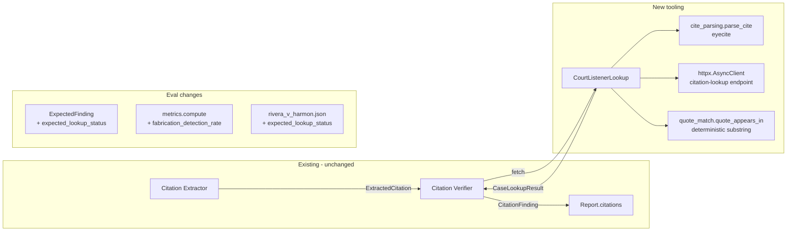
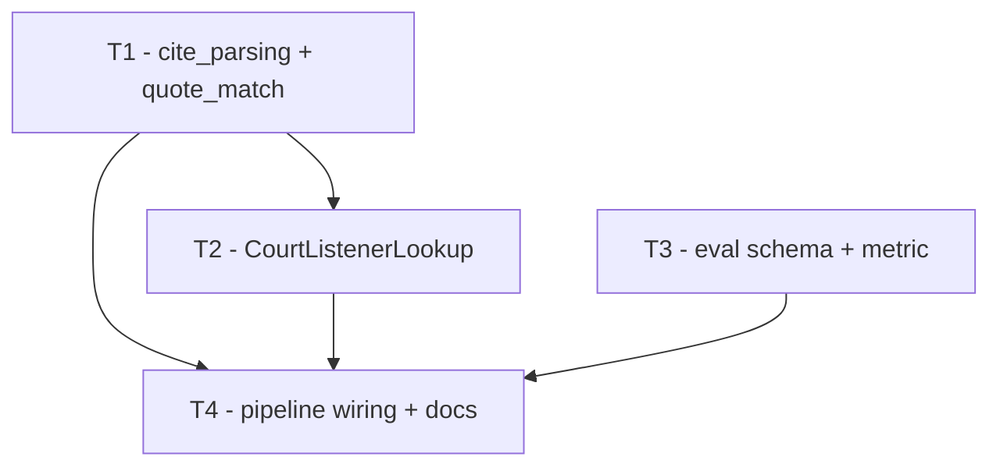

# Plan: Real Case Citation Checker (CourtListener)

**Status:** In Progress
**Owner:** Stefano
**Created:** 2026-05-02

## 1. Specification

### Goal
Replace the parametric "ask the LLM what it remembers" lookup with a real case-law lookup backed by CourtListener. Fabricated citations should resolve to `not_found` -> `could_not_verify` with a real source URL in the report. Real cases with doctored verbatim quotes should resolve to `unsupported`/`contradicted` because the verifier sees actual opinion text and a deterministic `quoted_text_match` flag.

This is the missing piece between "we have an interface for case-law lookup" and "we actually check the cited cases". It moves the citation pillar of the pipeline from parametric guesswork to a verifiable external source.

### Tier impact (per README)
- Tier 1 - "assess whether the cited authority actually supports the proposition" - currently relies on the model's training data. After this plan, the verifier judges against fetched holding text. Tier 1 graduates from "best-effort" to "actually checked".
- Tier 2 - new eval metric (`fabrication_detection_rate`) and new schema field (`expected_lookup_status`). Honest measurement of fabricated-cite catch rate.

### In scope
- New `CourtListenerLookup` implementing `CaseLawLookup` (Protocol unchanged).
- `eyecite` for citation parsing (volume / reporter / page / year). New dep.
- CourtListener REST API calls via `httpx.AsyncClient` (no auth; free unauth tier).
- Holding-text strategy: prefer CL's `headnote` -> `summary` -> `syllabus` (whichever is present and non-empty) -> first ~2000 chars of opinion plain text.
- Deterministic `quoted_text_match` substring check with light normalization (whitespace collapse, smart-quote -> straight-quote, hyphen variants).
- `pipeline.py` swaps `ParametricLLMLookup()` for `CourtListenerLookup()` as the only lookup wired into `run_pipeline`. `ParametricLLMLookup` stays in `agents/tools/case_lookup.py` as a reference / unit-test tool but is no longer imported by the pipeline.
- Eval gold-standard schema gains an optional `expected_lookup_status: list[Literal["found", "not_found", "ambiguous", "lookup_failed"]]` field on `ExpectedFinding`. When set, the actual finding's `lookup.lookup_status` must be one of the listed statuses to count as a true positive.
- New eval metric: `fabrication_detection_rate` - of expected findings whose `expected_lookup_status` includes `not_found`, what fraction of matched actual findings have `lookup_status == "not_found"`. Reported per-case and aggregate, appended to `history.jsonl`.
- `rivera_v_harmon.json` updated: every fabricated cite gets `expected_lookup_status: ["not_found"]`, the Privette quote-doctoring entry gets `expected_lookup_status: ["found"]`.
- New unit-test fixture `mock_lookup` in `conftest.py` for tests that need a fake `CaseLawLookup`.
- README + AGENTS.md updates: how to run, what it costs, what fails when offline.
- `httpx` and `eyecite` added to `requirements.txt`.

### Out of scope
- On-disk caching of CL responses. Skipped per direction. Eval reproducibility comes from the small case set + CL's stable IDs; if it bites us, add it later.
- Authenticated CL tier. We use the free unauth endpoint until rate limits force the issue.
- A `ChainedLookup` fallback. The new lookup replaces parametric outright. There is no "try CourtListener, fall back to parametric" code path. (We keep `ParametricLLMLookup` in the tree for tests/reference only.)
- Westlaw, Lexis, Caselaw Access Project, Google Scholar.
- Parallel-cite handling. We take the first parsed cite per `ExtractedCitation`.
- An LLM-driven holding extractor (Option C from Phase 1). The headnote-first strategy is v1.
- Touching the `CaseLookupResult` Pydantic shape - it already has every field we need (`source_url`, `lookup_status`, `quoted_text_match`, `notes`, `holding_text`).
- Touching the verifier prompt - it already says "treat holding_text as the source of truth" and folds quote-accuracy in.
- Touching the `crossdoc_checker` or `claim_extractor` - this plan is citation-only.
- Frontend changes. The existing UI already renders `lookup.source_url` and `lookup.lookup_status` if present in the report, and that's enough for v1.

### Acceptance criteria for the whole plan
- [ ] `cd backend && python -m evals.run --report-out /tmp/eval.json` runs end-to-end against the live Rivera case with `CourtListenerLookup` and finishes without partial failures from the lookup step (network permitting).
- [ ] In the eval report, every fabricated cite in `rivera_v_harmon.json` has actual `lookup.lookup_status == "not_found"` and `lookup.source_url is None`.
- [ ] `Privette v. Superior Court` resolves with `lookup.lookup_status == "found"` and a non-null `lookup.source_url` pointing at courtlistener.com. The verdict on that finding is one of `unsupported` / `contradicted`.
- [ ] `fabrication_detection_rate >= 0.9` on the Rivera case (8 of 8 fabricated cites caught is the goal; we set the floor at 0.9 to absorb one CL miss).
- [x] Unit tests pass: `cd backend && pytest -q`. No test in the suite hits the network.
- [x] No `import` of `ParametricLLMLookup` exists in `pipeline.py`. Grep-enforced in the verification plan.
- [x] `requirements.txt` lists `httpx` and `eyecite`.
- [x] README has a "Citation lookup" subsection explaining the unauth CL dependency, what `not_found` means, and how to disable network in dev (env var, see T2).

### Data contracts

```python
# backend/agents/tools/cite_parsing.py - new
@dataclass(frozen=True)
class ParsedCite:
    volume: int
    reporter: str        # canonicalized (eyecite reporter key, e.g. "F.3d", "Cal.4th")
    page: int
    year: int | None
    raw: str             # the original cite string, kept for logging

def parse_cite(cite: str) -> ParsedCite | None: ...
# Returns None if eyecite finds no full case citation.

# backend/agents/tools/quote_match.py - new
def normalize(text: str) -> str: ...
# Lowercase, collapse runs of whitespace to single space, replace smart quotes
# (‘ ’ “ ”) with straight quotes, replace en/em dashes with
# hyphen, strip leading/trailing whitespace.

def quote_appears_in(quote: str, opinion_text: str) -> bool: ...
# True iff normalize(quote) is a substring of normalize(opinion_text).

# backend/agents/tools/courtlistener_lookup.py - new
class CourtListenerLookup:
    def __init__(
        self,
        *,
        client: httpx.AsyncClient | None = None,
        base_url: str = "https://www.courtlistener.com",
        timeout_s: float = 15.0,
    ) -> None: ...

    async def fetch(self, citation: ExtractedCitation) -> CaseLookupResult:
        # 1. parse_cite(citation.cite) -> ParsedCite | None
        #    None -> CaseLookupResult(lookup_status="not_found", notes="cite did not parse")
        # 2. GET /api/rest/v3/citation-lookup/?volume=...&reporter=...&page=...
        #    HTTP error / timeout / connection error -> lookup_status="lookup_failed"
        #    0 results -> lookup_status="not_found"
        #    >1 results -> lookup_status="ambiguous", notes lists the cluster ids
        #    1 result  -> step 3
        # 3. From the matched cluster, pick the holding_text:
        #    headnote -> summary -> syllabus -> first 2000 chars of plain_text
        #    (concatenate plain_text from sub-opinions if cluster has them)
        # 4. quoted_text_match:
        #    citation.quoted_language is None -> None
        #    else -> quote_appears_in(citation.quoted_language, opinion_text)
        # 5. Return CaseLookupResult(
        #        found=True,
        #        canonical_cite=cluster.citation_string,
        #        holding_text=holding_text,
        #        quoted_text_match=quoted_text_match,
        #        source_url=cluster.absolute_url -> "https://www.courtlistener.com" + path,
        #        lookup_status="found",
        #        notes=None,
        #    )
```

We also extend the eval label schema:

```python
# backend/evals/labels.py - additive
class ExpectedFinding(BaseModel):
    # ...existing fields...
    expected_lookup_status: list[
        Literal["found", "not_found", "ambiguous", "lookup_failed"]
    ] = Field(default_factory=list)
    # When non-empty, the actual finding's lookup.lookup_status must be in this
    # list to count as a TP. When empty, behaves exactly as today.
```

### Open questions
- **CL response shape volatility.** The CL REST v3 `citation-lookup` endpoint returns clusters with nested `opinions[]`. T1's subagent must hit the endpoint once during exploration to lock the field path (`absolute_url` vs `resource_uri`, `headnote` vs `headnotes`, etc) and pin the response with a `pytest` fixture. Treating this as a known unknown rather than a blocker.
- **Rate limits.** Free unauth tier is 5000 req/day, no documented per-second cap. The Rivera case has ~10 cites; we're far from the ceiling. If a future case has hundreds, we revisit. Not solving today.
- **Encoded vs plain reporter keys.** eyecite returns canonical reporter keys ("F.3d") - CL accepts the same in URL params. If a future cite uses a non-standard abbreviation eyecite can't normalize, it returns `None` and we treat as `not_found`. Acceptable.
- **CL flakiness on a given run.** Without a cache, a transient 5xx on the day of the eval will inflate `lookup_failed` count and tank `fabrication_detection_rate`. We accept that for v1; if it bites in practice, the fix is the cache (which we explicitly skipped).

## 2. Architecture



The verifier's contract with the lookup is unchanged - it still gets a `CaseLookupResult`, decides `could_not_verify` from `lookup_status`, and otherwise calls the LLM with `holding_text`. The change is entirely under the lookup boundary plus an additive eval-schema field.

## 3. Tasks

Each task is independently buildable, ≤500 LOC, and has a self-contained subagent prompt.

### T1 - Citation parsing + quote matching (deterministic helpers)
- **Description:** Two pure-Python modules under `backend/agents/tools/` - `cite_parsing.py` (eyecite wrapper) and `quote_match.py` (text normalization + substring check). No network. Both exposed for use by T2 and reusable in tests.
- **Files to create/modify:**
  - Create `backend/agents/tools/cite_parsing.py`
  - Create `backend/agents/tools/quote_match.py`
  - Create `backend/tests/test_agents/test_cite_parsing.py`
  - Create `backend/tests/test_agents/test_quote_match.py`
  - Modify `backend/requirements.txt` (add `eyecite`)
- **How:**
  - `parse_cite(cite_str)` calls `eyecite.get_citations(cite_str)`, takes the first `FullCaseCitation` if any, extracts `groups["volume"]`, `groups["reporter"]`, `groups["page"]`, `metadata.year`. Returns frozen `ParsedCite` or `None`.
  - `normalize(text)` does: `.lower()` -> map smart quotes to `'`/`"` -> map en/em dashes (–, —) to `-` -> `re.sub(r"\s+", " ", text)` -> `.strip()`.
  - `quote_appears_in(quote, opinion_text)` returns `normalize(quote) in normalize(opinion_text)` (after early-out if `quote` is empty).
  - Test cases: real Privette cite parses correctly; the fabricated `Whitmore v. Delgado Scaffolding Co., 334 F. Supp. 2d 1189` parses to volume 334 / reporter `F. Supp. 2d` / page 1189 (we want fabrications to parse - that's how CL says "no match"); a clearly malformed string returns `None`. Quote match handles smart-quote-to-straight-quote, line breaks inside quoted text, missing trailing periods.
- **Acceptance criteria:**
  - [x] `parse_cite("Privette v. Superior Court, 5 Cal.4th 689 (1993)")` returns `ParsedCite(volume=5, reporter="Cal.4th", page=689, year=1993, raw=...)` (the exact reporter string can be eyecite's canonical form - lock it from the test once we see what eyecite emits, and keep that as the contract).
  - [x] `parse_cite("Smith v. Jones")` (no reporter) returns `None`.
  - [x] `quote_appears_in("A hirer is never liable", "...A hirer is never liable for...")` returns `True`.
  - [x] `quote_appears_in("a hirer’s general control", "A hirer's general control suffices")` returns `True` (smart-quote normalization).
  - [x] `quote_appears_in("totally absent text", "...the actual opinion...")` returns `False`.
  - [x] Tests pass: `cd backend && pytest tests/test_agents/test_cite_parsing.py tests/test_agents/test_quote_match.py -q`
- **Depends on:** none
- **Estimated LOC:** ~150 (impl + tests)
- **Subagent prompt:**
  > You are implementing T1 (citation parsing + quote matching) in the BS Detector repo at `/home/stefano/stefanostamato/lh-ai-fs`.
  > Read `AGENTS.md` and `ARCHITECTURE.md` first. Follow them strictly, including the writing style (no emdashes, talk like a person, default to no comments).
  >
  > **TDD is mandatory:**
  > 1. Write failing tests for the acceptance criteria below in `backend/tests/test_agents/test_cite_parsing.py` and `backend/tests/test_agents/test_quote_match.py`. Run them, confirm red.
  > 2. Implement the minimum code to pass. Run tests, confirm green.
  > 3. Refactor if the result violates AGENTS.md (no dead code, no premature abstraction).
  > 4. Re-run tests after refactor.
  >
  > **Files you may touch:**
  > - `backend/agents/tools/cite_parsing.py` (create)
  > - `backend/agents/tools/quote_match.py` (create)
  > - `backend/tests/test_agents/test_cite_parsing.py` (create)
  > - `backend/tests/test_agents/test_quote_match.py` (create)
  > - `backend/requirements.txt` (add `eyecite`)
  > Don't modify anything else.
  >
  > **You must not:** mock the LLM (this task has no LLM calls), make HTTP requests, introduce dependencies beyond `eyecite`, or touch files belonging to other tasks.
  >
  > **Implementation notes:**
  > - `cite_parsing.py` exposes `ParsedCite` (frozen dataclass: `volume: int`, `reporter: str`, `page: int`, `year: int | None`, `raw: str`) and `parse_cite(cite: str) -> ParsedCite | None`.
  > - Use `eyecite.get_citations(cite)`. Take the first result that is a `FullCaseCitation`. Extract from `c.groups["volume"]`, `c.groups["reporter"]`, `c.groups["page"]`, `c.metadata.year`. Convert volume and page to `int`; if either fails, return `None`.
  > - `quote_match.py` exposes `normalize(text: str) -> str` and `quote_appears_in(quote: str, opinion_text: str) -> bool`.
  > - `normalize`: lowercase, replace `‘ ’ ‚ ‛ ′` with `'`, replace `“ ” „ ‟ ″` with `"`, replace `– — −` with `-`, replace runs of whitespace (incl. newlines) with single space, strip.
  > - `quote_appears_in("", _)` returns `False`. Otherwise `normalize(quote) in normalize(opinion_text)`.
  > - First eyecite import will pull in `reporters_db`. That's expected.
  >
  > **Acceptance criteria (verbatim):**
  > - `parse_cite("Privette v. Superior Court, 5 Cal.4th 689 (1993)")` returns a `ParsedCite` with `volume=5`, `page=689`, `year=1993`. Reporter string is whatever eyecite emits canonically; the test asserts whatever value you observed once you ran eyecite. (Pin it from the test, document it as the contract.)
  > - `parse_cite("Smith v. Jones")` returns `None`.
  > - `quote_appears_in("A hirer is never liable", "...A hirer is never liable for...")` returns `True`.
  > - `quote_appears_in("a hirer’s general control", "A hirer's general control suffices")` returns `True`.
  > - `quote_appears_in("totally absent text", "the actual opinion")` returns `False`.
  > - Tests pass via `cd backend && pytest tests/test_agents/test_cite_parsing.py tests/test_agents/test_quote_match.py -q`.
  >
  > Report back: list of files changed, test command output (last 20 lines), the canonical reporter string eyecite emitted for the Privette cite, any open issues.

### T2 - CourtListenerLookup implementation
- **Description:** `CourtListenerLookup` class implementing `CaseLawLookup`. Takes an `httpx.AsyncClient` (constructable internally if not passed), parses the cite via T1's helper, calls CL's `citation-lookup` endpoint, builds `CaseLookupResult` from the response. Quote-match runs on the fetched opinion text. Tests mock the HTTP layer with `respx` (or hand-rolled monkeypatching - prefer monkeypatching the `httpx.AsyncClient.get` if `respx` adds a dep we don't want).
- **Files to create/modify:**
  - Create `backend/agents/tools/courtlistener_lookup.py`
  - Create `backend/tests/test_agents/test_courtlistener_lookup.py`
  - Modify `backend/requirements.txt` (add `httpx`)
- **How:**
  - One method: `async def fetch(self, citation: ExtractedCitation) -> CaseLookupResult`.
  - First: `parsed = parse_cite(citation.cite)`. If `None`, return `CaseLookupResult(found=False, lookup_status="not_found", notes="cite did not parse", canonical_cite=None, holding_text=None, quoted_text_match=None, source_url=None)`.
  - Second: GET `/api/rest/v3/citation-lookup/` with query params `volume`, `reporter`, `page` (and optional `year` if available). Wrap in `try/except (httpx.HTTPError, asyncio.TimeoutError, json.JSONDecodeError)` -> `lookup_status="lookup_failed"`, no notes (we already log the cite). 5xx and 4xx both map to `lookup_failed`.
  - Third: parse the response. CL returns a list of clusters. 0 -> `not_found`. >1 -> `ambiguous`, `notes=f"{len(clusters)} clusters matched"`, no holding (the verifier will downgrade to `could_not_verify`). 1 -> proceed.
  - Fourth: pick `holding_text`. Order: `cluster.headnote`, `cluster.summary`, `cluster.syllabus`, then concat `opinion.plain_text` from `cluster.sub_opinions[]` and take first 2000 chars. If nothing usable, `lookup_status` stays `found` but `holding_text=None` - the verifier already handles "found with no holding" as `could_not_verify` (see `citation_verifier.py` line 82-92).
  - Fifth: `quoted_text_match`. If `citation.quoted_language` is None, leave as None. Else `quote_appears_in(citation.quoted_language, full_opinion_text)` where `full_opinion_text` is the concatenation of all `sub_opinions[].plain_text` (the holding extract is just for the LLM; quote-match needs the whole opinion).
  - Sixth: build `source_url` as `f"{base_url}{cluster.absolute_url}"` if `absolute_url` is present, else `None`. `canonical_cite` from `cluster.citation_string` if present, else None.
  - Make HTTP base URL and timeout constructor params; default to `https://www.courtlistener.com` and 15s. Don't pass an API key.
  - Tests use `monkeypatch.setattr` to replace the lookup's `_http_get` (a small private method) with a fake async returning prebuilt JSON. This avoids adding `respx`.
  - Lock the CL response shape from one real probe: the first time T2 runs, the subagent sends one real GET to record an actual response into a fixture file under `backend/tests/test_agents/fixtures/courtlistener_<cite_slug>.json`. Tests load those fixtures. This is the only network call and only happens during T2 development - not in CI.
- **Acceptance criteria:**
  - [x] `await CourtListenerLookup().fetch(<unparsable cite>)` returns `lookup_status="not_found"` without making a network call (verified by mocking `_http_get` to raise `RuntimeError` and asserting it wasn't called).
  - [x] On a fixture for `Privette v. Superior Court, 5 Cal.4th 689 (1993)` returning a single cluster with `headnote`, fetch returns `lookup_status="found"`, `holding_text == cluster.headnote`, `source_url` startswith `"https://www.courtlistener.com"`, `quoted_text_match` reflects whether the test quote is in the cluster's opinion text.
  - [x] On a fixture returning 0 clusters, fetch returns `lookup_status="not_found"`, `holding_text=None`, `source_url=None`.
  - [x] On a fixture returning 2 clusters, fetch returns `lookup_status="ambiguous"`, `holding_text=None`, `notes` mentions cluster count.
  - [x] When `_http_get` raises `httpx.HTTPError`, fetch returns `lookup_status="lookup_failed"`.
  - [x] When the cluster has no `headnote`/`summary`/`syllabus` but has `sub_opinions[].plain_text`, `holding_text` is the first 2000 chars of the concatenated plain_text.
  - [x] No test in this file makes a real network call. (`pytest -q` runs offline.)
  - [x] Tests pass: `cd backend && pytest tests/test_agents/test_courtlistener_lookup.py -q`
  - **Note:** CL's v3 `citation-lookup` endpoint now requires auth, so the implementation hits `/api/rest/v4/search/?type=o&citation=...` and post-filters results by exact normalized cite match. With the filter, Privette resolves to a single matching cluster as expected.
- **Depends on:** T1
- **Estimated LOC:** ~250 (impl + tests + fixtures)
- **Subagent prompt:**
  > You are implementing T2 (CourtListenerLookup) in the BS Detector repo at `/home/stefano/stefanostamato/lh-ai-fs`. T1 (cite_parsing + quote_match) is complete; their modules live at `backend/agents/tools/cite_parsing.py` and `backend/agents/tools/quote_match.py`.
  > Read `AGENTS.md` and `ARCHITECTURE.md` first. Follow them strictly, including the writing style.
  >
  > **TDD is mandatory:**
  > 1. Write failing tests for the acceptance criteria below in `backend/tests/test_agents/test_courtlistener_lookup.py`. Run them, confirm red.
  > 2. Capture one real CL response by calling `https://www.courtlistener.com/api/rest/v3/citation-lookup/?volume=5&reporter=Cal.4th&page=689` (or whatever eyecite produces for Privette) ONCE during development to lock the field shape. Save the response under `backend/tests/test_agents/fixtures/courtlistener_privette.json`. Build all other test fixtures by hand from this template - 0-cluster, 2-cluster, no-headnote, etc.
  > 3. Implement to pass. Run tests, confirm green.
  > 4. Refactor.
  > 5. Re-run.
  >
  > **Files you may touch:**
  > - `backend/agents/tools/courtlistener_lookup.py` (create)
  > - `backend/tests/test_agents/test_courtlistener_lookup.py` (create)
  > - `backend/tests/test_agents/fixtures/courtlistener_*.json` (create)
  > - `backend/requirements.txt` (add `httpx`)
  > Don't modify anything else.
  >
  > **You must not:** modify the verifier, the pipeline, the parametric lookup, schemas, eval files, frontend, or anything in T1's files. Don't add `respx` (use monkeypatch). Don't make a real network call from any committed test. The single dev-time probe is for fixture capture only.
  >
  > **Implementation notes:**
  > - Class name `CourtListenerLookup`. Implements `CaseLawLookup` Protocol from `agents/tools/case_lookup.py`. Constructor: `(self, *, client: httpx.AsyncClient | None = None, base_url: str = "https://www.courtlistener.com", timeout_s: float = 15.0)`.
  > - One public method `async def fetch(self, citation: ExtractedCitation) -> CaseLookupResult`.
  > - Internal helper `async def _http_get(self, path: str, params: dict[str, str | int]) -> dict | list`. Tests monkeypatch this.
  > - Field-path map (lock from your fixture probe; document deviations in your report):
  >   - cluster list at the top of the response (or under `results` - confirm)
  >   - per-cluster: `headnote`, `summary`, `syllabus`, `citation_string`, `absolute_url`, `sub_opinions` (list of opinions with `plain_text`)
  > - `holding_text` selection: first non-empty of `cluster.headnote`, `cluster.summary`, `cluster.syllabus`, else first 2000 chars of joined `opinion.plain_text` from `sub_opinions`. Strip whitespace at end.
  > - `quote_appears_in` (from T1) takes the FULL opinion text (all sub_opinions joined), not the truncated holding_text.
  > - All exceptions during HTTP go through one `try/except (httpx.HTTPError, asyncio.TimeoutError, json.JSONDecodeError)` -> `lookup_failed`. Don't catch bare `Exception`.
  > - Don't read `OPENAI_API_KEY` or any other secret. CL is unauth.
  >
  > **Acceptance criteria (verbatim):**
  > - `await CourtListenerLookup().fetch(<unparsable cite>)` returns `lookup_status="not_found"` without making a network call.
  > - On a fixture for Privette returning a single cluster with `headnote`, fetch returns `lookup_status="found"`, `holding_text == cluster.headnote`, `source_url` startswith `"https://www.courtlistener.com"`.
  > - On a fixture returning 0 clusters, fetch returns `lookup_status="not_found"`, `holding_text=None`, `source_url=None`.
  > - On a fixture returning 2 clusters, fetch returns `lookup_status="ambiguous"`, `holding_text=None`, `notes` mentions cluster count.
  > - When `_http_get` raises `httpx.HTTPError`, fetch returns `lookup_status="lookup_failed"`.
  > - When the cluster has no `headnote`/`summary`/`syllabus` but has `sub_opinions[].plain_text`, `holding_text` is the first 2000 chars of the concatenated plain_text.
  > - No committed test makes a real network call.
  > - Tests pass via `cd backend && pytest tests/test_agents/test_courtlistener_lookup.py -q`.
  >
  > Report back: list of files changed, test command output (last 20 lines), the actual CL response field-path map you observed during the probe (which fields exist, their paths), any open issues.

### T3 - Eval label schema + new metric
- **Description:** Add optional `expected_lookup_status` to `ExpectedFinding`, plumb it through the matcher (substring + verdict + lookup_status all required when set), add `fabrication_detection_rate` to `Metrics`, update the eval runner's history line, update `rivera_v_harmon.json`.
- **Files to create/modify:**
  - Modify `backend/evals/labels.py` (add field)
  - Modify `backend/evals/metrics.py` (use new field; add `fabrication_detection_rate`)
  - Modify `backend/evals/run.py` (history line + verbose report formatting)
  - Modify `backend/evals/cases/rivera_v_harmon.json` (add field on relevant entries)
  - Modify `backend/tests/test_evals.py` (cover new field + metric)
- **How:**
  - `ExpectedFinding.expected_lookup_status: list[Literal["found","not_found","ambiguous","lookup_failed"]] = Field(default_factory=list)`. Empty list = field unused (back-compat with cases that don't set it).
  - `_match_expected_finding` adds: `if expected.expected_lookup_status and (not isinstance(finding, CitationFinding) or finding.lookup.lookup_status not in expected.expected_lookup_status): return False`. Only runs for citation findings - consistency findings have no `lookup`.
  - Add to `Metrics`: `fabrication_detection_rate: float`. Computed as: of expected findings whose `expected_lookup_status` includes `"not_found"`, what fraction matched an actual finding with `lookup.lookup_status == "not_found"`. If no such expected findings exist, return 1.0 (no signal).
  - Update `_aggregate` to roll the new metric (TP/total per case, summed).
  - Update `_format_metrics` to print it.
  - Update `_append_history` to include it.
  - Update `EvalAggregate` in `evals/report.py` if it has metric fields (check; if it just stores `Metrics` dicts, no change).
  - In `rivera_v_harmon.json`: every entry whose `note` says "Fabricated" gets `"expected_lookup_status": ["not_found"]`. Privette gets `"expected_lookup_status": ["found"]`.
  - Tests: a labeled fabricated cite where the actual finding has `lookup_status="not_found"` is a TP and contributes to `fabrication_detection_rate`. Same label where actual is `"found"` is an FP. A label with no `expected_lookup_status` behaves identically to today.
- **Acceptance criteria:**
  - [x] `CaseLabels.model_validate(rivera_v_harmon.json)` succeeds.
  - [x] An expected finding with `expected_lookup_status=["not_found"]` matched against an actual citation finding with `lookup.lookup_status="not_found"` and matching verdict and substring counts as a TP.
  - [x] Same label matched against an actual finding with `lookup.lookup_status="found"` does NOT count as a TP - falls through to substring-only FP per existing precedence.
  - [x] `Metrics.fabrication_detection_rate` exists and computes correctly: 1.0 when no fabrication labels, `tp/total` otherwise.
  - [x] `_aggregate` rolls the new metric across cases.
  - [x] `history.jsonl` lines include the new metric field.
  - [x] Tests pass: `cd backend && pytest tests/test_evals.py -q`.
- **Depends on:** none (independent of T1 and T2 - both only touch eval code paths)
- **Estimated LOC:** ~200 (impl + tests, gold-standard JSON edits)
- **Subagent prompt:**
  > You are implementing T3 (eval schema + metric for fabrication detection) in the BS Detector repo at `/home/stefano/stefanostamato/lh-ai-fs`.
  > Read `AGENTS.md` and `ARCHITECTURE.md` first. Follow them strictly. The eval code is at `backend/evals/`.
  >
  > **TDD is mandatory:**
  > 1. Write failing tests in `backend/tests/test_evals.py` for: (a) the new field validates on `rivera_v_harmon.json`, (b) match logic respects `expected_lookup_status`, (c) `fabrication_detection_rate` computes correctly. Confirm red.
  > 2. Implement to pass. Confirm green.
  > 3. Refactor.
  > 4. Re-run.
  >
  > **Files you may touch:**
  > - `backend/evals/labels.py`
  > - `backend/evals/metrics.py`
  > - `backend/evals/run.py`
  > - `backend/evals/cases/rivera_v_harmon.json`
  > - `backend/tests/test_evals.py`
  > Don't modify anything else. In particular, do NOT touch the pipeline, agents, schemas (the main `schemas.py`), or tools.
  >
  > **You must not:** add new dependencies, change existing field names, break existing eval cases, mock the LLM (no LLM here).
  >
  > **Implementation notes:**
  > - `ExpectedFinding.expected_lookup_status: list[Literal["found","not_found","ambiguous","lookup_failed"]] = Field(default_factory=list)`. Empty -> field unused.
  > - In `metrics._match_expected_finding`, after the existing verdict + evidence_doc checks, add: if `expected.expected_lookup_status` is non-empty and finding is a `CitationFinding`, require `finding.lookup.lookup_status in expected.expected_lookup_status`. If finding is not a citation, the check is a no-op (consistency findings have no lookup).
  > - Add `fabrication_detection_rate: float` to the `Metrics` dataclass. Compute in `compute()`: count expected findings whose `expected_lookup_status` includes `"not_found"`; of those, count how many were claimed as TP (matched_ef set entries) by an actual finding whose `lookup.lookup_status == "not_found"`. Rate = matched / total, or 1.0 if total == 0.
  > - To compute the rate, the matcher needs to surface which actual finding claimed which expected slot. Easiest: have `_classify_one` return the actual finding's `lookup_status` alongside its classification when it's a citation TP, and accumulate in `compute`.
  > - In `_aggregate`, sum the matched/total separately across cases and recompute the ratio.
  > - In `_format_metrics`, add a line: `fabrication_detection: {m.fabrication_detection_rate:.2f}`.
  > - In `_append_history`, add `"fabrication_detection_rate": m.fabrication_detection_rate`.
  > - In `rivera_v_harmon.json`: every entry whose note begins with "Fabricated" gets `"expected_lookup_status": ["not_found"]`. The Privette entry gets `"expected_lookup_status": ["found"]`. (See the file's existing `note` field to identify which entries.)
  > - `CaseLabels` already has `model_config = ConfigDict(extra="forbid")` - the new field is additive on `ExpectedFinding`, that's fine.
  > - Don't change the floor / ceiling constants (`RECALL_FLOOR`, `HALLUCINATION_CEILING`).
  >
  > **Acceptance criteria (verbatim):**
  > - `CaseLabels.model_validate(json.loads(rivera_v_harmon.json))` succeeds.
  > - An expected finding with `expected_lookup_status=["not_found"]` matched against an actual citation finding with `lookup.lookup_status="not_found"` and matching verdict and substring counts as a TP.
  > - Same label matched against an actual citation finding with `lookup.lookup_status="found"` does NOT count as a TP.
  > - `Metrics.fabrication_detection_rate` returns 1.0 when there are no fabrication labels, else matched/total.
  > - `_aggregate` rolls the metric across cases.
  > - `history.jsonl` lines include `fabrication_detection_rate`.
  > - All existing eval tests still pass.
  > - Tests pass via `cd backend && pytest tests/test_evals.py -q`.
  >
  > Report back: list of files changed, test command output (last 20 lines), any open issues.

### T4 - Pipeline wiring + mock_lookup fixture + docs
- **Description:** Swap `ParametricLLMLookup()` -> `CourtListenerLookup()` in `pipeline.py`. Add a `mock_lookup` pytest fixture. Update README and AGENTS.md. Confirm `ParametricLLMLookup` is still importable from `agents/tools/case_lookup.py` but not imported anywhere outside its own tests.
- **Files to create/modify:**
  - Modify `backend/pipeline.py` (one-line lookup swap; remove `ParametricLLMLookup` import)
  - Modify `backend/tests/conftest.py` (add `mock_lookup` fixture)
  - Modify `backend/tests/test_pipeline.py` (use the new fixture; verify the pipeline does not crash if `CourtListenerLookup.fetch` returns each of the four `lookup_status` values - reuses existing test_pipeline patterns)
  - Modify `README.md` (Citation lookup subsection)
  - Modify `AGENTS.md` (one-line note: CourtListener is the live lookup; ParametricLLMLookup is reference only)
- **How:**
  - `pipeline.py`: change `from agents.tools.case_lookup import CaseLawLookup, ParametricLLMLookup` -> `from agents.tools.case_lookup import CaseLawLookup` plus `from agents.tools.courtlistener_lookup import CourtListenerLookup`. Change `lookup = ParametricLLMLookup()` -> `lookup = CourtListenerLookup()`.
  - `mock_lookup` fixture: similar shape to `mock_llm`. Returns a `CaseLawLookup`-shaped object whose `fetch` is configurable per-cite (a dict `{cite_substring: CaseLookupResult}` or a callable). Used by tests that exercise the verifier or the pipeline without hitting the network.
  - Update existing pipeline tests that previously injected `ParametricLLMLookup` via a `mock_llm` (search for "case lookup" / "ParametricLLMLookup" in the tests and refit to use `mock_lookup`). Most pipeline tests probably mock the verifier directly; only a few will need to change.
  - README addition under a new "## Citation lookup" subsection: explain we use CourtListener's free unauth tier, what `not_found` means in the report, that there is no API key to set, and that running `python -m evals.run` requires an internet connection.
  - AGENTS.md addition: short note in `### Test fixtures` referencing `mock_lookup` for tests that need a fake `CaseLawLookup`.
- **Acceptance criteria:**
  - [x] `grep -n ParametricLLMLookup backend/pipeline.py` returns no matches.
  - [x] `grep -rn ParametricLLMLookup backend/` returns matches only inside `backend/agents/tools/case_lookup.py` and `backend/tests/test_agents/test_case_lookup.py`.
  - [x] `grep -n CourtListenerLookup backend/pipeline.py` returns one match.
  - [x] `mock_lookup` fixture exists and is usable in at least one rewired pipeline test.
  - [x] All pre-existing tests still pass: `cd backend && pytest -q`.
  - [x] README has a "Citation lookup" subsection.
- **Depends on:** T1, T2, T3 (T3 only because we want one green eval run with the new schema in place; in practice T4 doesn't import T3's code, but verifying together is cleaner)
- **Estimated LOC:** ~150 (mostly fixture + small test rewires + docs)
- **Subagent prompt:**
  > You are implementing T4 (pipeline wiring + mock_lookup + docs) in the BS Detector repo at `/home/stefano/stefanostamato/lh-ai-fs`. T1 (cite_parsing, quote_match), T2 (CourtListenerLookup), and T3 (eval schema + metric) are complete. Their modules are in place.
  > Read `AGENTS.md` and `ARCHITECTURE.md` first. Follow them strictly.
  >
  > **TDD is mandatory:**
  > 1. Write failing tests in `backend/tests/test_pipeline.py` that use the new `mock_lookup` fixture. Confirm red.
  > 2. Implement: add the fixture in `conftest.py`, swap the lookup in `pipeline.py`. Confirm green.
  > 3. Refactor.
  > 4. Re-run the full suite.
  >
  > **Files you may touch:**
  > - `backend/pipeline.py`
  > - `backend/tests/conftest.py`
  > - `backend/tests/test_pipeline.py`
  > - `README.md`
  > - `AGENTS.md`
  > Don't modify anything else.
  >
  > **You must not:** delete `ParametricLLMLookup` (it stays in `case_lookup.py` for reference and its own tests), make real network calls, add new dependencies, mock the LLM in a test that should be using `mock_lookup`.
  >
  > **Implementation notes:**
  > - In `pipeline.py`: change `from agents.tools.case_lookup import CaseLawLookup, ParametricLLMLookup` to `from agents.tools.case_lookup import CaseLawLookup` and add `from agents.tools.courtlistener_lookup import CourtListenerLookup`. Change `lookup = ParametricLLMLookup()` to `lookup = CourtListenerLookup()`.
  > - `mock_lookup` fixture: same factory pattern as `mock_llm`. Configure with a dict `{cite_substring: CaseLookupResult}` or a callable `(citation: ExtractedCitation) -> CaseLookupResult`. The fixture monkeypatches `CourtListenerLookup.fetch` so any pipeline-driven test gets the fake response without network. Returns the call list. At teardown, asserts the patched function was called at least once (mirror `mock_llm`).
  > - Search existing tests for "ParametricLLMLookup" or for places that pass a fake lookup to the pipeline. Rewire them to use `mock_lookup` if they previously hand-rolled a fake.
  > - README: add a `## Citation lookup` section between existing sections. State: we use CourtListener's free unauth tier; no API key needed; running `python -m evals.run` requires internet; if a cite isn't found in CL it reports as `not_found` -> the verifier emits `could_not_verify` with high confidence.
  > - AGENTS.md: in section 3 ("Test fixtures"), add one bullet referencing `mock_lookup` for tests that need a fake `CaseLawLookup`.
  > - Don't add a fallback to ParametricLLMLookup. The user explicitly said: replace, don't chain.
  >
  > **Acceptance criteria (verbatim):**
  > - `grep -n ParametricLLMLookup backend/pipeline.py` returns no matches.
  > - `grep -rn ParametricLLMLookup backend/` returns matches only inside `backend/agents/tools/case_lookup.py` and `backend/tests/test_agents/test_case_lookup.py`.
  > - `grep -n CourtListenerLookup backend/pipeline.py` returns one match.
  > - `mock_lookup` fixture exists in `backend/tests/conftest.py`.
  > - At least one pipeline test in `test_pipeline.py` uses `mock_lookup`.
  > - All pre-existing tests still pass: `cd backend && pytest -q`.
  > - README has a "## Citation lookup" subsection.
  >
  > Report back: list of files changed, test command output (last 20 lines), any open issues.

## 4. Dependency graph & execution waves



```
Wave 1 (parallel):  T1, T3
Wave 2:             T2 (needs T1)
Wave 3:             T4 (needs T1, T2, T3)
```

T1 and T3 touch disjoint files (helpers under `agents/tools/` vs eval modules), so they parallelize cleanly. T2 depends on T1 only. T4 is the integration step.

LOC budget: ~150 + 250 + 200 + 150 = ~750 LOC across four tasks. None over the 500-LOC ceiling individually.

## 5. Verification plan

`/verify` should pass when:

1. `cd backend && pytest -q` is fully green.
2. `grep -n ParametricLLMLookup backend/pipeline.py` returns nothing. `grep -rn ParametricLLMLookup backend/` only matches `case_lookup.py` and `test_case_lookup.py`.
3. `grep -n "CourtListenerLookup()" backend/pipeline.py` returns exactly one match.
4. `python -c "import httpx, eyecite; print(httpx.__version__, eyecite.__name__)"` runs without error after `pip install -r backend/requirements.txt`.
5. The eval runner accepts the updated case JSON: `cd backend && python -c "from evals.labels import CaseLabels; import json; CaseLabels.model_validate(json.load(open('evals/cases/rivera_v_harmon.json')))"` succeeds.
6. **One real eval run** (this is the live signal, costs real money + makes real CL requests): `cd backend && python -m evals.run --report-out /tmp/cl_eval.json`. The verbose report should show:
   - All 8 fabricated cites with `lookup.lookup_status == "not_found"` and `lookup.source_url is None`.
   - `Privette v. Superior Court` with `lookup.lookup_status == "found"` and a CL URL.
   - `fabrication_detection_rate >= 0.9`.
   - `recall >= 0.6`, `hallucination_rate <= 0.1` (existing floors still hold).
7. NOTES.md gets a manual-test entry from Stefano summarizing what was caught vs. what was missed (this is the human-in-the-loop signal that the change actually moved the product, not just the metrics).

## 6. Post-Build Refinements

(Empty - populated by /tweak after execution.)
