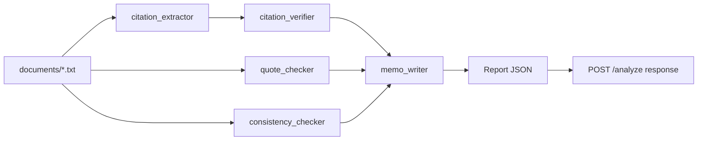

# ARCHITECTURE.md

How this repo is structured, where things go, and the patterns to follow when extending it. Read [AGENTS.md](AGENTS.md) first - this doc assumes those rules, including the writing style (no emdashes, talk like a person, mermaid for shape).

## 1. What exists today

The starting point is intentionally minimal:

```
lh-ai-fs/
├── README.md                  # Challenge brief
├── AGENTS.md                  # Code rules
├── ARCHITECTURE.md            # This file
├── NOTES.md                   # Stefano's running diary (gets fed by /write-notes)
├── docker-compose.yml         # Two services, hot-reload via volume mounts
├── .env.example               # OPENAI_API_KEY=...
├── .claude/                   # Slash commands and plans (committed - see README)
│   ├── commands/              # /plan, /execute, /tweak, /verify, /eval, /write-notes
│   └── plans/                 # Execution plans written by /plan
│
├── backend/                   # Python 3.11 + FastAPI on :8002
│   ├── Dockerfile
│   ├── entrypoint.sh          # pip install + uvicorn --reload
│   ├── requirements.txt       # fastapi, uvicorn, openai, python-dotenv
│   ├── main.py                # FastAPI app + POST /analyze (currently a TODO stub)
│   ├── llm.py                 # OpenAI client wrapper - the single seam for all LLM calls
│   └── documents/             # The four case-file documents
│       ├── motion_for_summary_judgment.txt
│       ├── police_report.txt
│       ├── medical_records_excerpt.txt
│       └── witness_statement.txt
│
└── frontend/                  # React 18 + Vite on :5175
    ├── Dockerfile
    ├── entrypoint.sh          # npm install + npm run dev
    ├── package.json
    ├── vite.config.js
    ├── index.html
    └── src/
        ├── main.jsx
        └── App.jsx            # Single-screen client: button -> POST /analyze -> render JSON
```

Runtime facts to keep in mind:
- Backend on `http://localhost:8002`, frontend on `http://localhost:5175`. CORS in [backend/main.py](backend/main.py) is wired to that exact frontend origin.
- `docker compose up --build` is the canonical run command. Both services hot-reload from host volume mounts.
- `OPENAI_API_KEY` is read from `.env` at the repo root (compose) or `backend/.env` (manual).
- `/analyze` already loads all `.txt` files in `backend/documents/` into a `dict[str, str]` keyed by stem. That's the pipeline's input.

## 2. Where new code goes

The layout below assumes a multi-agent pipeline. You don't need to create empty folders, but when you create a file of a given type, this is where it goes.

```
backend/
├── main.py                   # FastAPI routes only. Thin. No business logic.
├── llm.py                    # Single LLM client wrapper (sync + async). The ONLY place importing `openai`.
├── schemas.py                # Pydantic models for every cross-agent payload + the API response.
│                             # Split into schemas/<topic>.py if it grows past ~300 LOC.
│
├── agents/                   # One agent per file. Each exports a single callable.
│   ├── __init__.py
│   ├── citation_extractor.py
│   ├── citation_verifier.py
│   ├── quote_checker.py
│   ├── consistency_checker.py
│   └── memo_writer.py        # Tier 3: judicial memo. Clerk's voice, not advocate. Cannot upgrade verdicts.
│
├── pipeline.py               # Orchestrator. Wires agents together. Owns the dependency graph.
│                             # Knows about agents; agents do not know about it.
│
├── documents/                # Case file source documents (existing). Read by the pipeline.
│
├── evals/
│   ├── run.py                # Single-command entry point: `python -m evals.run`
│   ├── metrics.py            # Precision / recall / hallucination rate
│   ├── cases/                # Labeled gold-standard cases - one file per case
│   │   ├── citation_smith_v_jones.json
│   │   └── ...
│   ├── history.jsonl         # Append-only log of run results, used to spot regressions
│   └── README.md             # How to run, how to interpret, how to add cases
│
├── tests/
│   ├── conftest.py           # `mock_llm` fixture (the only sanctioned way to mock LLM calls)
│   ├── test_schemas.py       # Pydantic round-trips + validation rules
│   ├── test_agents/          # One test file per agent, mocks the llm.py boundary
│   └── test_pipeline.py      # End-to-end with mocked LLM
│
└── .env.example              # Existing
```

```
frontend/src/
├── main.jsx                  # Existing entry point
├── App.jsx                   # Top-level layout + route to report view
├── api/
│   └── analyze.js            # fetch wrapper for POST /analyze
└── components/               # When the UI grows past App.jsx, and only then
    ├── ReportView.jsx
    ├── FlagCard.jsx          # One flag (citation, quote, fact) with verdict + confidence + reasoning
    └── MemoSection.jsx
```

## 3. Architectural patterns

### 3.1 The pipeline at a glance



Each box is a single agent module. Each arrow is a typed Pydantic payload.

### 3.2 The pipeline is a function, not a framework

`backend/pipeline.py` exposes one async function. Call it `run_pipeline(documents: dict[str, str]) -> Report`. It composes agent calls. It does not implement a generic agent framework, a DAG executor, or a plugin system. We're shipping one pipeline, not a platform.

```python
# Sketch - actual signatures live in schemas.py
async def run_pipeline(documents: dict[str, str]) -> Report:
    citations = await extract_citations(documents["motion_for_summary_judgment"])
    verifications = await asyncio.gather(*[verify_citation(c) for c in citations])
    quotes = await check_quotes(documents["motion_for_summary_judgment"], citations)
    consistency = await check_consistency(documents)
    memo = await write_memo(verifications, quotes, consistency)
    return Report(...)
```

Parallelism comes from `asyncio.gather`. Not a custom scheduler. If the pipeline ever gets complex enough that this hurts, *then* introduce structure.

### 3.3 Agents are pure-ish functions of typed inputs to typed outputs

Each agent module defines:
- A **prompt constant or builder function** so it's testable and version-controlled.
- One **public function** that takes Pydantic input(s) and returns a Pydantic output.
- No file I/O. No HTTP. No knowledge of FastAPI or the pipeline. The only side effect is calling `llm.py`.

This is the seam that makes evals possible: `verify_citation(citation, source_text)` runs identically from a test, the pipeline, or the eval suite.

### 3.4 `llm.py` is the only place that imports `openai`

Every LLM call goes through `llm.py`. That gives us one place to:
- Swap models or add a fallback
- Add structured-output via `response_format` with a Pydantic schema
- Add retry-on-malformed-JSON
- Add token logging
- Mock in tests (via the `mock_llm` fixture, which patches `llm.call_llm`)

If you find yourself importing `openai` in an agent, stop and add the helper to `llm.py` instead.

### 3.5 Inter-agent contracts are Pydantic, not dicts

`schemas.py` is load-bearing. Every payload that crosses an agent boundary is a Pydantic model with `model_config = {"extra": "forbid"}`. Sketches (exact fields TBD by `/plan`):

- `TextSpan(document_id: str, start: int, end: int)` - document offsets, not vibes.
- `Citation(source_text: str, cite: str, proposition: str, span: TextSpan)`
- `CitationVerification(citation: Citation, verdict: Literal["supported", "contradicted", "unverified"], confidence: float, reasoning: str, evidence_quote: str | None, evidence_span: TextSpan | None)`
- `QuoteCheck(claimed_quote: str, claimed_span: TextSpan, source_span: TextSpan | None, verdict: ..., confidence: float, reasoning: str)`
- `ConsistencyFinding(claim: str, claim_span: TextSpan, contradicting_spans: list[TextSpan], verdict: ..., confidence: float, reasoning: str)`
- `JudicialMemo(text: str, top_findings: list[FindingRef])` - `FindingRef` points at a finding by id, never restates a verdict the verifier didn't make.
- `Report(citations: list[CitationVerification], quotes: list[QuoteCheck], consistency: list[ConsistencyFinding], memo: JudicialMemo, meta: ReportMeta)`

**Invariant: every finding is traceable to a source range.** Each finding type carries at least one `TextSpan` pointing at where in which document the claim lives, plus (when verified against a source) a span pointing at the supporting or contradicting text. A finding without a usable span is malformed and should fail validation - the UI's job is to let a judge click through to the document, and we can't do that without offsets.

Field order in finding models is deliberate: source ref first, then evidence, then verdict, then reasoning, then confidence. That's the order a judge scans. Schemas are read top-down; we mirror the human reading order.

Two consequences:
- The `/analyze` response schema is `Report.model_json_schema()`. One source of truth.
- Adding a field is a deliberate act. Update the schema, update the producing agent, update the consuming renderer. No silent dict-key drift.

### 3.6 Confidence, uncertainty, and verifiability are first-class

Every verdict carries a `confidence: float`, a `reasoning: str`, and a `TextSpan` that pins the claim to the source. "Unverified" is a real verdict, not an error. The eval suite measures hallucination rate by counting findings that don't have evidence in the source - so an agent that *can't* find evidence has to say so, not invent it.

A finding without a span is malformed - validation should reject it. The whole product premise (a judge trusts this because they can verify it in seconds) collapses if we let findings float free of the document.

### 3.6.1 Sycophancy across our own agents

Sycophancy is one of the BS modes named in the brief - and it's a risk *inside* our pipeline, not just in the documents we analyze. Two design rules to prevent it:

- **Downstream agents cannot upgrade upstream verdicts.** The memo writer sees `unverified` and may not turn it into `contradicted` in the prose. Verdict promotion is a schema-level invariant - assert it in tests.
- **Verifier agents do not see the extractor's confidence.** They re-derive their own confidence from the source. If we pipe upstream confidence forward, downstream agents anchor on it and the chain agrees with itself by default.

### 3.6.2 Impartiality

Learned Hand sits between adversaries. A pipeline that systematically over-flags one side erodes trust faster than missing flaws. The discipline is in two places:

- **Prompts treat both sides symmetrically.** No prompt mentions plaintiff or defense by name. Prompts say "the moving party's claim" and "the opposing record" - role labels, not parties.
- **Eval cases are paired where the data allows.** If we have a case where the MSJ misquotes a source, we want a paired case where a response brief misquotes a source. Aggregate metrics can hide one-sided suspicion; per-side breakdowns surface it.

For this take-home, the dataset is one MSJ - so impartiality is mostly a prompt-design discipline, not a measured metric. Note this as a design intent in the plan and call it out as a limitation in the reflection.

### 3.7 Evals are code, not vibes

`backend/evals/run.py` is a single-command entry point. The README mentions both `python -m evals.run` and `python run_evals.py` - pick one in the plan and document it. The runner:
1. Loads labeled cases from `evals/cases/`.
2. Runs the pipeline (or a single agent) on each, hitting real LLM APIs.
3. Computes precision, recall, hallucination rate via `evals/metrics.py`.
4. Prints a structured summary, per-case and aggregate.
5. Appends one line to `evals/history.jsonl` so future runs can diff.
6. Exits non-zero if metrics regress past a configured threshold, so it's CI-friendly.

`/eval` is the slash command that drives this. It does not mock - eval is the only place we use real LLMs in the test loop.

Eval cases are versioned JSON: input documents (or pointers to them), expected findings, and expected non-findings (negative cases matter for precision).

### 3.8 Test fixtures live in `tests/conftest.py`

Unit tests mock LLM calls via a single `mock_llm` fixture that patches `llm.call_llm` (and the async variant). Tests never reach into `openai.*` directly. Sketch:

```python
def test_extracts_citations(mock_llm):
    mock_llm({"extract citations": fixture_citations_json})
    result = await extract_citations("...motion text...")
    assert len(result) == 4
```

The fixture is keyed by a substring of the prompt so a single test can serve a multi-step pipeline call.

### 3.9 Frontend stays simple until it can't

`App.jsx` is one screen. When the report grows past a JSON dump:
1. Extract `ReportView` and per-section components into `src/components/`.
2. Move the `fetch` to `src/api/analyze.js`.
3. *Then* consider whether anything else (state library, router, styling system) is justified. For a single-screen tool, it usually isn't.

## 4. The shape of `POST /analyze`

Concrete enough to build to. The plan refines field names, this doc fixes the shape:

**Request:** no body today. If config sneaks in (e.g. which model to use), it goes in a body, not a query string.

**Response:** `Report` (Pydantic model). Roughly:

```json
{
  "citations": [
    {
      "claim_span": { "document_id": "motion_for_summary_judgment", "start": 1843, "end": 1922 },
      "cite": "Smith v. Jones, 123 F.3d 456 (9th Cir. 1999)",
      "proposition": "...",
      "evidence_quote": "...",
      "evidence_span": { "document_id": "police_report", "start": 401, "end": 488 },
      "verdict": "contradicted",
      "reasoning": "...",
      "confidence": 0.82
    }
  ],
  "quotes": [...],
  "consistency": [...],
  "memo": { "text": "...", "top_findings": [...] },
  "meta": {
    "model": "gpt-4o",
    "elapsed_ms": 12340,
    "token_usage": { "prompt": 12000, "completion": 1800 }
  }
}
```

Field order is the order a judge reads: claim location, evidence, verdict, reasoning, confidence. Every finding carries at least a `claim_span` and (when applicable) an `evidence_span`. The UI uses these to let the judge click straight into the document. Exact field names are decided in `/plan`. Typed, structured, uncertainty-aware, source-traceable - decided here.

## 5. Things this architecture deliberately doesn't have

- **A generic agent framework.** We're building one pipeline. LangChain / LlamaIndex / Autogen would obscure more than they help at this scope.
- **A database.** Documents live on disk. Reports aren't persisted. If we add persistence, it goes in one new module, not a sprinkled ORM.
- **A queue or worker pool.** `asyncio` handles concurrency; the workload is tiny.
- **A config system.** Constants live in module scope. Env vars go through `os.getenv` in `llm.py`. No `pydantic-settings` until we have ≥5 settings.
- **A logging framework.** `print` and `logging.basicConfig` are enough. Reach for structlog only if logs become a deliverable.

If the plan needs any of these, the plan justifies it. Default answer is no.

## 6. Decision log

When `/plan` makes an architectural choice that overrides or extends this doc, the chosen plan in `.claude/plans/` is the record. Plans get committed (the README explains why), so the plan + this doc + AGENTS.md should be enough for any future contributor to pick up.
