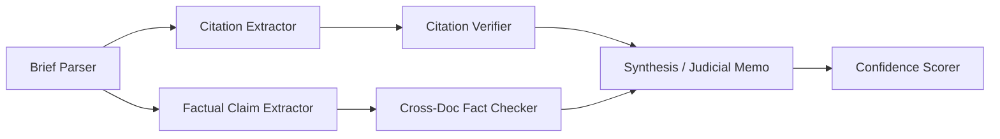

# Development notes - Learned Hand Coding Challenge
This document contains my raw notes as I work on this coding challenge. It's meant to be a diary-style, brain dump of my thought process so that I can refer to it at the end of the project to reflect on my thinking and approaches taken.

## Stages

### 0. Project setup
**Time spent:** 15 minutes
I started by reading `README.md` and getting myself familiarized with the project at hand. I also researched Learned Hand as an organization to wrap my head around the product, the problem it tries to solve, and how it delivers value to the users. Here's the gist of my understanding:

#### Learned Hand
Learned Hand is a legaltech startup providing trusted AI tools that judges use on their day to day to help them do more with their current resources and keep up with growing demand. It seems the product today focuses heavily on the review of motions to do things like:
* extract facts, map issues, structure arguments
* map citations to the case record (this project seems to be tangent to this topic)
* verify the AI's outputs quickly so that they get time savings, not a shift in workload
* allow courts to build their own rules and procedures - the output fits the court's needs, instead of requiring them to shift their core business to a model predefined by the tool

When building at Learned Hand, these principles are extremely important:
* Impartiality
* Ease of adoption (e.g., CMS integration - no need to move/migrate files)
* Leave the decision to the human - don't automate it, support a human in deciding
* Verification - hallucination is the kryptonite of trust here, must be mitigated
* Specificity - build a tool they can shape to fit their needs, like how a high quality pair of shoes molds to an individual's body over time to be a perfect, comfortable, and familiar fit

#### This project (BS detector)
This is a small but important piece of the puzzle - catching BS in the legal briefs. Hallucinations (citations that aren't actually true), Syncophancy (telling the user what it thinks they want to hear, cherry-picking words), Contradictions (stating facts that are directly contradicted by the supporting documentation). It's critical because a product like Learned Hand is ultimately built on trust: one occurrence of the issues above can erode months of work done correctly. Courts save time if they trust the outputs, otherwise they have to spend more time reviewing - this undermines the very value prop that underpins this product.

## 1. AI setup
**Time spent:** 35 minutes.
I spent some time setting up claude code to help me with this project. The goal was to set up a workflow I trust before writing a single line of pipeline code. I'd rather lose 30 minutes upfront on tooling than spend 2 hours later untangling agent slop. I decided to remove `.claude` from `.gitignore` so that my setup can be viewed if desired, given the `README.md` states you want to see how I use AI.

What I built, with the why for each:

**Slash commands in `.claude/commands/`:**
- `/plan` - acts as a senior architect. Grills me on requirements before proposing anything. Forces two distinct architectural options with a tradeoff table. Only after I pick a direction does it write a plan to `.claude/plans/<slug>.md`. Plans have a spec, a mermaid agent graph, per-task subagent prompts with TDD instructions, dependency waves for parallelism, and a verification plan. Each task is capped at ~500 LOC to keep subagent context windows tight and includes an explicit files-to-touch lists so parallel execution doesn't collide.
- `/execute` - the orchestrator. Reads a plan, pre-flights (checks no cycles, no overlapping files in same wave), then spawns subagents wave-by-wave via the Agent tool. The key rule: it runs each task's tests itself before marking done. The subagent's narrative isn't proof. A wave-N failure halts wave N+1.
- `/tweak <plan> -- <issue>` - for the "huh, that's weird" moments after execution. Reproduces the issue, fixes minimally with a regression test, appends an R<N> entry to the plan's "Post-Build Refinements" section. I can run it multiple times. Hard rule: root-cause the fix, no band-aids.
- `/verify <plan>` - independent audit. Walks every acceptance criterion looking for file:line evidence, runs tests, runs the eval suite, reports actual numbers. Told to lean skeptical - I'd rather manually decide not to fix something than have it make that decision for me.
- `/eval` - runs the real eval suite. Real LLM calls, real numbers. Appends to `backend/evals/history.jsonl` so future runs can diff against this one. Forbidden from mocking - that's what unit tests are for.
- `/write-notes` - Appends to NOTES.md verbosely so I have raw material for the final reflection.

**Docs:**
- `AGENTS.md` - codifies the README's spirit plus the Python/FastAPI/Pydantic/OpenAI/React conventions extending what's already in the codebase. Includes a writing-style section at the top: dashes not emdashes, talk like a person, no business-speak. That rule applies to code comments, docs, command files, all of it.
- `ARCHITECTURE.md` - where things live and why.

**Decisions worth remembering:**
- Committed `.claude/` to the repo. Removed it from `.gitignore`. The README literally says "use everything, we want to see how you use it" - hiding the workflow felt like the wrong call. Added a section to the README header explaining what's in there and why. If reviewers don't care, they ignore the folder. If they do care, they get a window into how I actually work.
- Plans get committed too. They're the closest thing to a journal of what was built and why each choice was made. Not committing them felt like deleting the homework.
- The `mock_llm` fixture is the contract for unit tests - patches `llm.call_llm` keyed by prompt substring. AGENTS.md and ARCHITECTURE.md both pin this so every agent test looks the same. Real LLM calls only happen in `/eval`.
- `llm.py` stays the only place that imports `openai`. This was already true in the starter code, but I made it a load-bearing rule because it's the seam for retries, structured output, and test mocking.
- Pydantic with `extra: forbid` for every cross-agent payload. Pushed back hard against dicts-passed-between-agents because the README explicitly grades on "pass structured data between agents, not raw text blobs".

## 2. Initial manual analysis of the case files
**time spent:** 25 minutes
I decided to spend some time analyzing the case files myself (with AI of course) so that I can build some intuition around the problem we're solving. This should pay dividends later when I'm trying to debug/fine-tune the agent chain performance for this problem. Here's what I found.

### What's actually in the documents

I ran three subagents in parallel to mimic what the eventual pipeline will do: one to forensically extract every citation, quote, and factual claim from the MSJ; one to compile a ground-truth fact sheet from the police report, medical records, and witness statement; and one to actually try to verify the cited cases via web search. Doing it as a multi-agent fan-out felt right - it surfaced things I would have missed reading linearly, and it's a good dry run of the agent-decomposition I'll eventually write code for.

**The case in one paragraph:** Carlos Rivera, a journeyman scaffolder employed by Apex Staffing Solutions (a subcontractor), fell ~14 ft when a section of frame scaffolding collapsed at a Harmon-run commercial renovation site at 2200 W. Olympic Blvd, LA on March 12, 2021. He broke his left tibia (comminuted, IM-nailed next day), his left wrist (Colles' fracture), and has an ongoing L4-L5 disc bulge with paraspinal strain. As of the 4-week ortho follow-up (April 9, 2021), he can't return to construction work, with a 4-6 month estimated full-duty return. The defense's MSJ argues Privette doctrine, OSHA-compliance-as-due-care, and a hedged SOL non-argument.

**The MSJ is densely BS'd.** This is pretty cool - gives me a glimpse behind what we're looking to find with the pipeline. The flaws are layered into distinct categories that map cleanly onto separate agents:

1. **Fabricated citations** - 8 of 10 cases in the MSJ don't exist. CourtListener's volume indices are occupied by entirely different cases at the cited pages. One of them (Kellerman, 887 F.2d 1204) has a volume-vs-year mismatch (887 F.2d is a 1989 volume, brief says 1991) - a tell-tale LLM-generated citation signature. The footnote-1 string-cite of six cases (no parentheticals, mixing CA/TX/FL) is a classic padding hallucination pattern.

2. **Real cases, misused** - Privette is real but the brief attributes a fabricated direct quote to it ("a hirer is *never* liable") that doesn't appear in the opinion and overstates the rule. SeaBright is real but cited for a proposition (statutory compliance = probative of due care) that's not what the case holds.
3. **Cross-doc factual contradictions** - the MSJ says the incident was "March 14, 2021" but every supporting doc says March 12. The MSJ says Rivera wasn't wearing PPE; the police report and witness statement both confirm he was wearing hard hat, harness, and (per the witness) high-vis vest. The lanyard pulled free because the *anchor point was part of the collapsed section* - the harness worked, the structure failed.

4. **Internal inconsistencies** - mechanism of injury slips between "collapsed beneath him" and "gave way." Argument tracks pull against each other: "Apex controlled the work" (Privette) vs. "Harmon's IIPP and OSHA compliance" (which would imply retained control). The SOL section literally hedges itself into a non-argument.

5. **Procedural BS** - no record citations anywhere. No § 437c framing, no separate statement, no exhibit/declaration/deposition refs. Facially defective as a real CA MSJ. Not the headline target (this is probably just the nature of a synthetic, .txt dataset for simplicity with this challenge specifically), but I am thinking that a "judicial memo" agent could note it if these were real case files.

**Critical reframing - this tool is for judges, not for either side.** I caught that the AI's analysis was full of implicit "the defense overstates X" framing. That's wrong for a judge-facing product. Symmetry is non-negotiable: if a hypothetical plaintiff brief quoted "L4-L5 disc bulge with mild central canal narrowing" but stripped the adjacent "may be pre-existing vs. acute" hedge from the same paragraph, that's the same flaw category as the defense's doctored Privette quote. The pipeline must catch both with the same machinery and the same severity. This led me to consider tweaking my artifacts to make sure I'm capturing the spirit and context of Legal Hand's product better.

This also points to a few design insights:
- Output schema has no `helps_defense` / `harms_plaintiff` fields. Just `claim`, `source_says`, `discrepancy_type`, `confidence`.
- Agent system prompts must explicitly say "you serve a judge; do not characterize findings as favoring either party." No advocacy verbs (overstates, mischaracterizes, hides, conceals). Stick to neutral verbs (asserts, cites, quotes) on the brief side, and "the source says" on the record side.
- Eval harness could include a symmetry test (relevant metric to build trust with judges - are we disproportionately flagging/catching BS on either side of the case): feed it a plaintiff-side brief making opposite selective-citation moves and verify the pipeline catches them with equivalent confidence. If it only catches one side's BS, it's biased - this would erode trust in the product. This feels like a real metric worth including.
- "Could not verify" must be a first-class output, not a fallback for "no issue found." For a judge, *unsupported* and *contradicted* are different signals that imply different judicial responses. Make them separate flag types, not a single severity scale.
- The judicial memo agent is a *findings* memo, not a *recommendation* memo. Never says "summary judgment should be denied." Surfaces verifiable discrepancies and stops.

**Implications for agent decomposition:**

Four distinct agents with non-overlapping jobs, which lines up with the Tier-3 spec. The natural boundaries emerged from the BS categories, much better than me arbitrarily role-splitting with (realistically) fairly limited knowledge about the underlying legal process.

**Difficulty asymmetry to plan around:** cross-doc fact-checking is *much* easier than citation verification. The supporting docs are right there in the prompt - the model can do this in one call. Case-law verification needs either a tool with web access or a curated mock corpus, plus careful "could not verify" handling so it doesn't confabulate holdings. Time strategy: get cross-doc working first, well-tested, with clean evals. Then citations. The PPE contradiction and the date contradiction are the lowest-hanging fruit and the most defensible "we caught real BS" findings - those are my floor.

**Eval metric design - what's worth measuring:**
- **Precision**: of all flags raised, what fraction are real BS? False flags are the worst failure mode for a judge-facing tool because they erode trust the most.
- **Recall**: of the known BS items in the document (I can hand-label these from the analysis above - every fabricated citation, every doctored quote, every cross-doc contradiction), what fraction did the pipeline catch?
- **Hallucination rate**: did the pipeline flag something that isn't actually in the brief? Or "verify" a citation it couldn't actually access? This is its own metric and matters more than precision/recall for trust.
- **Symmetry**: separately, does the pipeline catch plaintiff-side selective citation as readily as defense-side? Same recall on a mirrored test set.
- **Calibration**: when the pipeline says "high confidence," is it actually right at that rate? "Could not verify" should never collapse silently into either tier.

**Things I want to remember when implementing:**
- The "may be pre-existing vs. acute" line in the ED radiology note is a landmine the current MSJ doesn't actually use. Don't over-fit the pipeline to flaws that exist in *this* document - build it for the general pattern (selective quotation that omits adjacent qualifying language), not for the specific instances I've cataloged.
- The witness statement is plaintiff-friendly and was taken by plaintiff's counsel. The pipeline should not weight it differently than the police report, but a judge would. Stay neutral - flag claims against any source equally.
- The harness/lanyard story is a beautiful test case for "selectively quoting facts to misleading effect." The lanyard *did* fail in a sense (pulled free). But the cause was the structural anchor failing, not the lanyard itself. The MSJ already does the misleading version. A pipeline that catches this passes a real-world test.
- Don't build for "this MSJ is procedurally defective." A real defense brief from a competent firm wouldn't have those tells. The pipeline needs to catch *substantive* BS that survives a well-formatted brief.

## 3. Refining AI setup based on the review above
**Time spent: 10 minutes**
After seeing the review above it was clear that AI had a few gaps in understanding when it comes to the real context behind this project - stuff like impartiality, precision > recall - deep, core stuff that speaks to why Learned Hand is valuable. I decided to spend a few minutes tweaking those commands/artifacts to make sure they encapsulate the project and the spirit behind it better. This should pay dividends across the board later on. Here's a high-level overview of what I fine-tuned at this stage.

* `AGENTS.md` - section 1 rewritten: trust-as-currency framing, sycophancy across our own agents, surface-don't-decide, span-on-every-finding, impartiality. Prompt hygiene gained clerk-not-advocate voice rule and symmetric few-shot guidance.
* `ARCHITECTURE.md` - schemas now show TextSpan on every finding type (citations, quotes, consistency); section 3.6 expanded into verifiability + new 3.6.1 (sycophancy across agents) + 3.6.2 (impartiality); memo agent comment in the tree clarified; /analyze example shows claim_span + evidence_span and field-order-as-judge-reading-order.
* `.claude/commands/plan.md` - Phase 1 grilling adds surface-vs-decide, impartiality, sycophancy, verifiability questions.
* `.claude/commands/verify.md` - independent checks added: span resolvability, memo-doesn't-upgrade-verdicts, voice check, eval symmetry.
* `.claude/commands/eval.md` - verifiability rate metric and per-side breakdown in the report template.
* `.claude/commands/tweak.md` - root-cause rationale extended (band-aid hides a class of errors and reaches a judge next time).
README.md - short "Why this matters" section threading Learned Hand's framing into the brief.*

## 4. Push to git
**Time spent:** 5 minutes
At this point I felt comfortable with the project structure