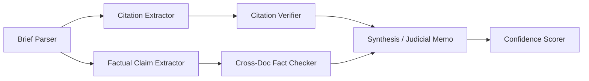

# Development notes - Learned Hand Coding Challenge
This document contains my raw notes as I work on this coding challenge. It's meant to be a diary-style, brain dump of my thought process so that I can refer to it at the end of the project to reflect on my thinking and approaches taken.

## Stages

### 0. Project setup
**Time spent:** 15 minutes

I started by reading `README.md` and getting myself familiarized with the project at hand. I also researched Learned Hand as an organization to wrap my head around the product, the problem it tries to solve, and how it delivers value to the users. Here's the gist of my understanding:

#### Learned Hand
Learned Hand is a legaltech startup providing trusted AI tools that judges use on their day to day to help them do more with their current resources and keep up with growing demand. It seems the product today focuses heavily on the review of motions to do things like:
* extract facts, map issues, structure arguments
* map citations to the case record (this project seems to be tangent to this topic)
* verify the AI's outputs quickly so that they get time savings, not a shift in workload
* allow courts to build their own rules and procedures - the output fits the court's needs, instead of requiring them to shift their core business to a model predefined by the tool

When building at Learned Hand, these principles are extremely important:
* Impartiality
* Ease of adoption (e.g., CMS integration - no need to move/migrate files)
* Leave the decision to the human - don't automate it, support a human in deciding
* Verification - hallucination is the kryptonite of trust here, must be mitigated
* Specificity - build a tool they can shape to fit their needs, like how a high quality pair of shoes molds to an individual's body over time to be a perfect, comfortable, and familiar fit

#### This project (BS detector)
This is a small but important piece of the puzzle - catching BS in the legal briefs. Hallucinations (citations that aren't actually true), Syncophancy (telling the user what it thinks they want to hear, cherry-picking words), Contradictions (stating facts that are directly contradicted by the supporting documentation). It's critical because a product like Learned Hand is ultimately built on trust: one occurrence of the issues above can erode months of work done correctly. Courts save time if they trust the outputs, otherwise they have to spend more time reviewing - this undermines the very value prop that underpins this product.

## 1. AI setup
**Time spent:** 35 minutes.

I spent some time setting up claude code to help me with this project. The goal was to set up a workflow I trust before writing a single line of pipeline code. I'd rather lose 30 minutes upfront on tooling than spend 2 hours later untangling agent slop. I decided to remove `.claude` from `.gitignore` so that my setup can be viewed if desired, given the `README.md` states you want to see how I use AI.

What I built, with the why for each:

**Slash commands in `.claude/commands/`:**
- `/plan` - acts as a senior architect. Grills me on requirements before proposing anything. Forces two distinct architectural options with a tradeoff table. Only after I pick a direction does it write a plan to `.claude/plans/<slug>.md`. Plans have a spec, a mermaid agent graph, per-task subagent prompts with TDD instructions, dependency waves for parallelism, and a verification plan. Each task is capped at ~500 LOC to keep subagent context windows tight and includes an explicit files-to-touch lists so parallel execution doesn't collide.
- `/execute` - the orchestrator. Reads a plan, pre-flights (checks no cycles, no overlapping files in same wave), then spawns subagents wave-by-wave via the Agent tool. The key rule: it runs each task's tests itself before marking done. The subagent's narrative isn't proof. A wave-N failure halts wave N+1.
- `/tweak <plan> -- <issue>` - for the "huh, that's weird" moments after execution. Reproduces the issue, fixes minimally with a regression test, appends an R<N> entry to the plan's "Post-Build Refinements" section. I can run it multiple times. Hard rule: root-cause the fix, no band-aids.
- `/verify <plan>` - independent audit. Walks every acceptance criterion looking for file:line evidence, runs tests, runs the eval suite, reports actual numbers. Told to lean skeptical - I'd rather manually decide not to fix something than have it make that decision for me.
- `/eval` - runs the real eval suite. Real LLM calls, real numbers. Appends to `backend/evals/history.jsonl` so future runs can diff against this one. Forbidden from mocking - that's what unit tests are for.
- `/write-notes` - Appends to NOTES.md verbosely so I have raw material for the final reflection.

**Docs:**
- `AGENTS.md` - codifies the README's spirit plus the Python/FastAPI/Pydantic/OpenAI/React conventions extending what's already in the codebase. Includes a writing-style section at the top: dashes not emdashes, talk like a person, no business-speak. That rule applies to code comments, docs, command files, all of it.
- `ARCHITECTURE.md` - where things live and why.

**Decisions worth remembering:**
- Committed `.claude/` to the repo. Removed it from `.gitignore`. The README literally says "use everything, we want to see how you use it" - hiding the workflow felt like the wrong call. Added a section to the README header explaining what's in there and why. If reviewers don't care, they ignore the folder. If they do care, they get a window into how I actually work.
- Plans get committed too. They're the closest thing to a journal of what was built and why each choice was made. Not committing them felt like deleting the homework.
- The `mock_llm` fixture is the contract for unit tests - patches `llm.call_llm` keyed by prompt substring. AGENTS.md and ARCHITECTURE.md both pin this so every agent test looks the same. Real LLM calls only happen in `/eval`.
- `llm.py` stays the only place that imports `openai`. This was already true in the starter code, but I made it a load-bearing rule because it's the seam for retries, structured output, and test mocking.
- Pydantic with `extra: forbid` for every cross-agent payload. Pushed back hard against dicts-passed-between-agents because the README explicitly grades on "pass structured data between agents, not raw text blobs".

## 2. Initial manual analysis of the case files
**time spent:** 25 minutes

I decided to spend some time analyzing the case files myself (with AI of course) so that I can build some intuition around the problem we're solving. This should pay dividends later when I'm trying to debug/fine-tune the agent chain performance for this problem. Here's what I found.

### What's actually in the documents

I ran three subagents in parallel to mimic what the eventual pipeline will do: one to forensically extract every citation, quote, and factual claim from the MSJ; one to compile a ground-truth fact sheet from the police report, medical records, and witness statement; and one to actually try to verify the cited cases via web search. Doing it as a multi-agent fan-out felt right - it surfaced things I would have missed reading linearly, and it's a good dry run of the agent-decomposition I'll eventually write code for.

**The case in one paragraph:** Carlos Rivera, a journeyman scaffolder employed by Apex Staffing Solutions (a subcontractor), fell ~14 ft when a section of frame scaffolding collapsed at a Harmon-run commercial renovation site at 2200 W. Olympic Blvd, LA on March 12, 2021. He broke his left tibia (comminuted, IM-nailed next day), his left wrist (Colles' fracture), and has an ongoing L4-L5 disc bulge with paraspinal strain. As of the 4-week ortho follow-up (April 9, 2021), he can't return to construction work, with a 4-6 month estimated full-duty return. The defense's MSJ argues Privette doctrine, OSHA-compliance-as-due-care, and a hedged SOL non-argument.

**The MSJ is densely BS'd.** This is pretty cool - gives me a glimpse behind what we're looking to find with the pipeline. The flaws are layered into distinct categories that map cleanly onto separate agents:

1. **Fabricated citations** - 8 of 10 cases in the MSJ don't exist. CourtListener's volume indices are occupied by entirely different cases at the cited pages. One of them (Kellerman, 887 F.2d 1204) has a volume-vs-year mismatch (887 F.2d is a 1989 volume, brief says 1991) - a tell-tale LLM-generated citation signature. The footnote-1 string-cite of six cases (no parentheticals, mixing CA/TX/FL) is a classic padding hallucination pattern.

2. **Real cases, misused** - Privette is real but the brief attributes a fabricated direct quote to it ("a hirer is *never* liable") that doesn't appear in the opinion and overstates the rule. SeaBright is real but cited for a proposition (statutory compliance = probative of due care) that's not what the case holds.
3. **Cross-doc factual contradictions** - the MSJ says the incident was "March 14, 2021" but every supporting doc says March 12. The MSJ says Rivera wasn't wearing PPE; the police report and witness statement both confirm he was wearing hard hat, harness, and (per the witness) high-vis vest. The lanyard pulled free because the *anchor point was part of the collapsed section* - the harness worked, the structure failed.

4. **Internal inconsistencies** - mechanism of injury slips between "collapsed beneath him" and "gave way." Argument tracks pull against each other: "Apex controlled the work" (Privette) vs. "Harmon's IIPP and OSHA compliance" (which would imply retained control). The SOL section literally hedges itself into a non-argument.

5. **Procedural BS** - no record citations anywhere. No § 437c framing, no separate statement, no exhibit/declaration/deposition refs. Facially defective as a real CA MSJ. Not the headline target (this is probably just the nature of a synthetic, .txt dataset for simplicity with this challenge specifically), but I am thinking that a "judicial memo" agent could note it if these were real case files.

**Critical reframing - this tool is for judges, not for either side.** I caught that the AI's analysis was full of implicit "the defense overstates X" framing. That's wrong for a judge-facing product. Symmetry is non-negotiable: if a hypothetical plaintiff brief quoted "L4-L5 disc bulge with mild central canal narrowing" but stripped the adjacent "may be pre-existing vs. acute" hedge from the same paragraph, that's the same flaw category as the defense's doctored Privette quote. The pipeline must catch both with the same machinery and the same severity. This led me to consider tweaking my artifacts to make sure I'm capturing the spirit and context of Legal Hand's product better.

This also points to a few design insights:
- Output schema has no `helps_defense` / `harms_plaintiff` fields. Just `claim`, `source_says`, `discrepancy_type`, `confidence`.
- Agent system prompts must explicitly say "you serve a judge; do not characterize findings as favoring either party." No advocacy verbs (overstates, mischaracterizes, hides, conceals). Stick to neutral verbs (asserts, cites, quotes) on the brief side, and "the source says" on the record side.
- Eval harness could include a symmetry test (relevant metric to build trust with judges - are we disproportionately flagging/catching BS on either side of the case): feed it a plaintiff-side brief making opposite selective-citation moves and verify the pipeline catches them with equivalent confidence. If it only catches one side's BS, it's biased - this would erode trust in the product. This feels like a real metric worth including.
- "Could not verify" must be a first-class output, not a fallback for "no issue found." For a judge, *unsupported* and *contradicted* are different signals that imply different judicial responses. Make them separate flag types, not a single severity scale.
- The judicial memo agent is a *findings* memo, not a *recommendation* memo. Never says "summary judgment should be denied." Surfaces verifiable discrepancies and stops.

**Implications for agent decomposition:**

Four distinct agents with non-overlapping jobs, which lines up with the Tier-3 spec. The natural boundaries emerged from the BS categories, much better than me arbitrarily role-splitting with (realistically) fairly limited knowledge about the underlying legal process.

**Difficulty asymmetry to plan around:** cross-doc fact-checking is *much* easier than citation verification. The supporting docs are right there in the prompt - the model can do this in one call. Case-law verification needs either a tool with web access or a curated mock corpus, plus careful "could not verify" handling so it doesn't confabulate holdings. Time strategy: get cross-doc working first, well-tested, with clean evals. Then citations. The PPE contradiction and the date contradiction are the lowest-hanging fruit and the most defensible "we caught real BS" findings - those are my floor.

**Eval metric design - what's worth measuring:**
- **Precision**: of all flags raised, what fraction are real BS? False flags are the worst failure mode for a judge-facing tool because they erode trust the most.
- **Recall**: of the known BS items in the document (I can hand-label these from the analysis above - every fabricated citation, every doctored quote, every cross-doc contradiction), what fraction did the pipeline catch?
- **Hallucination rate**: did the pipeline flag something that isn't actually in the brief? Or "verify" a citation it couldn't actually access? This is its own metric and matters more than precision/recall for trust.
- **Symmetry**: separately, does the pipeline catch plaintiff-side selective citation as readily as defense-side? Same recall on a mirrored test set.
- **Calibration**: when the pipeline says "high confidence," is it actually right at that rate? "Could not verify" should never collapse silently into either tier.

**Things I want to remember when implementing:**
- The "may be pre-existing vs. acute" line in the ED radiology note is a landmine the current MSJ doesn't actually use. Don't over-fit the pipeline to flaws that exist in *this* document - build it for the general pattern (selective quotation that omits adjacent qualifying language), not for the specific instances I've cataloged.
- The witness statement is plaintiff-friendly and was taken by plaintiff's counsel. The pipeline should not weight it differently than the police report, but a judge would. Stay neutral - flag claims against any source equally.
- The harness/lanyard story is a beautiful test case for "selectively quoting facts to misleading effect." The lanyard *did* fail in a sense (pulled free). But the cause was the structural anchor failing, not the lanyard itself. The MSJ already does the misleading version. A pipeline that catches this passes a real-world test.
- Don't build for "this MSJ is procedurally defective." A real defense brief from a competent firm wouldn't have those tells. The pipeline needs to catch *substantive* BS that survives a well-formatted brief.

## 3. Refining AI setup based on the review above
**Time spent:** 10 minutes

After seeing the review above it was clear that AI had a few gaps in understanding when it comes to the real context behind this project - stuff like impartiality, precision > recall - deep, core stuff that speaks to why Learned Hand is valuable. I decided to spend a few minutes tweaking those commands/artifacts to make sure they encapsulate the project and the spirit behind it better. This should pay dividends across the board later on. Here's a high-level overview of what I fine-tuned at this stage.

* `AGENTS.md` - section 1 rewritten: trust-as-currency framing, sycophancy across our own agents, surface-don't-decide, span-on-every-finding, impartiality. Prompt hygiene gained clerk-not-advocate voice rule and symmetric few-shot guidance.
* `ARCHITECTURE.md` - schemas now show TextSpan on every finding type (citations, quotes, consistency); section 3.6 expanded into verifiability + new 3.6.1 (sycophancy across agents) + 3.6.2 (impartiality); memo agent comment in the tree clarified; /analyze example shows claim_span + evidence_span and field-order-as-judge-reading-order.
* `.claude/commands/plan.md` - Phase 1 grilling adds surface-vs-decide, impartiality, sycophancy, verifiability questions.
* `.claude/commands/verify.md` - independent checks added: span resolvability, memo-doesn't-upgrade-verdicts, voice check, eval symmetry.
* `.claude/commands/eval.md` - verifiability rate metric and per-side breakdown in the report template.
* `.claude/commands/tweak.md` - root-cause rationale extended (band-aid hides a class of errors and reaches a judge next time).
README.md - short "Why this matters" section threading Learned Hand's framing into the brief.*

## 4. Push to git
**Time spent:** 2 minutes

At this point I felt comfortable with the project structure and decided to push to my fork. Structured this in a few commits:
* docs: add project rules, architecture, and notes
* chore: commit .claude/ workflow with explanation in README

## 5. Initial chain build
**Time spent:** 150 minutes
* ~75 minutes on the approach and finalizing the plan
* ~40 minutes for the AI to implement
* ~20 minutes of manual testing & fixes to get a stable version
* ~15 minutes of deep manual analysis to understand shortcomings & next steps

I'm thinking of doing a first build of the full agent chain based on everything we've seen so far. I'm ~1.5h in so I have another 4.5h on this. I think this approach gets me the farthest possible the soonest, and leaves enough time for fine-tuning at the end. A couple things worth noting:

### Fold confidence scoring into each agent, rather than build one confidence agent
Initially I had an insight to make this a specific agent, but really it makes way more sense to have each agent otuput its own confidence score. A separate confidence agent only helps when there's a lot of upstream agents whose confidence and callibration differ, and has the tradeoff of introducing its own bias into the chain. In my experiecne it's best to keep it simple & later add complexity, so I decided to have each agent output its confidence & if needed I'll clean this up later. I suspect the need won't arise - this would be more helpful if we had 5-6 upstream agents and wanted to ensure we're applying confidence uniformly across them.

### Building the legal memo agent right off the bat
I know README says that the legal memo agent is a stretch goal, but I've built these types of agent chains a few times before and I think I can get there within the 6 hours allowed for this challenge. I decided to build this right away as it'll be cheaper than building as a follow-up later.

### Error modes - always surface gaps and errors as the rule of thumb
Judge ALWAYS sees gaps/errors explicitly. Humans make decisions, the platform serves them the facts on a silver platter.

### JSON output of LLMs - what to do when things go wrong
LLMs have gotten good at this but still non-deterministic. Adding a 3-step retry increasing max_tokens at each time - this is the main failure mode I've seen in production a few times and it's a cheap defense against it. I decided to add it in this pass.

### Evals - including cost and latency metrics
I realized that another couple important metrics to track is how much the chain costs and how long it takes to run in the evals. Just here as a note so I don't forget to include it later.

### Model choice
GPT 4o across the board for now - I'll fine tune later, there's room to cut costs here on some of the simpler agents.

### UI surface
For now, just doing the report-rendering core (memo + findings list + verdict pills + click-through) and treating filters / side-by-side viewer / banners as a future improvement.

### Loading state
This chain call will probably take ~1 minute or so to run. For now I'm leaving it as a spinner, but if time permits I'd love to get some SSE plumbing built so that the user can see progress as it's being made. It's subtle but in my experience this type of UX goes a long way toward building trust with the user - they don't feel it's a black box, they get just enough info to know what it's doing & judge how long it might take.

### Eval gold standard
Build a structured ground truth JSON from the manual analysis we've done before so that the eval has something to test against. For now I'm allowing groudn truth veredicts to specify more than one (e.g., a fabricated citation could be either unsupported or could_not_verify) - I'll start with the more flexible approach & tighten later once I have more intuition around this.

### Architectural decision - linear pipeline or DAG orchestrator
The agents are well defined at this point, the main open question is how the orchestrator wires them together. This affects how we test, handle failure isolation, and add future agents - but I'm leaning towards keeping it simple for this task. The options are:

**linear async pipeline, fan-out with `asyncio.gather`**
* single async function in `pipeline.py` that calls each agent in sequence
* for fan-out calls (citation path parallel to the factual claims path) use `asyncio.gather`
* each agent is a pure async function (typed input -> typed output)
* the orchestrator owns the dependency graph (plain python)
* *pros:* simple, readable, easy to test, easy to isolate failures, no new dependencies, clear separation
* *cons:* adding a new agent requires editing pipeline (not registry driven i.e., adding a file to agents/) - if the pipeline grew to 10+ agents we might want to refactor this, no introspection (okay for a deterministic pipeline but as this evolves it'd likely be non-deterministic - e.g., in some cases run some agents, in others run others)

**declarative DAG orchestrator with a Stage registry**
* structure pipeline stages using a Directed Acyclic Graph (Stage dataclass + Orchestrator class that walks the DAG, schedules concurrent stages, collects results)
* agents registered via decorator with dependencies
* *pros:* new agents = new files with `@stage` decorator - no orchestrator changes, more introspection (can dry-run and audit the chain itself - this helps lower CI test costs plus add auditability), cleaner conditional execution later via the decorator
* *cons:* a lot of complexity for a small project, bigger LoC and testing surface, harder to read (if the team is highly experienced with this it's a non issue, but with a team that's learning the tooling this creates a steep learning curve), and premature abstraction risk - this builds the foundation for a lot more later, but we're not there yet, and who knows what assumptions will change

**decision:** keep it simple, go with the linear async pipeline. We can always add complexity later when the cost is justified. I would potentially weigh this decision differently if I were building the actual Legal Hand product - the tradeoff might be worth it when it accelerates parallel devs working on the pipeline and simplifies future extensibility. Assuming the product is still very much in the iterate quickly phase during early-traction product market fit, this could pay for itself within a few months. But for this coding challenge I'll keep it simple.

### Implementation
The /execute approach here paid off - claude was able to build the entire thing in one shot in ~30 minutes using parallel subagents. Pretty happy with the AI performance during the build. I think I'm at the edge of my knowledge here of optimizing AI coding agents for speed in an IDE so I think for my own learning I'll start exploring a few different paradigms later to get even more speed gains (cloud agents, creating tasks as github issues that agents pick up and work on - with a PR on each, as the large PRs have been the main bottleneck in my process lately). As far as the results of this coding stage, they were mostly satisfactory but had a few issues (some errors weren't caught until live testing). This includes an oversight on the imports - I wanted it to treat the /backend directory as the "root" path for python but it decided to consider the repo root as the python root. This caused a mismatch in what imports needed to be in local vs. docker environments, which was unideal and should have been caught early. Quick fix though. This is something I've faced in many projects and generally the mitigation I've adopted is to invest in e2e tests. I think another approach I need to dig deeper into is the browser integration in vscode - letting claude verify its own outputs and debug/fix from there.

### Shortcomings to overcome
* Hitting OpenAI rate limit often - considering adding retry with backoff logic on 429 responses
* Memo writer fails to write - possibly a downstream consequence of the issue above
* We're not yet actually checking the cited cases - only cross-document. This feels like an important part of the project and are entirely missing.
* Running eval as a claude command is finnicky - I'd like to change this to a fully deterministic python command and document in README as requested in the challenge spec, plus a /eval command around it that also analyzes the output. The python script should also output verbose reports so that they can be analyzed adequately.
* Some claims are supported by text that spans multiple TextSpans - currently the pipeline flags as unsupported if it's not within one text span.
* Recall is strong, precision is the bottleneck - we're flagging 22 findings when there should really only be 11. This is precisely what we want to avoid - fine tuning is needed urgently.
* One missed finding (labels outline 11 expected, our findings matched 10)

## 6. Urgent improvements
4pm. I still have about 2h left. Now I need to address the main issues from this first chain run.

**First wave:** ~30 minutes
* Add retries with exponential backoff on 429 to reduce agent error rates
* Refactor eval into a python file with a documented how to run in the README to run the eval and produce a verbose report, and refactor my /eval claude skill to interpret this report

**Second wave: ~50 minutes**
* Fix false positives from consistency checker - we're surfacing findings that say "this is consistent" but our eval pipeline sees "huh a finding" - so these should really be suppressed. We can keep raising findings for consistent if we want, but the verifier needs to distinguish these from actual findings. Or the eval harness needs to evolve to consider the true negatives (finding claims that are consistent & backable). Also, facts raised by one document and not disputed or corroborated by other documents return could_not_verify finding which maps as a FP but it isn't (it's really an undisputed fact at that point). There's also a duplicate issue - we're raising March 14 date twice, once it's counted correctly but the second time counts as a false positive.

**Third wave: ~15 minutes
* We're calling "unsupported" claims that are supported but the supporting content spans multiple lines (limitation of how I designed the textspan) - need to fix - should improve precision
* Our pipeline is correctly catching authorities that are cited, but the AI-generated eval labels were missing these - should improve precision

### Decision to move on
At this point we're at ~85% precision but I'm running out of time, only 30 mins left. I need to move on. There's a lot to improve but I'm satisfied with the trajectory over these improvements - in an hour and a bit we went from ~50% precision to ~85%, not too bad.

## 7. Add actual case citation checker
Started planning this in parallel with the tweaks in the phase above. Given time crunch I went with the very simplest approach - it creates a big agent with a fat tool that does a lot of things. If I had more time I would have split this into a more reasonable shape.

## Future to-do's
I'm keeping a running list of stuff I still need to do so I don't forget.
* Add actual case citation checker (go beyond documents here)
* Format output and deliverables according to README
* Optimize model size per agent (quantify with evals)
* Improve UI with filters, side-by-side viewer, banners
* Improve loading state with event streaming
* Refine eval gold standard - especially check if allowing multiple veredicts is good enough

## Reflections / questions
* Undisputed fact vs. could not verify
    * Let's say the claim says the worker was not using PPE
    * The police report or medical report should probably speak to this
    * In the case they don't, do we take the claim as undisputed fact, or do we surface as a "soft red flag" hey this should be corroborated by other documents if true but wasn't, so pay attention?
    * For now I went with "if not disputed directly by a document, it's assumed this is an undisputed fact" - but this would be a question I'd ask a domain expert if I were building the real product.
* Time management - 6 hours was tough, we came close at the end! I think I would have included the actual citation verification beyond the included documents in the initial chain build. I underestimated the time needed for fine tuning and improvements, I thouhgt I'd be able to come back to this, but I only got to it in the nick of time.
* Not using LangChain - I considered this tradeoff and my judgement was that a lot of the benefits of the library (dynamic tool routing, prompt templates with versioning, tracing) weren't actually issues this challenge focused on. So I aired on the side of keeping it simple and building it in a way where introducing LangChain later isn't a major refactor (i.e., agent contracts as Pydantic input to Pydantic output - unchanged later). I did have to write retries with backoff and usage collector by hand - I think that was an okay decision for the scope of this challenge.
* Separating citations and cross-document consistency - when considering the problem, it became clear that these are two separate issues. In building these types of agent chains before, the biggest improvement I've had to make in production is to split generalist agents into specialist ones - so I decided to specialize early in this challenge. Different veredict vocabularies (consistency points to disputed/undisputed, citations point to verified/unverified etc), different shapes (preferred to separate schemas than to combine into one), and different mental models for the Judge (this document miscites the law vs. this document contradicts this other document) so I felt okay separating them.
* Confidence scores - I didn't get to polishing these at the end, but I considered a confidence layer at the end vs. letting each agent define its own confidence. I went with the latter, but didn't have a chance to fine-tune. The agent's confidence is bound by the prompts to some extent, but if I were planning on running this for real I would definitely spend a bit more time making confidence more robust - especially so we can lean on it as an additional metric to improve the chain later. Also there's some deterministic steps (the lookup tool) that also give confidence metrics - I think I'd consider a different approach here, since that's a deterministic path so confidence doesn't mean the same thing it means when considering an LLM, non-deterministic path. Confidence is also not considered entirely in the eval - I would also explore as a future step some eval on calibration.
* Symmetry - clearly impartiality is critical for Learned Hand. I thought about including this in evals somehow, but given the document set is fairly limited in this scenario I decided to leave it as a maybe stretch-goal for myself. I didn't get to doing it.
* Loading state - I would have loved to make this progress more visible with streamed server-side events or something like that. Didn't have the time, but I'd weigh this as important in reality because it builds trust by not making the agent a black box.
* No e2e tests - given the time pressure I decided to not prioritize these, but in reality this is a worthwhile investment for a dev team highly leveraging AI, so I'd definitely spend some time beefing this up with Playwright or some other tool.
* Evals - recall = 1.0 is very very suspicious. I wish I could spend more time digging into why. My hypotheses are that this is overfit to the one test case, the pipeline overflags (benefits recall but degrades precision - the exact opposite of what we want).
