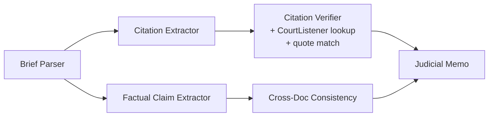

# Reflections

This is the end-of-project reflection that the README asks for. It pulls from the running diary in [NOTES.md](NOTES.md), but it's the synthesized version - the diary has the play-by-play; this has the takeaways.

## What I built

A multi-agent pipeline that takes the *Rivera v. Harmon* MSJ plus its supporting docs and produces a structured verification report. The shape:

Five agents with non-overlapping jobs, plus a memo synthesizer at the end. Linear async pipeline orchestrated in [backend/pipeline.py](backend/pipeline.py), with `asyncio.gather` for the fan-out. Pydantic with `extra: forbid` for every cross-agent payload - structured data between agents, not raw text. Findings carry `TextSpan` references back to the source so a judge can click from a flag straight into the document. Real LLM calls only happen in evals; unit tests use a `mock_llm` fixture keyed by prompt substring.

The eval harness lives in [backend/evals/](backend/evals/) and runs end-to-end against the live OpenAI API (and CourtListener). It reports precision, recall, hallucination rate, plus cost and latency. Gold labels are hand-built from my manual analysis of the case file.

## Design decisions and tradeoffs

### Specialist agents over a generalist

The single biggest decision. I split citation verification from cross-document consistency early instead of having one "fact-checker" agent do both. The reasoning: they have different verdict vocabularies (verified/unsupported vs. consistent/contradicted), different mental models for a judge ("this brief miscites the law" vs. "this brief contradicts this other document"), and different evidence shapes. Every time I've tried to merge similar-looking agents in production they've drifted into vague generalism. So I specialized early.

Tradeoff: more agents to maintain, more prompts to tune. But the prompts stay sharp because each one has exactly one job.

### Linear async pipeline, not a DAG orchestrator

I considered building a `Stage` registry with a DAG walker so adding agents would just mean dropping a file with a `@stage` decorator. Tempting. But for a 5-agent pipeline that's deterministic, it would have been a lot of scaffolding for a small payoff. I kept it linear in [backend/pipeline.py](backend/pipeline.py). If I were building the real Learned Hand product with 10+ agents, several of them conditional, with parallel devs landing changes weekly, I'd revisit. Not here.

### Confidence scoring lives inside each agent, not as a separate layer

I almost built a dedicated confidence agent. Talked myself out of it. A separate confidence agent only earns its keep when you have many upstream agents whose calibrations differ wildly and need normalizing. With 5 agents and tight prompts, putting confidence inside each one keeps the chain simple and avoids one more LLM call introducing its own bias. This is the decision I'm least sure about. Confidence isn't currently in the eval as a calibration metric, so I don't actually know if my per-agent scores are well calibrated. If I were running this for real I'd build a calibration metric and then revisit whether per-agent or aggregator-style is better.

There's a cleaner subpoint here too - the CourtListener lookup is deterministic. "Confidence" doesn't mean the same thing for a deterministic API call as for an LLM judgment, and right now I treat them the same. Worth fixing.

### Built the judicial memo agent up front

The memo is a Tier-3 stretch goal but I built it in the first pass. Two reasons: I've built this shape of agent chain before and knew the cost was lower up-front than retrofitting later, and the memo is the artifact a judge actually reads. Building it early forced the upstream agents to produce findings that compose cleanly into a one-paragraph synthesis. That pressure improved the schemas.

The hard rule I baked into the memo prompt: it never upgrades verdicts, never recommends a ruling, never says "summary judgment should be denied." It's a *findings* memo, not a *recommendation* memo. The verifier in [.claude/commands/verify.md](.claude/commands/verify.md) explicitly checks for this.

### Surface, don't decide

The whole product DNA. Every flag is a question for a judge with evidence attached. No `helps_defense` / `harms_plaintiff` field in any schema. Agent prompts use clerk-not-advocate voice - neutral verbs only ("asserts", "cites", "quotes" on the brief side, "the source says" on the record side). The README leans on impartiality and that thread runs through prompts, schemas, and the verifier.

This came directly out of the manual analysis in NOTES.md stage 2. When I first ran subagents to recon the case file, their output was full of implicit "the defense overstates X" framing. That's wrong for a judge-facing product. Caught it before writing pipeline code, which saved a lot of refactoring.

### CourtListener for citation verification

The citation pillar uses CourtListener's free v4 search endpoint. I post-filter results by exact normalized cite match. The older v3 `citation-lookup` endpoint that does this in one call now requires auth, so the unauth tier needs search + filter. Cites that CourtListener can't find land as `lookup_status == "not_found"` and the verifier short-circuits to `verdict: "could_not_verify"` with high confidence and emits no fabricated holding text. That's how the pipeline catches made-up citations - the source doesn't exist, so no agent gets to invent one.

### "Could not verify" as a first-class verdict

This is separate from "no issue found" and separate from "contradicted." A judge needs to know whether a claim is *unsupported* (couldn't find evidence) or *contradicted* (actively disputed by a source) - they imply different judicial responses. So I made them different verdict types, not different points on a severity scale. Fabricated citations route to `could_not_verify`, doctored quotes route to `unsupported` or `quote_mismatch`, cross-doc disagreements route to `contradicted`.

### Eval gold labels allow multiple acceptable verdicts

I let some gold-label findings accept either of two verdicts (e.g., a fabricated cite could legitimately be `unsupported` or `could_not_verify`). Loose, on purpose. As I built more intuition I'd tighten. Better to start permissive and tighten than to start strict and have eval false-positives drown out real signal.

## What worked

- **The upfront tooling investment.** I spent ~35 minutes on the Claude Code workflow (`/plan`, `/execute`, `/verify`, `/tweak`, `/eval`, `/write-notes`) before writing a single line of pipeline code. It paid for itself many times over. The full agent chain came together in a single `/execute` run in ~30 minutes via parallel subagents. The orchestrator's hard rule - the orchestrator runs the tests itself, the subagent's narrative isn't proof - caught real issues that would otherwise have shipped.
- **The 25-minute manual analysis of the case file before writing code.** Worth more than I expected. It surfaced the four BS categories (fabricated cites, real cases misused, cross-doc factual contradictions, internal inconsistencies) and those mapped cleanly onto separate agents. The agent decomposition wasn't arbitrary - it emerged from the actual flaw shapes in the document.
- **Pydantic with `extra: forbid` everywhere.** Caught two cross-agent shape mismatches at test time that would otherwise have surfaced as silent dropped fields in a downstream prompt.
- **TDD via the orchestrator.** Every task in every plan had test acceptance criteria, and `/execute` enforced them. No agent got marked done without its tests passing. The eval harness tells me about end-to-end quality; the unit tests tell me about component correctness; together they cover most of the surface.

## What didn't work, what surprised me
- **Citation checker went ~15 minutes over time:** I should have built this as part of stage one. I'm quite frustrated I didn't - it was clearly a huge part of the requirements and I tunnel-visioned too much into the cross-document consistency rather than focusing on this. That was the wrong call, and an important learning moment for me. In the future I'd spend more time building intuition around the requirements/brief to avoid allocating time where it's not as needed - especially under time pressure like this challenge.
- **Recall = 1.0 in the eval is suspicious.** I don't trust it. My best hypotheses: the pipeline overflags (which would benefit recall at the cost of precision - and precision *is* the bottleneck, which fits), or the labels are overfit to this specific document. I didn't have time to dig in. If I were continuing this I'd build a second test case (a synthetic mirrored plaintiff brief) and see if recall held. If recall stays 1.0 on a held-out brief it's real. If it drops, it was overfit.
- **Precision was the bottleneck, not recall.** The first pipeline run flagged 22 findings when the gold label said 11. Precision around 50%. I spent the second half of the project pushing it to ~85% by fixing false positives in the consistency checker (consistent claims being surfaced as findings, undisputed-but-uncorroborated facts being marked `could_not_verify`, duplicate flags), fixing the TextSpan limitation (claims supported by text that spans multiple spans were getting flagged as `unsupported`), and updating the AI-generated eval labels which were missing some legitimately cited authorities. False flags are the worst failure mode for a judge-facing tool because they erode trust most. If I had another hour I'd push precision further.
- **OpenAI rate limits during eval runs.** I underestimated this. The first eval runs hit 429s repeatedly and the memo writer was the most common failure (probably because it ran last, after the budget was already squeezed). Added retry with exponential backoff and the failure rate dropped to near zero. Should have built this in from the start - it's a known production failure mode and a cheap defense.
- **Imports between local and Docker environments.** I wanted Claude to treat `/backend` as the Python root; it picked the repo root. Caused a mismatch between local dev and Docker. Quick fix but I should have caught it at planning time. The mitigation I'd reach for in a real codebase is e2e tests that exercise the full container, plus probably letting the agent verify its own output via a browser integration in VSCode. Worth exploring.
- **TextSpan span-of-spans limitation.** The schema currently expects each finding to point to one contiguous span. Real life doesn't always cooperate - sometimes the supporting text is split across two paragraphs. The pipeline was flagging these as `unsupported` when they weren't. I patched it but the schema needs a real fix - probably `evidence_spans: list[TextSpan]`.

## What I'd do differently with more time

- **Build the actual citation checker (not just cross-doc) in the initial chain pass.** I deferred it because cross-doc was the easier win and I wanted a working end-to-end pipeline first. That was right strategically but I cut it too close. The citation pillar shipped in the last 20 minutes as a single big agent with a fat tool that does extraction, lookup, and quote matching. If I had another hour I'd split it into the same shape as the rest of the pipeline - one agent per job.
- **Add a symmetry eval.** Mirror the MSJ to a synthetic plaintiff brief making opposite selective-citation moves. Verify the pipeline catches both with equivalent confidence. For a judge-facing product, biased catching is worse than missed catching. I called this out in the manual analysis stage and didn't get to it.
- **SSE for the loading state.** The pipeline takes ~60s end-to-end. Right now the UI just spins. In my experience streaming progress events ("parsing brief", "verifying citation 3 of 10") goes a long way toward building user trust - it stops feeling like a black box and the user gets just enough info to judge how long things will take. For a tool whose entire value prop is trust, the loading UX matters more than it would for most products.
- **Calibration metric for confidence.** Right now confidence scores are unmeasured. I'd add a Brier score or reliability diagram and tune from there. As is, they're a vibe.
- **E2E tests with Playwright.** Skipped under time pressure. For a team leveraging AI heavily, e2e tests catch the kind of surface-level integration bugs that AI-generated code creates and unit tests miss (the import path issue above is a perfect example). High ROI in the medium term.
- **Filters and side-by-side viewer in the UI.** A judge wants to filter findings by verdict, severity, source document. Right now they get a flat list. Not hard to build, just didn't fit the timebox.
- **Optimize per-agent model size.** GPT-4o across the board because I didn't want to fine-tune two variables at once. Some agents (parser, extractor) probably run fine on a smaller model. Quantify with the eval, swap, re-measure.

## Honest self-assessment

I made it through Tier 1 and most of Tier 2, plus the Tier 3 memo agent and a working UI. Citation verification against external authority shipped but in a rougher shape than the rest - this is my biggest regret by far. Precision was at ~85% but then degraded to ~73% when I did my first pass with the tool, which I'm okay with given where it started but not where I'd want to ship. Recall is suspiciously high and I'd want a second test case to validate it. The eval suite is honest about what it measures and reports cost and latency alongside quality.

The thing I'm proudest of isn't a feature - it's that the manual analysis in stage 2 of NOTES.md actually shaped the build. Doing the recon first meant the agent decomposition emerged from real flaw shapes instead of from a generic AI-pipeline template. The four BS categories I found in the case file map almost exactly onto the four agents that catch them. This also helped me build intuition that allowed me to spot issues when they arised, which I couldn't have done if I were going into this more blind.

The thing I most want to fix is precision and the citation checker. Both fixable in a few hours. Neither is fundamentally limited by the architecture.

## Open questions I'd take to a domain expert

- **Undisputed fact vs. could-not-verify.** If the MSJ claims "Rivera wasn't wearing PPE" and no supporting document speaks to PPE either way, do we flag it as a soft red flag ("this should be corroborated") or treat it as undisputed fact? I went with "if not directly disputed, treat as undisputed." A judge or trial lawyer would probably have a strong opinion here.
- **How loud should "could not verify" be?** Right now it sits in the same findings list as `contradicted`. From the schema it's clearly distinct, but from a UI density perspective it might be drowning out the high-signal flags. A real judge user study would settle this fast.
- **Calibration target.** What confidence threshold should the memo agent use to decide what's "top finding" worthy? Right now I cherry-picked. Real answer comes from talking to or watching judges use the tool and seeing what they engage with.
